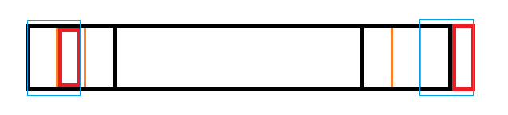
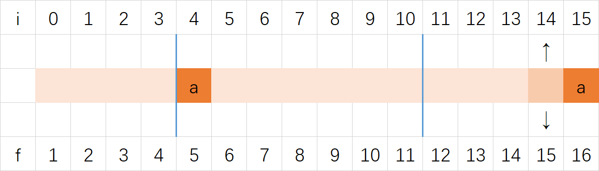
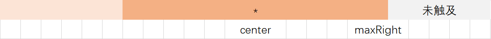

# 树的度序列和 Prüfer 编码

##树的度序列

##### 1. 来源

​	由于树有 n - 1 条边，因此树的度数和为 $2(n - 1)$。**反过来，**如果我们知道了一个**不上升的**正整数序列 $S$： $d_1, d_2, d_3, ... , d_n$，且它们的和为 $2(n - 1)$，我们就可以构造出以它为度序列的树。

##### 2. 证明

​	用数学归纳法。

​	假设 $n = k$ 时成立，只需证明 $n = k + 1$ 时也成立。首先必然有 $d_{k + 1} = 1$，否则序列和至少为 $2(k + 1) > 2k$（因为递增）。我们从序列中删去 $d_1$ 和 $d_{k +1}$ 并增加 $d' = d_1 - 1$ 到序列中一个保持不上升的位置。那么，现在这个序列的度数和为 $2(n - 1)$，**根据假设，**这可以构造出一棵合法的树。现在增加一个新结点 v，把它和 $d'$ 对应的结点相连，则 $d'$ 的值变为 $d_1$，并且增加了一个度为 1 的结点 v，因此新树的结点序列为 S。得证！

​	然后就可以说明，在 S 乱序时也成立了。

## Prüfer 编码

##### 1. 编码方法

​	设树为 T。

​	① 找到 T 编号最小的叶子结点 $b_1$，设它的相邻接点为 $a_1$。**这里的叶子结点是指度为 1 的结点。**

​	② 从 T 中删除 $b_1$，将 $a_1$ 添加到编码的尾部。

​	③ 重复以上过程，直到只剩下两个结点。

​	我们就得到了一个**长度为 n - 2 **的有序序列 $a$。

##### 2. 解码方法

​	①首先令 $a_{n - 1} = n$，即把编码手动延长至 n - 1 个数。

​	②令 $b_i$ 为不在当前序列的编号最小的点，则当前序列的第一个结点与 $b_i$ 有边。把它们连起来，然后**删去当前序列的第一个结点，并且不再记录 $b_i$。**

​	可以用堆进行这个操作，注意删去序列中的结点后可能会产生新的序列中没有出现过的点，这时要把它加入堆中。时间复杂度为 $O(n \log n)$。

##### 3. Cayley 定理

​	**Prüfer 编码中的每一位可以独立取 1~n 的任意数，即一个 Prüfer 序列对应一棵带标号无根树，因此有得到 Cayley 定理：**

​	不同的 n 结点标号树的数量是 $n^{n - 2}$。

##### 4. 一些推论

​	①若在 Prüfer 序列中一个点出现了 $x$ 次，那么这个点的度数为 $x + 1$。

​	②若一棵树的度数为分别为 $a_1, a_2, a_3, ... , a_n$，那么这棵树的同构数目为 $\frac {n!} {(a_1 - 1)!(a_2 - 1)! \, ... \, (a_n - 1)!}$。

#再再再谈 KMP 算法

##### 1. 问题定义

​	给定一个模板串，要求在一个字符串中找到模板串的位置。这又叫作字符串匹配问题。

##### 2. 原理

​	对朴素匹配进行改进。之前我们已经匹配了一些了，设匹配了 p 个。由于我们是知道模板串的，所以我们也就知道匹配串的情况，至少这 p 个我们是一清二楚的，所以有些地方不必一个一个地检查。开始以下一位为起点时，我们是知道已经匹配了多少位的，而不必像朴素算法一样重新开始。通过一些奇技淫巧，我们便能在线性时间复杂度里完成匹配。

##### 3. 失配函数 f

​	f 的物理意义是：==模板串**长度为 i** 的前缀的“相同的前缀和后缀”（不包括本身）的**最大长度**。==这样也就很好理解为什么可以快速匹配了：末尾失配了，开头的那一段好歹是一样的。保留个开头，再拿中间的那块去试试呗。

​	f 的匹配意义是：==若在模板串已匹配的长度为 i 时失配，接下来应假设已匹配的长度为多少。==通过这个定义，就能用 while 写出匹配函数了。

​	我们再来考虑如何求 f。我们假设要求 f[i + 1]，首先我们设 pre = f[i]，表示模板串 t[i]（注意这里 i 是第 i + 1 个，下标从 0 开始），然后看 t[i] 能否让后缀跟前缀一样。如果失败，我们就得尝试减少这个长度（f[i + 1]）。如图，注意图中有哪些部分是一样的。



​	因此，可以说这个过程用到了动态规划的思维：利用先前求出来的最长长度判断，而不是暴力枚举。其均摊时间复杂度为 $O(n)$。

#####4. 真正的 KMP 算法

​	上述算法其实只是 ==MP== 算法，真正的 KMP 算法还要对失配函数进行优化。



​	如上图，考虑 i = 14 的情况，此时正在计算 f[**15**]。考虑 f 的物理意义，按照 MP 算法可以得到 f[15] = 4。再考虑 f 的匹配意义，当已经匹配了 15 个字符，即正在考虑 t[**15**] 时失配，下一步应假设已匹配了多少个字符。不难得到答案应该是 4。但是，由于 t[15] = t[4] = a，**因此当 i = 15 时失配意味着在文本串的相同位置 i = 4 时也不会匹配。此时的情况是 t[i + 1] = t[f[i + 1]]。

​	一个显然的解决办法是，遇到这种情况，就让 f[i + 1] = f[f[i + 1]]。**这样相当于抛弃了 f 的物理意义，我们就不能通过之前的方式用 f 递推 f 了。**考虑这个初始化的过程，这其实是一个==自己匹配自己==的过程，所以维护一个当前已匹配数 pre，就相当于有一个**原意义下的 f[i]。**

​	由于 f 的含义改变了，**因此不能写 f[f[i + 1]] 和 t[f[i + 1]]，而要写 f[pre] 和 t[pre]。**

​	==新的模板==如下：

```c++
INT fMP[maxn];
void initFailureMP()
{
	fMP[0] = -1;
	for (int i = 0; i < m; i++)
	{
		INT pre = fMP[i]; //这个 pre 事实上可以通过维护得到
		while (~pre && t[i] != t[pre]) pre = fMP[pre];
		pre++; //从 -1 开始避免了判断
		fMP[i + 1] = pre;
	}
}
INT fKMP[maxn];
void initFailureKMP()
{
	INT pre = fKMP[0] = -1;
	for (int i = 0; i < m; i++)
	{
		while (~pre && t[i] != t[pre]) pre = fKMP[pre];
		pre++;
		if (t[i + 1] == t[pre]) fKMP[i + 1] = fKMP[pre];
		else fKMP[i + 1] = pre;
	}
}

//...
	while (~cnt && str[i] != t[cnt]) cnt = fKMP[cnt];
	cnt++;
```

​	至于为什么不用 `while(t[i + 1] == t[pre])`，原因是**这其实是一个递推的过程，要用的之前的 f 已经是优化过的了。**

# Manacher

[参考资料](https://segmentfault.com/a/1190000003914228)

##### 1. 问题定义

​	最长回文子串问题：给定一个字符串，求出它的最长回文子串长度。回文串的定义是：如果一个字符串正着读和反着读是一样的，那么它就是回文串。

###### ① 暴力方法

​	找到所有子串，验证它是否为回文子串。时间复杂度 $O(n^3)$。

###### ② 改进的方法

​	枚举中心，向两边扩张，时间复杂度为 $O(n^2)$。

##### 2. Manacher 算法

###### ①问题 1

​	当回文串长度的奇偶性不同时，回文串的形式是不同的。

​	Manacher 首先要做一个预处理，在包括首尾的空隙位置插入一个同样的，但是不会在原串中出现的符号。**这使得所有的回文子串的长度变为了奇数**，但是不影响原串的回文性质：原来是回文的串，插完之后还是回文的，原来不是回文的，依然不会是回文。

###### ②问题 2

​	效率问题。如何将时间复杂度将为 $O(n)$？

##### 3. Manacher 算法的定义

###### 回文半径

​	==设一个回文串中最左或最右位置的字符与其对称轴的距离称为回文半径。==Manacher 定义了一个回文半径数组 RL，==用 $RL_i$ 表示**以第 i 个字符为对称轴的回文串的回文半径。**==由于我们一般对字符串从左往右处理，因此这里定义 $RL_i$ 表示==以第 i 个字符为对称轴的回文串的**最右**一个字符与字符 i 的距离。==

​	距离在这里指**包含开始和结尾的字符个数。**

```
str:	# a # b # a # a #
RL:		1 2 1 4 1 2 3 2 1 
RL - 1:	0 1 0 3 0 1 2 1 0
```

​	观察上例，发现 **$RL_i - 1$ 的值正是原字符串以 i 为对称轴的最长回文子串的长度。** 

​	定义：RL 的物理意义是==以 i 为回文中心的回文串的回文半径。==RL 的匹配意义是==原串中以位置 i 为对称轴的最长回文串的长度 + 1。==

##### 4. Manacher 算法的过程

###### ①基本思路

​	利用回文串的对称性，扩展回文串。

###### ②算法步骤

​	**我们的任务是求 RL 数组。**

​	

​	我们需要维护==两个变量：maxRight 和 center。==maxRight 代表从左到右处理时已经到达过的最右位置（它是一个回文子串的端点），center 代表 maxRight 对应的回文子串的回文中心。

​	**注意：上图中从未说到目前正在处理哪里！接下来将对此分情况讨论！**

​	我们设当前正在处理第 i 位，毫无疑问，第 i 位一定在 center 的右边。然后我们分成以下三种情况：

①若 i 在 maxRight 左边


​	上图应该是最简单的情况了。**我们找到 i 关于 center 对称的点 j，发现 j 的回文半径居然还不足以触及到 center！**所以此时 $RL_i = RL_j$。（1）

​	

​	当 j 的回文半径更大，超过了 center 时，我们只能 **i 到 maxRight 是以 i 为回文中心的最小回文半径（粗虚线）。**能否到细虚线**或是更远**，只能扩张 i 并且**更新 maxRight 和 center** 来检查了。（2）

②当 i 在 maxRight 的右边


​	**只有唯一一种情况：i 与 maxRight 相邻。**这时让回文半径从 1 开始（即从 i 开始）不断扩张，直到**不再回文或到达边界，同时更新 center 和 maxRight 即可。**（3）

​	==总的来说分成三种情况。==

##### 5.时空复杂度

​	空间复杂度明显是线性的。由于扩张 maxRight 的操作对于每个位置只会进行一次，因此我们得到：Manacher 的时间复杂度是线性的。

# Aho-Corasick Automation

（粗体为终点内容，加亮为关键内容）

##### 1. 问题定义

​	给定一个模板串集合，要求在一个字符串中找到所有模板的位置。这个问题又叫做多模式匹配问题。

##### 2. AC 自动机

​	AC 自动机由一个 Trie 和一个失配边集合组成。

​	由于 AC 自动机的底层是一个 Trie，那么它自然有一个 Trie 结点。

```c++
struct Node
{
  Node* c[alpha_size];
  Node* fail;
  Node* suffix;
  INT count;
};
```

​	可以看出，AC 自动机的结点在 Trie 的基础上多出了个 fail 指针，还多了个 suffix 指针。它们到底怎么用呢？我们一会儿来讲解。

###### ①Trie 的结构

​	我们一般认为，Trie 是一棵结点上没有字符，而在边上有字符的树。AC 自动机也类似，根结点是一个虚拟的结点，但是==可以认为字符存在在其它结点上，==**这样有助于理解“状态”一词。**实际上，==AC 自动机的结点中不保存字符，我们仍然把字符“存”在边上。==

​	回忆 KMP 算法，在某个地方失配后我们要让模板串往前移，通过记录一个失配函数来实现这个功能。事实上 KMP 的失配函数是一个状态机，由于它很简单，所以可以用一个 f 数组来实现。AC 自动机是一棵树，所以必须要用指针，**但是它的功能和 KMP 的失配函数是完全一样的，**==其物理含义也是一样的：指向最长的与后缀相同的前缀的尾部。==

​	与 KMP 算法类似，AC 自动机也是边走边匹配，但是有这么一个区别：若找到了一个串，同时也就说明了找到了这个串的后缀；**如果一个模板是另一个模板的后缀，说不定会出现同时找到两个串或更多串的情况。**一个最简单的想法是沿着失配边走，直到走到根结点，但是**当模板串只由一种字符组成时，时间复杂度就悲剧了：失配边边数与模板串长度同阶。**所以我们需要一个更优秀的东西，它就是 ==suffix 指针==，中文名叫做==后缀链接==。==它的作用就是在**每一个**状态处（并不一定非要是匹配的一个状态）往回走，保证只会走到匹配点或者根结点。==这样时间复杂度就得到了保证。

###### ②构建 AC 自动机

​	工欲善其事，必先利其器。==建立 AC 自动机前，你要先建好 Trie 树。==**这就意味着你不能边插入模板串边维护 AC 自动机，只能把模板串插入完后再一次建成。**

​	步骤（1）：==用 AC 自动机的结点，建立一棵一般的 Trie 树。==

​	受题目影响，**可能会有相同的模板串。**==这时要根据题目要求确定记一次还是记多次，count 就起作用了。==

​	步骤（2）：==构造 fail 指针，同时构造 suffix 指针。==

​	**由于我们肯定是用之前的数据推出之后的目标，所以 ==BFS== 是我们的不二选择。**我们先将根结点放进队列中，==每次通过出队的去更新它的儿子，而不是在出队时更新自己。==这样一不用特判根结点，二我们能**知道子结点对应的字符是什么。**

​	suffix 的计算与 fail 的计算息息相关。==得到 fail 指针后，我们先检查 fail 指向的结点是否代表一个字符串，如果是，就指向 fail，否则指向 fail 的 suffix。== 

​	就这样，AC 自动机就建好了。

###### ③向自动机输入

​	然后就和 KMP 几乎一模一样了，唯一的区别是==**每次**都要跑一次 suffix 到根结点。==

##### 3. 时空复杂度

​	设文本串长度为 n，模板串总长度为 m。

​	**Trie 结点占用的大小不能忽视**，其空间复杂度为 $O(α)$，代表字母表大小。很明显整体空间复杂度为 $O(mα)$。

​	时间复杂度是线性的。

##### 4. 改进

​	