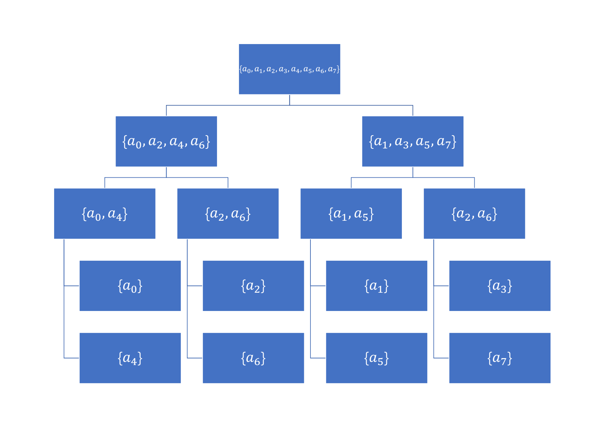

[TOC]

>   开局一个 Markdown，内容全靠编。——Orange

# 从多项式乘法到傅里叶变换

>   前言
>
>   &emsp;&emsp;众而周知，一般的多项式乘法的时间复杂度为 $O(n^2)$，无法满足使用需求。而由快速傅里叶变换算法（Fast Fourier Transform，FFT）驱动的**离散傅里叶变换（DFT）和其逆运算 IDFT** 成功解决了这个时间问题。本文将从多项式和复数的基础知识出发，进而讨论傅里叶变换，最后再使用快速傅里叶变换来完成我们最初提到的多项式乘法。

### 基础知识

#### 多项式基础

>   &emsp;&emsp;多项式的概念是最为基础的部分。这部分主要补充过去没有听说过或者很少用到的概念。

##### 1. 一元多项式乘法

&emsp;&emsp;设 $f(x) = a_0 + a_1 \cdot x + a_2 \cdot x^2 + \cdots + a_k \cdot x^k$，称形如 $f_1(x) \cdot f_2(x)$ 的乘法为**一元多项式乘法**。

&emsp;&emsp;一个重要的应用便是高精度乘法：当 $x$ 等于 $10$ 时，代入计算出来的 $f(x)$ 便是结果。

&emsp;&emsp;我们接下来只讨论一元多项式，**所以把一元多项式简称为多项式**。

##### 2. 多项式的基本概念 

###### ①次数界

&emsp;&emsp;定义一个多项式的次数界为**多项式的最高项的次数 + 1**。

e.g. $A(x) = 2x^3 - 5x^2 + x - 8$ 的次数界为 4。

------

&emsp;&emsp;一个次数界为 $N$ 的多项式可以记作：[^j]
$$
A(x) = \sum _{j = 0} ^{N - 1} a_j · x^j
$$
&emsp;&emsp;需要注意的是，最高次系数为 $N - 1$。

[^j]: 因为本节会使用到复数以及虚数单位 $i$，所以循环变量一般使用 $j$。

###### ②系数表示的多项式乘法

&emsp;&emsp;设 $C(x) = A(x) \cdot B(x)​$。将这两个多项式相乘的方法为：
$$
c_k = \sum _{j = 0} ^{k} a_j b_{k - j} \; (0 \le k \le N_A + N_B - 1)
$$
&emsp;&emsp;很明显，计算出一个系数的时间复杂度为 $O(n)$，所以总的时间复杂度为 $O(n^2)$。

------

&emsp;&emsp;设一个多项式的次数界为 $N$，则有：
$$
N_C = N_A + N_B - 1
$$

###### ③多项式的系数表示

&emsp;&emsp;前面表示多项式的方法为**多项式的系数表示法**：
$$
A(x) = \sum _{j = 0} ^{n - 1} a_j · x^j
$$

##### 3. 点值与插值

###### ①点值

&emsp;&emsp;对于一个多项式 $A(x)$，假设 $A(x) = x^2 - 3x + 2$，我们将 $x$ 代入具体数值，得到多项式的值：
$$
A(0) = 2
\\
A(1) = 0
\\
A(-2) = 12
$$
&emsp;&emsp;将 $x \to y$ 写作 $(x, y)$，就可以写作：$(0, 2)$，$(1, 0)$，$(-2, 12)$。像这三组有序对一样，**一般地，如果有 $(x, y)$ 满足 $A(x) = y$，则称 $(x, y)$ 为 $A(x)$ 的点值对。**

&emsp;&emsp;对于上例，将三组有序对组成一个集合 $S = \{ (0, 2), (1, 0), (-2, 12) \}$，则称 $S$ 为 $A(x)$ 的一个点值表示。

###### ②多项式的点值表示

&emsp;&emsp;一般地，一个次数界为 $N$ 的多项式 $A(x)$ 的点值表示就是一个**由至少 $N$ 个点值对所组成的集合**：
$$
\{ (x_0, y_0), (x_1, y_1), \cdots,(x_{N - 1}, y_{N - 1}) \}
$$
&emsp;&emsp;对于集合中的每个元素，必须满足 $y_k = A(x_k)$。	

&emsp;&emsp;对 $x$ 的取值不是很严格，只需要满足互不相同就可以了。

&emsp;&emsp;如果已知多项式 $A(x)$ 的系数表示，得到多项式的点值表示的过程叫作**点值运算**。

###### ③插值

&emsp;&emsp;假设我们得到了一个有至少 $N$ 个正确的点值对的点值表示，那么我们就**可以确定一个唯一的次数界为 $N$ 的多项式**。这个过程叫作**插值运算**。**插值运算是点值运算的逆运算。**

&emsp;&emsp;两个典型的例子是两点定一直线，三点定一抛物线。

##### 4. 点值，插值，与多项式乘法

###### ①点值表示的多项式乘法

&emsp;&emsp;对于两个用相同个点值对表示的唯一多项式 $A$，$B$，我们首先要确定一组 $x$：
$$
A = \{ (x_0, y_0), (x_1, y_1), \cdots, (x_{n - 1}, y_{n - 1}) \}
\\
B = \{ (x_0, y'_0), (x_1, y'_1), \cdots, (x_{n - 1}, y'_{n - 1}) \}
$$
&emsp;&emsp;设 $C = A \cdot B​$，我们可以得到 $C​$ 的点值表示：
$$
C = \{ (x_0, y_0 · y'_0), (x_1, y_1 · y'_1), \cdots, (x_{n - 1}, y_{n - 1} · y'_{n - 1}) \}
$$
&emsp;&emsp;**很明显，点值表示的多项式乘法的时间复杂度为 $O(n)$。**特别注意，用于表示 $A$ 和 $B$ 的点值对数必须相同。

###### ②对乘法结果进行插值运算

&emsp;&emsp;如果使用上面的方法计算 $C$，将无法进行插值运算。因为 $N_C = N_A + N_B - 1$，所以用以上方法表示的 $C$ 并不能对应一个唯一的多项式。

&emsp;&emsp;解决方法很简单，那就是让 $A$ 和 $B$ 各用 $2N$ 个点值对表示，再做乘法，就能得到可以进行插值运算的 $C$ 了。

------

&emsp;&emsp;就这样，我们有了计算两个用系数表示的多项式的乘法的新方法：

（1）点值运算

&emsp;&emsp;构造出 $A$ 和 $B$ 的长度为 $2N$ 的点值表示，其中 $N = \max(N_A, N_B)$。

（2）点值表示的多项式乘法

&emsp;&emsp;计算出 $C = A \cdot B​$ 的点值表示。

（3）插值运算

&emsp;&emsp;通过 $C$ 的点值表示求出多项式 $C$ 的每项系数。

------

&emsp;&emsp;**注意到，如果我们直接选取 $1$ ~ $2N$ 作为 $x$，点值运算的时间复杂度为 $O(N^2)$。**可以证明，**插值运算的时间复杂度也为 $O(N^2)$。**如果我们解决了这个时间复杂度的问题，我们的多项式乘法就完成了。

#### 复数基础

>   &emsp;&emsp;我们需要用到复数中的 $N$ 次单位复数根的特殊性质来进入傅里叶变换。这一部分既是关键点，又是难点。

##### 1. 坐标系中的复数 

&emsp;&emsp;我们可以用一条横轴表示全体实数。如果再用一条纵轴表示虚数，便可以在平面直角坐标系中表示一个复数。

&emsp;&emsp;一般地，我们把形如 $a + bi \; (a, b \in \mathbb{R})$ 的数称为复数。[^复数]

[^复数]: 有关复数的详细内容，可以参考高中数学。 

##### 2. $n$ 次单位复数根 

###### ①定义

&emsp;&emsp;$n$ 次单位复数根指满足 $w^n = 1$ 的复数 $w$，记为 $w_n$。

&emsp;&emsp;$n$ 次单位复数根恰好有 $n$ 个，即：
$$
w = e^{\frac {k} {n} · 2 \pi i } \; (0 \le k < n)
$$
&emsp;&emsp;其中 $i$ 为虚数单位。

------

&emsp;&emsp;$e^{ui}$ 是什么意思呢？我们有欧拉公式：
$$
e^{ui} = \cos(u) + i \sin(u)
$$
&emsp;&emsp;便得到了它的几何意义：**$e^{ui}$ 代表单位圆上的一点，原点与其所在射线与 $x$ 正半轴成角 $u$。**

&emsp;&emsp;**所以 $n$ 个 $n$ 次单位复数根均匀分布在单位圆上。**

###### ②主 $n$ 次单位根

&emsp;&emsp;我们记 $n$ 次单位复数根为 $\{ w_n^0, w_n^1, w_n^2, \cdots, w_n^{n - 1} \}$，对其中的一个元素，记 $w_n^k = e^{\frac {k} {n} \cdot 2 \pi i } \; (0 \le k < n)$。

&emsp;&emsp;我们**称 $w_n^1$ 为主 $n$ 次单位根，记为 $w_n$**。

------

&emsp;&emsp;注意到，$n$ 次单位复数根都是经过旋转而得到的，每次的旋转都是一定的角度。可以写作：
$$
w_n^i = w_n^{i - 1} w_n
$$
&emsp;&emsp;因此，**$n$ 次单位复数根可视为公比为主 $n$ 次单位根的等比数列。**

&emsp;&emsp;同时，记号 $w_n^j$ 也可以看作 $(w_n^1)^j$，即主 $n$ 次单位根的 $j$ 次幂。

###### ③由群论推导出的 $n$ 次单位复数根的性质

&emsp;&emsp;我们有：
$$
w_n^0 = w_n^n = 1
$$
&emsp;&emsp;由群论[^群论]的相关知识，结合主 $n$ 次单位根的性质，我们可以得到：
$$
w_n^j w_n^k = w_n^{j + k} = w_n^{(j + k) \bmod n}
$$

[^群论]: 有关群论的相关知识，请自行查阅相关资料。 这里涉及很浅。

-------

&emsp;&emsp;推论：
$$
w_n^{-1} = w_n^{n - 1}
\\
w_n^k = w_n^{k + n}
\\
(w_n^k)^2 = w_n^{2k}
$$

##### 3. $n$ 次单位复数根的更多重要性质

&emsp;&emsp;前面提到了主 $n$ 次单位复数根和群论带来的 $n$ 次单位复数根的性质。接下来我们在它们的基础上继续讨论。

###### ①消去引理

$$
w_{dn}^{dk} = w_n^k
$$

&emsp;&emsp;称为**消去引理**。结合 $n$ 次单位复数根的几何意义，应该不难理解。

------

&emsp;&emsp;推论：
$$
w_n^{\frac {n} {2}} = w_2 = -1
\\
(w_n^k)^2 = w_{\frac {n} {2}}^{k}
$$
&emsp;&emsp;其中 $w_2$ 为主 $2$ 次单位根。

###### ②折半引理

&emsp;&emsp;如果 $n > 0$ 且 $n$ 为偶数，那么 $n$ 次单位复数根的平方的几何就是 $\frac {n} {2}$ 次单位复数根的集合。这被称为**折半引理**。

&emsp;&emsp;可以继续结合 $n$ 次单位复数根的几何意义理解。

###### ③求和引理

&emsp;&emsp;对于任意正整数 $n$ ，若有一非负整数 $k$ 满足 $n \nmid k$，则有：
$$
\sum_{j = 0}^{n - 1} (w_n^k)^j = 0
$$
&emsp;&emsp;称为**求和引理**。

>   证明
>
>   &emsp;&emsp;考虑等比数列求和。
>   $$
>   \sum_{j = 0}^{n - 1} (w_n^k)^j
>   =
>   \frac {(w_n^k)^n - 1} {w_n^k - 1}
>   $$
>   &emsp;&emsp;因为有 $w_n^k = (w_n)^k$，得：
>   $$
>   =
>   \frac {(w_n^n)^k - 1} {w_n^k - 1}
>   =
>   \frac {(1)^k - 1} {w_n^k - 1}
>   =
>   0
>   $$
>   &emsp;&emsp;如果 $k$ 是 $n$ 的倍数，那么分母为 $0$，无法通过这个方法计算。放回原式，实际上我们会计算 $\sum 0^j$，当 $j = 0$ 时，原式无意义。**所以当 $k$ 为 $n$ 的倍数时原式无意义。**

### 傅里叶变换

#### 信号

##### 1. 概念

&emsp;&emsp;信号是在有信息的物理量，是系统直接进行加工、变换以及实现通信的对象。

&emsp;&emsp;信号是信息的表现形式。

##### 2. 信号的描述

###### ①数学描述

&emsp;&emsp;使用具体的数学表达式，把信号描述为一个或若干个自变量的函数或序列的形式，叫作信号的数学描述
$$
f(t) = sin(1000 × 2\pi × t)
$$
&emsp;&emsp;这个式子便代表的是 1000 Hz 的正弦波。

###### ②波形描述

&emsp;&emsp;直观地说，把信号的波形画出来，叫作信号的波形描述。

##### 3. 信号的基本运算 

###### ①四则运算

$$
+~-~×~÷
$$

###### ②平移运算

$$
f(t) \to f(t - b)
$$

&emsp;&emsp;代表把信号向右移动 $b$ 个单位。

###### ③反褶运算

$$
f(t) \to f(-t)
$$

&emsp;&emsp;代表把信号沿 $y$ 轴水平翻转。

###### ④压扩运算

$$
f(t) \to f(at)
$$

&emsp;&emsp;代表把信号压缩或者扩张。特别地，当 $a < 0$ 时，相当于还做了一次反褶运算。

###### ⑤微分运算

$$
f(t) \to \frac {d} {dt} f(t)
$$

###### ⑥积分运算

$$
f(t) \to \int _{-\infty} ^{t} f(u) du
$$

###### ⑦卷积

$$
(f * g)(t) = \int _{-\infty}^{+\infty} f(t - \tau) g(\tau) d\tau
$$

##### 4. 卷积的性质

&emsp;&emsp;卷积是一个很重要的运算，有以下的性质。

###### ①交换律

$$
f * g = g * f
$$

###### ②分配律

$$
f * (g + h) = f * g + f * h
$$

###### ③结合律

$$
(f * g) * h = f * (g * h)
$$

###### ④与微分相关的性质

$$
\frac {d} {dt} (f * g) = (\frac {d} {dt} f) * g
$$

&emsp;&emsp;两个信号的卷积的微分等于其中一个信号的微分卷积另外一个信号。

###### ⑤与积分相关的性质

$$
\int (f * g) = (\int f) * g
$$

&emsp;&emsp;两个信号的卷积的积分等于其中一个信号的积分卷积另外一个信号。

#####5. 特殊的信号

###### ①单位斜变信号

$$
R(t) = \max(0, t)
$$

###### ②截顶的单位斜变信号

$$
R(t) = \min(\tau, \max(0, t))
$$

&emsp;&emsp;截顶的单位斜变信号比单位斜变信号更“科学”：单位斜变信号在现实世界中不会出现，而截顶的单位斜变信号可能。

###### ③单位阶跃信号

$$
u(t) =
\left \{ \begin {matrix}
1,~t > 0
\\
0,~t < 0
\end {matrix} \right.
$$

&emsp;&emsp;这个信号在 $t = 0$ 处未定义。

&emsp;&emsp;这个信号也不科学。

######④单位矩形脉冲信号

$$
G_{\tau}(t) =
\left \{ \begin{matrix}
1,~|t| < \frac {\tau} {2}
\\
0,~|t|> \frac {\tau} {2}
\end {matrix} \right.
$$

&emsp;&emsp;这个信号可以写作：
$$
G_{\tau}(t) = u(t + 0.5) - u(t - 0.5)
$$
&emsp;&emsp;**可以使用 $u(t)$ 来表示分段函数。**

###### ⑤单位冲激信号

$$
\delta(t) = 0,~t \ne 0
\\
\int _{-\infty}^{+\infty} \delta(t) = 1
$$

&emsp;&emsp;可以看作一瞬间上去了又下来，其面积等于 $1$。

&emsp;&emsp;这个信号的积分等于单位阶跃信号。

####傅里叶变换

>   &emsp;&emsp;这一部分的内容仅作扩展了解。

##### 1. 傅里叶级数（Fourier Series，FS）

&emsp;&emsp;FS 用于分解连续的周期信号。傅里叶提出，**任何连续的周期信号都能用一组适当的正弦曲线表示出来**，故有名傅里叶级数。

&emsp;&emsp;分解信号的方法除了有 FS，还有很多：

（1）直流分量 + 交流分量

&emsp;&emsp;直流分量可以理解成信号的平均值，**与时间无关**。

&emsp;&emsp;交流分量可以理解为周期性的东西。

（2）偶分量 + 奇分量

&emsp;&emsp;……

（3）实部分量 + 虚部分量

&emsp;&emsp;……

------

&emsp;&emsp;傅里叶坚信，任何连续的周期信号都能用一组适当的正弦曲线表示出来。我们知道，一个正弦信号的全部信息由它的频率、幅度以及初相位这三个参数来决定。也就是说，这三个参数是一个正弦信号的全部信息。

&emsp;&emsp;信号的频谱就是表示组成一个复杂信号的所有不同频率正弦信号的三参数。**它表示的不是一个时刻的信息，而是在无限长的时间中的信息。它是有周期的。**[^参考资料]

[^参考资料]: 参考资料：[频谱的具体概念是什么？](https://www.zhihu.com/question/26744092/answer/86082436)

------

&emsp;&emsp;傅里叶级数的公式是：
$$
f(t) = a_0 +
\sum_{n = 1}^{\infty} (a_n · \cos (n · \omega_1 t) + b_n · \sin (n · \omega_1t))
$$
&emsp;&emsp;其中，$\omega_1$ 为信号的角频率。

&emsp;&emsp;FS 还可以写成复指数形式。限于篇幅和内容的偏重点，这里不再介绍。

##### 2. 傅里叶变换（Fourier Transfoem，FT）

&emsp;&emsp;从公式来看，FS 得到的是离散的频谱信息。当傅里叶级数的周期变长时，可以认为每个分量的频率减小。因此我们得到的频率信息就很密集，也就得到了连续的东西。
$$
F(\omega) = \int_{-\infty}^{\infty} f(t)e^{-i \omega t} dt
$$
&emsp;&emsp;以上为 FT 的公式。它是一个对时间的积分（$dt$）。我们称在傅里叶变换前，我们的信息来源为**时域**。对应的，$\omega$ 为一个频率，我们称这个信息属于**频域**。**傅里叶变换的本质是从时域信号转化为频域信号。**

------

&emsp;&emsp;相应的，我们有把频域信号转换为时域信号的方法，称为**傅里叶逆变换（IFT）**。
$$
f(t) = \frac {1} {2 \pi} \int _{-\infty} ^{\infty} F(\omega) e^{i \omega t} d\omega
$$
&emsp;&emsp;这是一个对频率的积分。注意与 FT 有两个细节上的区别。

-----

&emsp;&emsp;**需要注意的是，FT 和 IFT 的结果都可能是复数，不管输入是什么。**

##### 3. FS 与 FT 的比较

###### ①FS

&emsp;&emsp;FS 处理的是周期信号。由公式可以看出它得到的是离散频率，得到的是频率分量的值。

###### ②FT

&emsp;&emsp;FT 处理的是非周期信号，得到的是频率分量的密度。

##### 4. FT 的性质

&emsp;&emsp;FT 是线性运算。满足齐次性和叠加性：
$$
FT(\alpha · f(t)) = \alpha · FT[f(t)]
\\
FT[f_1(t) + f_2(t)] = FT[f_1(t)] + FT[f_2(t)]
$$

------

&emsp;&emsp;FT 和 IFT 满足两个个十分重要的性质：时域卷积定理和频域卷积定理。
$$
FT[f_1(t) * f_2(t)] = FT[f_1(t)] · FT[f_2(t)]
\\
IFT[f_1(t) * f_2(t)] = \frac {1} {2 \pi} IFT[f_1(t)] · IFT[f_2(t)]
$$
&emsp;&emsp;**这两个公式用通俗的语言讲就是：时域上的卷积相当于频域上的乘积（注意到 FT 的结果是频域上的表示）；频域上的卷积相当于时域上的乘积。**

##### 5. 采样

&emsp;&emsp;计算机中是无法保存连续的函数的，也无法保存真正的实数，所以我们必须退而求其次，使计算机可以处理我们需要的数据。

&emsp;&emsp;方法是做以下改变：连续到离散，函数到序列，实数到浮点数。

&emsp;&emsp;我们称这种连续到离散的过程为**采样**。

###### ①采样的数学定义

$$
f'(t) = \sum _{n = -\infty} ^{\infty} f(nT) \delta(t - nT)
$$

------

&emsp;&emsp;规定如下参数：

&emsp;&emsp;采样间隔：$T$

&emsp;&emsp;采样频率：$f_s = \frac {1} {T}$

&emsp;&emsp;采样角频率：$\omega_s = \frac {2 \pi} {T}$

###### ②采样的信息丢失

&emsp;&emsp;根据频率卷积定理，有：
$$
IFT[F_1(\omega) * F_2(\omega)] = \frac {1} {2 \pi} IFT[F_1(\omega)] · IFT[F_2(\omega)]
$$
&emsp;&emsp;可以推导出：
$$
F'(\omega) = \frac {1} {T} \sum_{n = -\infty}^{\infty} F(\omega - n \omega_s)
$$
&emsp;&emsp;如果采样次数过少，将导致了信息的丢失[^欠采样]，称这种现象为欠采样，这会使信号的频谱发生混叠。

[^欠采样]: 实际上对这种信息丢失是有明确定义的。  

##### 6. 离散时间傅里叶变换（Discrete Time Fourier Transform，DTFT）

$$
\begin{align}
F(\omega) &
= \int_{-\infty}^{\infty} \sum _{n = -\infty}^{\infty} f(nT) \delta(t - nT) e^{-i \omega t} dt
\\
&
=
\sum _{n = -\infty}^{\infty} f(nT) e^{-i \omega nT}
\end{align}
$$

&emsp;&emsp;离散时间傅里叶变换处理的是离散的无限长的时域，得到的是连续的频域。

&emsp;&emsp;另外也存在 IDTFT。

#### 离散傅里叶变换与多项式乘法

##### 1. 离散傅里叶变换（Discrete Fourier Transform，DFT）

&emsp;&emsp;为了让计算机能够处理，我们需要从离散到离散。

&emsp;&emsp;便有了 DFT。它将采样后的时域信息转换为离散的频域信息。
$$
X(k) = \sum_{j = 0}^{n - 1} x(j) w_n^{jk} \pod {k = 0, 1, \cdots, n - 1}
$$
&emsp;&emsp;其中 $w$ 为 $n$ 次单位复数根。

------

&emsp;&emsp;$k$ 的取值范围告诉我们，时域和频域的序列长度应该是一样的，**这样我们得到的频域信息是完整的。**如果 $k$ 超过了 $n$，将会发生时域混叠。

------

&emsp;&emsp;同样，存在离散傅里叶逆变换（IDFT）：
$$
x(n) = \frac {1}{n} \sum_{k = 0}^{n - 1} X(k)w_n^{-kn}
$$

>   证明
>
>   &emsp;&emsp;考虑矩阵表示线性方程组。
>   $$
>   \begin{bmatrix}
>   1& 1 & 1 & 1 & \cdots & 1 \\
>   1 & w_n^1 & w_n^2 & w_n^3 & \cdots & w_n^{n - 1} \\
>   1 & w_n^2 & w_n^4 & w_n^6 & \cdots & w_n^{2(n - 1)} \\
>   1 & w_n^3 & w_n^6 & w_n^9 & \cdots & w_n^{3(n - 1)} \\
>   \vdots & \vdots & \vdots & \vdots & \ddots & \vdots \\
>   1 & w_n^{n - 1} & w_n^{2(n - 1)} & w_n^{3(n - 1)} & \cdots & w_n^{(n - 1)(n - 1)}
>   \end{bmatrix}
>   \begin{bmatrix}
>   x_0 \\ x_1 \\ x_2 \\ x_3 \\ \vdots \\ x_{n - 1}
>   \end{bmatrix}
>   =
>   \begin{bmatrix}
>   X_0 \\ X_1 \\ X_2 \\ X_3 \\ \vdots \\ X_{n - 1}
>   \end{bmatrix}
>   $$
>   &emsp;&emsp;两边同乘以系数矩阵的逆矩阵。
>   $$
>   V_n · x = X \to
>   x = V_n^{-1} · X
>   $$
>
>   ------
>
>   &emsp;&emsp;定理：**$V_n^{-1}$ 的 $(j, k)$ 处元素为 $\frac {w_n^{-kj}} {n}$。**
>
>   >   证明
>   >   $$
>   >   (V_n^{-1} · V_n)_{jj'}
>   >   =
>   >   \sum _{k = 0}^{n - 1} (\frac {w_n^{-kj}} {n}) · (w_n^{kj'})
>   >   =
>   >   \sum _{k = 0}^{n - 1} \frac {w_{n}^{k(j' - j)}} {n}
>   >   $$
>   >   &emsp;&emsp;当 $j = j'$ 时，易得结果为 $1$。
>   >
>   >   &emsp;&emsp;当 $j \ne j'$ 时，由[求和引理](#③求和引理)，得结果为 $0$。
>   >
>   >   &emsp;&emsp;得证！
>
>   ------
>
>   &emsp;&emsp;得证！
>

-------

&emsp;&emsp;DFT 和 IDFT 也满足时域卷积定理和频域卷积定理。

##### 2. 快速傅里叶变换（Fast Fourier Transform，FFT）与多项式乘法

&emsp;&emsp;FFT **的根本作用**便是**快速完成 DFT 及与其类似的 IDFT**。

###### ①多项式乘法的本质

&emsp;&emsp;观察多项式乘法的朴素做法：
$$
c_k = \sum _{j = 0} ^{k} a_j b_{k - j} \; (0 \le k \le N_A + N_B - 1)
$$
&emsp;&emsp;这实际上是一个**卷积**。

###### ②点值运算与 DFT

&emsp;&emsp;如果把多项式的系数看作时域中离散的振幅，会如何呢？我们可以使用离散傅里叶变换，将时域上的卷积转换成频域上的乘积，就能在 $O(n)$ 的时间复杂度内完成乘法。最后只需要再把信息从频域转换到时域上就可以了，根据定义，得到的正好是多项式的系数。

&emsp;&emsp;回忆一下[点值与插值](#3.-点值与插值)的概念，我们也可以理解为 DFT 只是用了特殊的 $n$ 个值：$n$ 次单位复数根，来达到点值运算的目的。
$$
y_k = A(w_n^k) = \sum_{j = 0} ^{n - 1} a_j w_n^{jk}
$$

###### ③FFT 的分治策略

&emsp;&emsp;先明确问题：通俗地讲，DFT 的任务是求得函数 $A(x)$ 在每个 $N$ 次单位复数根的取值。

&emsp;&emsp;**FFT 基于分治策略。**

&emsp;&emsp;回忆使用分治解决等比数列求和的问题，这里我们类似地定义两个新多项式：
$$
A^{[0]}(x) = a_0 + a_2 x + a_4 x^2 + \cdots + a_{n - 2} x^{\frac {n} {2} - 1}
\\
A^{[1]}(x) = a_1 + a_3 x + a_5 x^2 + \cdots + a_{n - 1} x^{\frac {n} {2} - 1}
$$
&emsp;&emsp;这两个多项式的特点：

（1）分别拥有奇数下标的系数与偶数下标的系数。

（2）次数界变为了 $\frac {N} {2}$。

&emsp;&emsp;不难得到：
$$
A(x) = A^{[0]}(x^2) + x · A^{[1]}(x^2)
$$
&emsp;&emsp;**于是我们初步构造出了分治模型。**

######④分治的时间复杂度

&emsp;&emsp;原问题：求一个多项式 $A(x)$ 在 $N$ 次单位复数根的取值。

&emsp;&emsp;$N$ 次单位复数根：$w_n^0$，$w_n^1$，... ，$w_n^{n - 1}$	

&emsp;&emsp;新问题：求两个多项式 $A^{[0]}(x)$ 和 $A^{[1]}(x)$ 在 $\frac {N} {2}$ 次单位复数根的取值。

&emsp;&emsp;$\frac {N} {2}$ 次单位复数根：$(w_n^0)^2$，$(w_n^1)^2$，... ，$(w_n^{n - 1})^2$。

------

&emsp;&emsp;**根据折半引理**，$(w_n^0)^2$，$(w_n^1)^2$，... ，$(w_n^{n - 1})^2$ 并不是 $n$ 个不同的值，而是由 $\frac {N} {2}$ 个 $\frac {N} {2}$ 次单位复数根组成，每个根恰好出现两次。

&emsp;&emsp;**假设不考虑具体的实现。**现在，我们解决一个规模为 $N$ 的问题，就等于要解决两个规模为 $\frac {N} {2}$ 的问题并且额外花费 $N$ 的时间。由主定理[^主定理]，算法的时间复杂度为 $O(n \log n)$。

[^主定理]: [主定理（master theorem）](https://baike.baidu.com/item/%E4%B8%BB%E5%AE%9A%E7%90%86)

&emsp;&emsp;这样，我们就在 $O(n \log n)$ 的时间复杂度内完成了**点值运算**。换言之，我们用一个超越 $O(n^2)$ 的时间复杂度完成了离散傅里叶变换，称这个方法为快速傅里叶变换。

###### ⑤插值运算与 IDFT

&emsp;&emsp;使用 DFT 完成了点值运算，而插值运算自然地是用 IDFT 来完成的。
$$
a_j = \frac {1} {n} \sum_{k = 0}^{n - 1} y_k w_n^{-jk}
$$
&emsp;&emsp;仍然可以使用 FFT 的思路完成 IDFT。具体的细节我们将会在实现时提及。

&emsp;&emsp;至此，**在理论上我们通过两次 FFT 分别进行 DFT 和 IDFT 解决了多项式乘法的时间瓶颈。**

##### 3. 实现

&emsp;&emsp;我们假设 $2N = 8$。

######①解决每个分治要处理的集合



&emsp;&emsp;上图展示了分治的过程。

&emsp;&emsp;然而在程序中，**我们难以保存这样的集合，也就难以保存每个集合对应的信息。**所以我们需要一些奇技淫巧来解决这个问题。

|       | $a_0$ | $a_4$ | $a_2$ | $a_6$ | $a_1$ | $a_5$ | $a_3$ | $a_7$ |
| :---: | :---: | :---: | :---: | :---: | :---: | :---: | :---: | :---: |
| 二进制编码 |  000  |  100  |  010  |  110  |  001  |  101  |  011  |  111  |

&emsp;&emsp;然后用一些奇技淫巧：

|                | $a_0$ | $a_4$ | $a_2$ | $a_6$ | $a_1$ | $a_5$ | $a_3$ | $a_7$ |
| :------------: | :---: | :---: | :---: | :---: | :---: | :---: | :---: | :---: |
|   二进制编码   |  000  |  100  |  010  |  110  |  001  |  101  |  011  |  111  |
| reverse[^反转] |  000  |  001  |  010  |  011  |  100  |  101  |  110  |  111  |

[^反转]: 这里是 reverse（反转），和 flip（翻转）区别开来。

&emsp;&emsp;反转二进制数后，我们发现，如果我们按顺序处理分治边界，我们将会得到一个连续的从 $0$ ~ $n - 1$ 的序列。

###### ②复数

&emsp;&emsp;只需要用两个实数来表示实部和虚部系数。

&emsp;&emsp;需要用到复数的加法，减法和乘法。

```c++
struct Complex
{
	double x, y;
	Complex() {}
	Complex(const double& x, const double& y) : x(x), y(y) {}
};
Complex operator+ (const Complex& a, const Complex& b)
{
	return Complex(a.x + b.x, a.y + b.y);
}
Complex operator- (const Complex& a, const Complex& b)
{
	return Complex(a.x - b.x, a.y - b.y);
}
Complex operator* (const Complex& a, const Complex& b)
{
	return Complex(a.x * a.x - a.y * b.y, a.x * b.y + b.x * a.y);
}
```

&emsp;&emsp;注意复数的乘法，可以使用多项式乘法**理解（而不是记忆）**，其中 $i^2 = -1$。

###### ③分治

&emsp;&emsp;首先是分治的边界。边界的多项式一定是像这样的：
$$
A(x) = c
$$
&emsp;&emsp;也就是一个常数。无论我们把 $x$ 代入什么数，它的结果都是 $c$，所以边界就是多项式的常系数。 

&emsp;&emsp;因为我们已经“排好序”了，所以我们根本不用处理边界。

------

&emsp;&emsp;我们的分治如何转移呢？

&emsp;&emsp;首先要明确的是，因为我们对序列已经排好序了，所以我们可以像序列上的分治一样进行处理。
$$
A(x) = A^{[0]}(x^2) + x · A^{[1]}(x^2)
$$
&emsp;&emsp;代入具体的值。如果我们要求在 $w_n^j \; (j < \frac {n} {2})$ 的值，代入后我们能够得到：
$$
A(w_n^j) = A^{[0]} (w_{\frac {n} {2}}^{j}) + w_n^j · A^{[1]}(w_{\frac {n} {2}}^{j})
$$
&emsp;&emsp;相应的，当 $j \ge \frac {n} {2}$ 时，代入后能够得到：
$$
A(w_n^j) = A^{[0]} (w_{\frac {n} {2}}^{j}) + w_n^j · A^{[1]}(w_{\frac {n} {2}}^{j})
$$
&emsp;&emsp;应当注意到：
$$
w_n^j = -w_n^{j + \frac {n} {2}}
$$
&emsp;&emsp;因为只有把 $A(w_n^j)$ 和 $A(w_n^{j + \frac {n} {2}})$（$j < \frac {n} {2}$）放在一起计算时才有分治的效果，所以应该把它们写在一个循环中。

------

&emsp;&emsp;仔细观察[上图](#①解决每个分治要处理的集合)，发现要处理的集合呈线性排列：

|         |  $a_0$  |  $a_4$  |    $a_2$    |  $a_6$  |  $a_1$  |  $a_5$  |  $a_3$  |  $a_7$  |
| :-----: | :-----: | :-----: | :---------: | :-----: | :-----: | :-----: | :-----: | :-----: |
| reverse |   000   |   001   |     010     |   011   |   100   |   101   |   110   |   111   |
| 1[^次数界] | any | any | any | any | any | any | any | any |
|    2    | $w_2^0$[^代入] | $w_2^1$ | $w_2^0$ | $w_2^1$ | $w_2^0$ | $w_2^1$ | $w_2^0$ | $w_2^1$ |
|    4    | $w_4^0$ | $w_4^1$ |   $ w_4^2$   | $w_4^3$ | $w_4^0$ | $w_4^1$ |   $w_4^2$   | $w_4^3$ |
| 8 | $w_8^0$ | $w_8^1$ |   $w_8^2$   | $w_8^3$ | $w_8^4$ | $w_8^5$ |   $w_8^6$   | $w_8^7$ |

[^次数界]: 代表每个多项式的次数界。经过“排序”后，每个多项式对应的系数在序列上是连续的。
[^代入]: 表格中的元素代表其所在集合对应的多项式代入表格中的值进行计算，这个位置保存的是计算出的结果。

&emsp;&emsp;如果画出“由谁转移而来”的图，应该长这样：


###### ④参考代码

&emsp;&emsp;实际操作时，一般写成迭代的形式，这样常数会小一些。下面给出参考代码[^题目]：

[^题目]: [Luogu 1919](https://www.luogu.org/problemnew/show/P1919) 

```c++
const double EPS = 0.5;
const double PI = std::acos((double)-1);
class FFT
{
public:
	int n, logn;
	inline int revbit(int x)
	{
		int ret = 0;
		for (int i = 0; i < logn; i++) //注意这里是小于
			ret = (ret << 1) | (bool)(x & (1 << i));
		return ret;
	}
	FFT(Complex a[], INT logn, INT sig) : n(1 << logn), logn(logn)
	{
		for (int i = 0; i < n; i++)
		{
			int t = revbit(i);
			if (i < t) std::swap(a[i], a[t]);
		}
		for (int i = 1; i <= logn; i++)
		{
			int S = 1 << i;
			int half = S >> 1;
			Complex w1 = Complex(std::cos(2 * PI / S), std::sin(2 * PI / S) * sig);
			for (int j = 0; j < n; j += S)
			{
				Complex w = Complex(1, 0);
				Complex *A = a + j;
				for (int k = 0; k < half; k++)
				{
					Complex t = A[k + half] * w;
					A[k + half] = A[k] - t;
					A[k] = A[k] + t;
					w = w * w1;
				}
			}
		}
	}
};
class DFT final : private FFT
{
public:
	DFT(Complex a[], INT logn) : FFT(a, logn, 1) {}
};
class IDFT final : private FFT
{
public:
	IDFT(Complex a[], INT logn) : FFT(a, logn, -1)
	{
		int n = 1 << logn;
		for (int i = 0; i < n; i++)
		{
			a[i].x /= n; //不要忘记除以 n
		}
	}
};
```

&emsp;&emsp;注意到，二进制数的反转操作实际上是每两个数一一对应的。所以我们不必再开一个数组，只需要在原数组上进行交换操作就可以了。注意不要交换两次，否则就等价于什么都没有干。

&emsp;&emsp;另外，浮点误差是个很严重的问题，需要四舍五入。


#### 后记

&emsp;&emsp;至此，我们最初的多项式乘法问题通过 FFT 实现的 DFT 和 IDFT 解决了。有时，我们要求在模意义下进行运算，又该怎么办？只需要找一个与 $n$ 次单位复数根类似的运算系统即可。具体的内容将会在以后总结。

&emsp;&emsp;总的来说，FFT 优化多项式乘法可以从两个方向来看：一是从信号的概念来理解，利用时域卷积定理来加速操作；另外也可以直接从多项式乘法的一些概念上来理解，通过 FFT 的分治加速点值运算和插值运算。两个理解方式结合起来，才能对这个问题有更深的认识。

# 参考资料

《频谱的具体概念是什么？》[^参考资料]

《快速傅里叶变换——FFT》 杨乐

WC 2018《傅里叶变换及其在 OI 中的应用》 王逸松