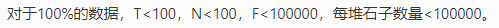

[TOC]

> 开局一个 Markdown，内容全靠编。——Orange

# 公平组合游戏

[参考资料：组合游戏与博弈论 学习笔记，Candy?](https://www.cnblogs.com/candy99/p/6548836.html)

## 基本概念

##### 1. 公平组合游戏

&emsp;&emsp;若一个游戏满足：

1. 由两名玩家交替行动。
2. 在游戏进程的任意时刻，可以执行的合法行动与轮到哪名玩家无关。
3. 不能行动的玩家判负。

则称该游戏为一个*公平组合游戏（ICG）*。

##### 2. 基本概念

&emsp;&emsp;我们把公平组合游戏（以下简称游戏）过程中面临的状态叫做*局面*（也可以就叫状态）。整局游戏第一个行动的称为*先手*，第二个行动的称为*后手*。

&emsp;&emsp;若在某一局面下无论采取何种行动，都会输掉游戏，则称该局面*必败*。所谓*采取最优策略*是指，若在某一局面下存在某种行动，使得行动后对手面临必败局面，则优先采取该行动，同时，这种局面被称为*必胜*局面。

&emsp;&emsp;我们讨论的博弈问题一般只考虑理想情况，即两人始终采取最优策略（也称*两人绝顶聪明*）时的结果。游戏没有平局，只有*先手必胜*和*后手必胜*两种情况。[^situation]

[^situation]: 如果可以执行的合法行动与轮到哪名玩家有关（不是 ICG），那么会有四种情况：先手必胜，后手必胜，A 必胜，B 必胜。

##### 3. 模型抽象

&emsp;&emsp;游戏可以抽象成一个 DAG，一个状态是一个点，一个决策是一条边，终止状态出度为 $0$。

&emsp;&emsp;一个状态是必胜的，当且仅当它的后继状态（用一条边直接相连的状态）存在一个必败态；一个状态时必败的，当且仅当它的后继状态不存在必败态。

##### 4. 有向图游戏

&emsp;&emsp;给定一个有向无环图，图中有一个唯一的起点，在起点上放有一个棋子。两名玩家交替地把这枚棋子沿有向边进行移动，每次可以移动一步，无法移动者算输。这个游戏被称为*有向图游戏*。

&emsp;&emsp;不难发现，任何一个公平组合游戏都可以转化为有向图游戏，只需要将游戏抽象成一个 DAG 即可。

## 从 Nim 游戏到有向图游戏的和

##### 1. Nim 游戏

&emsp;&emsp;给定 $n$ 堆物品，第 $i$ 堆物品有 $a_i$ 个。两名玩家轮流行动，每次可以任选一堆，取走任意多个物品，可把一堆取光，但不能不取。取走最后一件物品者获胜。两人都采取最优策略，问先手能否必胜。

###### 将 Nim 游戏转换成有向图游戏

&emsp;&emsp;我们定义状态为 $(a_1, a_2, \cdots, a_n)$，向所有满足 $\forall a'_i \le a_i$ 且恰好有一个值不同的状态连边，则 Nim 游戏被转换成了有向图游戏。

&emsp;&emsp;遗憾的是，这个转换并不能帮助我们解决 Nim 游戏，因为状态的数量是惊人的，转移的数量更多。所以需要更好的方法解决 Nim 游戏。

###### Bouton 定理

&emsp;&emsp;Nim 游戏先手必胜，当且仅当：
$$
a_1 \oplus a_2 \oplus \cdots \oplus a_n \ne 0
$$

> 证明
>
> &emsp;&emsp;所有物品被取光是一个必败局面（对手取走最后一个物品，已经获得胜利），此时显然有：
> $$
> a_1 \oplus a_2 \oplus \cdots \oplus a_n = 0
> $$
> &emsp;&emsp;对于任意一个局面，如果 $a_1 \oplus a_2 \oplus \cdots \oplus a_n = x \ne 0$，那么至少存在一堆石子 $a_i$，使得它的最高位与 $x$ 的最高位相同。我们在 $a_i$ 堆中取走若干式子，使其变为 $a_i \oplus x$，显然有 $a_i > a_i \oplus x$，所以操作一定合法。这样我们就得到了一个异或和为 $0$ 的局面。
>
> &emsp;&emsp;如果当前局面异或和为 $0$，那么无论怎么取，新局面的异或和都不会为 $0$。综上，异或和不为 $0$ 的局面为必胜局面，异或和为 $0$ 的局面为必败局面。
>
> &emsp;&emsp;证毕。

##### 2. SG 函数

&emsp;&emsp;在有向图游戏中，对于每个结点 $x$，设从 $x$ 出发共有 $k$ 条有向边，分别到达结点 $y_1, y_2, \cdots, y_k$。我们定义 $\mathrm{SG}(x)$ 为 $x$ 的后继结点 $y_1, y_2, \cdots, y_k$ 的 SG 函数值构成的集合再执行 mex 运算的结果：
$$
\mathrm{SG}(x) = \mathrm{mex}(\{ \mathrm{SG}(y_1), \mathrm{SG}(y_2), \cdots, \mathrm{SG}(y_k) \})
$$
###### mex 运算

&emsp;&emsp;设 $S$ 表示一个非负整数集合。定义 $\mathrm{mex}(S)$ 为不属于集合 $S$ 的最小非负整数，即：
$$
\mathrm{mex}(S) = \min_{x \in \mathbb N, x \not \in S} \{ x \}
$$

------

&emsp;&emsp;根据定义，SG 函数的定义域和陪域均在 $\mathbb N$ 中。对于一个没有后继结点的状态，根据 mex 运算的定义，这些状态的 SG 函数值为 $0$。

###### SG 函数的性质

&emsp;&emsp;若一个结点的 SG 函数值为 $x$，那么它可以转移到另一个状态，且下一个状态的 SG 函数值在 $[0, x)$ 的范围内均可取到。

##### 3. SG 定理

&emsp;&emsp;**有向图游戏的某个局面必胜，当且仅当该局面对应结点的 SG 函数值大于 $0$。**

&emsp;&emsp;**有向图游戏的某个局面必败，当且仅当该局面对应结点的 SG 函数值等于 $0$。**

> 证明
>
> &emsp;&emsp;在一个没有出边的结点上，棋子不能移动，它的 SG 值为 $0$，对应必败局面。
>
> &emsp;&emsp;若一个结点的某个后继结点的 SG 值为 $0$，则在 mex 运算后，该结点的 SG 值大于 $0$。这等价于，若一个局面的后继局面中存在必败局面，则当前局面为必胜局面。
>
> &emsp;&emsp;若一个结点的后继结点 SG 值均不为 $0$，则在 mex 运算后，该结点的 SG 值为 $0$。这等价于，若一个局面的后继局面全部为必胜局面，则当前局面为必败局面。

##### 4. 有向图游戏的和

&emsp;&emsp;我们已经有了针对单个有向图游戏的解法，即利用 SG 定理进行转移。那如果有多个有向图游戏同时进行呢？

&emsp;&emsp;设 $G_1, G_2, \cdots, G_m$ 是 $m$ 个有向图游戏。定义有向图游戏 $G$，它的行动规则是任选某个有向图游戏 $G_i$，并在 $G_i$ 上行动一步。$G$ 被称为有向图游戏 $G_1, G_2, \cdots, G_m$ 的和。

&emsp;&emsp;我们定义有向图游戏的和的 SG 函数值等于它包含的各个子游戏 SG 函数值的异或和，即：
$$
\mathrm{SG}(G) = \mathrm{SG}(G_1) \oplus \mathrm{SG}(G_2) \oplus \cdots \oplus \mathrm{SG}(G_m)
$$
&emsp;&emsp;这个 SG 函数值同样满足 SG 定理。

> 证明
>
> &emsp;&emsp;考虑 SG 函数的性质，可以将 SG 函数的转移看作取石子，则这实际上是一个 Nim 游戏。我们用类似于解决 Nim 游戏的方法去证明它即可。详细的证明过程略。

## 应用

##### 1. e.g. [游戏]()

题目大意：有四堆式子，用 $a, b, c, d$ 四个数表示，A 和 B 轮流操作，A 先手。有如下五种操作：

1. `a -= 2`，`b--`，`d -= 2`
2. `a--`，`b--`，`c--`，`d--`
3. `c -= 2`，`d--`
4. `b -= 3`
5. `a--`，`d--`

&emsp;&emsp;不能操作时判负。给定 $a, b, c, d \pod {a, b, c, d \le 60}$，求出胜者。

------

&emsp;&emsp;首先需要注意 ICG 的概念，是不能操作的人判负，所以这个游戏是一个 ICG。

&emsp;&emsp;由于数据规模小，操作也不具规律，因此直接把它看作有向图游戏，用动态规划求解即可，不需要使用 SG 定理。（所以这是一道普及组难度的题，但是它的核心不是动态规划，而是公平组合游戏）

```c++
int f[maxn][maxn][maxn][maxn];
bool DP(int a, int b, int c, int d) // 返回先手必胜
{
	int& ans = f[a][b][c][d];
	if (ans != -1) return ans;
	ans = false;
	if (!ans && a - 2 >= 0 && b && d - 2 >= 0)
		ans |= !DP(a - 2, b - 1, c, d - 2);
	if (!ans && a && b && c && d)
		ans |= !DP(a - 1, b - 1, c - 1, d - 1);
	if (!ans && c - 2 >= 0 && d)
		ans |= !DP(a, b, c - 2, d - 1);
	if (!ans && b - 3 >= 0)
		ans |= !DP(a, b - 3, c, d);
	if (!ans && a && d)
		ans |= !DP(a - 1, b, c, d - 1);
	return ans;
}
```

##### 2. e.g. [POJ 2311 Cutting Game](http://poj.org/problem?id=2311)

题目大意：给定一张 $n \times m$ 的网格纸，两名玩家轮流行动。在每一次行动中，可以任选一张矩形网格纸，沿着某一行或者某一列的格线，把它剪成两部分，首先剪出 $1 \times 1$ 的玩家获胜。假设两名玩家绝顶聪明，求先手是否必胜。$n, m \le 200$。

------

&emsp;&emsp;再次注意 ICG 的概念，是不能操作的人判负，但是这个题是不能操作的人判胜，所以就此看来，这个游戏并不是一个 ICG。

&emsp;&emsp;但事实上**我们可以对胜负判定进行转换**。由于剪出 $1 \times 1$ 算作胜利，所以 $1 \times X$ 和 $X \times 1$ 是必胜态。但是这仍然不符合我们对 ICG 的定义，怎么办呢？

&emsp;&emsp;我们发现，当网格纸的大小为 $2 \times X$ 和 $X \times 2$（$X \ge 2$）时，无论怎么剪我们都会剪出一个 $1 \times X$ 或者 $X \times 1$ 的网格纸，也就是说 $2 \times X$ 和 $X \times 2$ 是必败态。**既然那两个人绝顶聪明，那么在不必要的情况下他们一定不会剪出一条长为 $1$ 或者宽为 $1$ 的网格纸，所以我们强制让网格纸的长宽至少为 $2$，则原问题被转换为了 ICG 问题。**

&emsp;&emsp;接下来我们考虑如何进行转移。由于我们拿到了两张新的网格纸，因此我们得到了两个游戏。我们直接将问题看作有向图游戏的和即可。因此这道题只能保存 SG 函数，转移时要用到 mex 运算。

```c++
int SG[maxn][maxn];
int DP(int w, int h)
{
	int& ans = SG[w][h];
	if (ans != -1) return ans;
	bool vis[maxn] = {};
	for (int i = 2; w - i >= 2; i++)
		vis[DP(i, h) ^ DP(w - i, h)] = true;
	for (int i = 2; h - i >= 2; i++)
		vis[DP(w, i) ^ DP(w, h - i)] = true;
	for (int i = 0; i < maxn; i++)
		if (!vis[i]) return ans = i;
}
```

##### 3. 选做 [Luogu 3235 [HNOI 2014] 江南乐](https://www.luogu.org/problemnew/show/P3235)

题目大意：有 $n \pod{n \le 100}$ 堆石子，每堆石子有 $a_i \pod {a_i \le 10^5}$ 个。每次操作可以把某一个不少于 $F$ 个的石子堆分成 $2 \le m \le a_i$ 份，并且尽量均分，即最多的石子堆和最少的最多相差 $1$。不能操作者输，求是否先手必胜。有 $100$ 组数据。

------

&emsp;&emsp;首先，题目一开始给定的石子是互相独立的，因此我们可以把它们看作有向图游戏的和。设 $f_i$ 表示一堆有 $i$ 个石子的 SG 函数，我们现在的任务是求出它就好了。

&emsp;&emsp;当 $i < F$ 时，$f_i = 0$；当 $i \ge F$ 时，我们有 $O(i)$ 种显然的决策。所以我们马上就能得到一个 $O(n^2)$ 的做法，~~得到 0 分~~。



<center>就是不给你部分分你能把我咋地</center>

------

&emsp;&emsp;我们可以比较容易地写出一个暴力程序（伪代码）：

```c++
for (int i = 2; i <= x; i++)
{
	int Div = x / i;
	int Mod = x - Div * i;
	vis[(((i - Mod) & 1) ? DP(Div) : 0) ^ ((Mod & 1) ? DP(Div + 1) : 0)] = true;
}
```

&emsp;&emsp;首先我们可以知道，`Div` 的取值只有 $O(\sqrt n)$ 种，而下面的式子的计算又只跟 `i - Mod` 以及 `Mod` 的奇偶性有关，我们能不能用数论分块的方法把它解决掉呢？

&emsp;&emsp;答案是肯定的，我们观察一下带余除法：
$$
x \div i = d \cdots\cdots m
$$
&emsp;&emsp;即：
$$
x = di + m
$$
&emsp;&emsp;对于 $d$ 相同的情况，当 $i + 1$ 时，$m$ 会减少 $d$；当 $i + 2$ 时，$m$ 会减少 $2d$，注意这时 $i$ 和 $m$ 的奇偶性相比一开始都没有发生改变，继续增加 $i$ 也不会有新的奇偶性了，所以我们只需要看 $i$ 和 $i + 1$ 就好了。

###### 参考代码

&emsp;&emsp;（对于 `x < F` 的情况我先预处理过了）

```c++
int SG[maxn];
int DP(int x)
{
	int& ans = SG[x];
	if (~ans) return ans;
	std::set<int> mex;
	for (int i = 2, t; i <= x; i = t + 1)
	{
		t = x / (x / i);
		
		int Div = x / i;
		int Mod = x - Div * i;
		mex.insert((((i - Mod) & 1) ? DP(Div) : 0) ^ ((Mod & 1) ? DP(Div + 1) : 0));

		if (t != i)
		{
			i++;
			Mod -= Div;
			mex.insert((((i - Mod) & 1) ? DP(Div) : 0) ^ ((Mod & 1) ? DP(Div + 1) : 0));
		}
	}
	for (std::set<int>::iterator it = mex.begin(); it != mex.end(); it++, ans++)
		if (ans + 1 != *it)
			break;
	return ans += 1;
}
```

&emsp;&emsp;注意上面的代码中使用了集合而非数组，是因为集合大小最多为 $O(\sqrt n)$，而数组却必须开到 $i$ 这么大，这在递归求解时是很致命的，而且清空数组的时间复杂度就已经是 $O(n^2)$ 了，所以我们不能用数组。以上代码的时间复杂度为 $O(n \sqrt n \log n)$，实际表现受 $F$ 等因素的影响要优许多。

&emsp;&emsp;我们还可以做得更好。我们只开一个 `mex` 数组来求 mex 函数值，利用时间戳的技巧，我们不用清空这个数组。需要注意的是，必须先去把需要的状态全部计算出来后才能在 `mex` 数组中打标记，否则打好的标记可能会被覆盖。

```c++
int mex[maxn];
int SG[maxn];
int DP(int x)
{
	int& ans = SG[x];
	if (~ans) return ans;
	for (register int i = 2, t; i <= x; i = t + 1)
	{
		t = x / (x / i);

		int Div = x / i;
		int Mod = x - Div * i;
		DP(Div);
		if (t != i) DP(Div + 1);
	}
	for (register int i = 2, t; i <= x; i = t + 1)
	{
		t = x / (x / i);

		int Div = x / i;
		int Mod = x - Div * i;
		mex[(((i - Mod) & 1) ? DP(Div) : 0) ^ ((Mod & 1) ? DP(Div + 1) : 0)] = x;

		if (t != i)
		{
			i++;
			Mod -= Div;
			mex[(((i - Mod) & 1) ? DP(Div) : 0) ^ ((Mod & 1) ? DP(Div + 1) : 0)] = x;
		}
	}
	ans = 0;
	while (mex[ans] == x) ans++;
	return ans;
}
```

&emsp;&emsp;这样我们的时间复杂度就是 $O(n \sqrt n)$ 了。