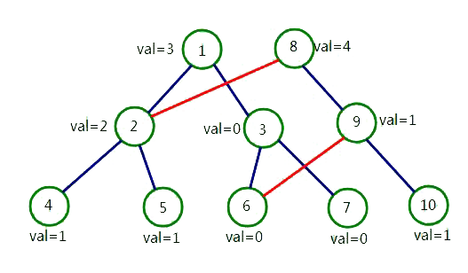

[TOC]

> 开局一个 Markdown，内容全靠编。——Orange

# 可持久化数据结构

## 入门[^编的]

[^编的]: 这里的内容都是我乱编的，请跳过。

##### 1. 版本

&emsp;&emsp;我们有一个 ADT，称某一时刻该 ADT 的状态为它的一个*版本（version）*。例如，对于一个数组来说，一开始它的所有元素全部都是 $0$，这就是它的一个版本；将某一个位置改为了 $1$，它就变成了一个某一位置为 $1$，其它位置为 $0$ 的数组，这又是它的另外一个版本。

&emsp;&emsp;我们称一个 ADT 当前的版本为*最新版本（latest version）*，称其它版本为*历史版本*。显然，对于数组来说，我们始终都只能在它的最新版本进行操作。如果稍微思考一下，你就会惊奇地发现：许多数据结构都只能在最新版本进行操作。例如线段树，当你修改了一个区间后，你就不能再知道修改前的状态了。

##### 2. 可持久化数据结构

&emsp;&emsp;什么是可持久化数据结构呢？一般地，对于一个 ADT，如果我们能够访问到它的历史版本，我们就称它为*可持久化数据结构*，又称*函数式数据结构*。

&emsp;&emsp;最简单的可持久化数据结构是什么？我觉得应该是可持久化栈。如何实现入栈操作呢？我们新建一个结点，并且令新的结点的上一个结点为当前结点，再令当前结点为新建结点。如何实现出栈操作呢？我们只需要令当前结点为当前结点的上一个结点即可。不难发现，这是一个树形结构，也就是说我们用一棵树就实现了可持久化栈。

&emsp;&emsp;上面的描述中，我们称新建的结点为*版本入口（entrance）*，如果需要访问一个历史版本，我们都必须从版本入口开始访问。换句话说，**可持久化数据结构必须保存所有（需要的）版本的版本入口，而一个版本的具体内容则取决于我们的内部实现**。

&emsp;&emsp;我们称新建版本的过程为*克隆（clone）*。对于可持久化栈来说，我们可以发现，**我们不仅可以从最新版本克隆，还可以从任意一个进行克隆**。特别地，对于可持久化栈，如果我们只需要执行“出栈 $x$ 次后入栈一个元素 $y$”这样的操作，**我们甚至可以不保存出栈产生的新版本的版本入口，直接从一个没有版本入口的版本进行克隆**。像这样，可以（几乎）任意进行克隆的可持久化数据结构，我们称它为*完全可持久化的*。相应的，如果一个可持久化数据结构只能从最新版本进行克隆（或者只有这样克隆才能保证复杂度），但是可以访问所有版本，我们称它为*部分可持久化的*。

&emsp;&emsp;一般地，ADT 都有一个初始状态，我们称它为初始*版本（original version）*。例如，栈的初始版本就是一个空栈。

##### 3. 可持久化数据结构的一些特征

&emsp;&emsp;可持久化的目的是访问历史版本，但是我们还不知道其它可持久化数据结构的具体实现。那些神秘莫测的数据结构的目的是什么呢？很大部分上是为了**节省空间和时间**。试想，如果有一台运算能力无限，内存无限的计算机，我们完全可以选择拷贝整个栈的数据来实现可持久化栈，但是这明显是很 naive 的。

&emsp;&emsp;可持久化数据结构的另一个特征是**不可删除历史版本**（但是可以放弃保存部分历史版本的版本入口），因为一个克隆的版本可能需要所有历史版本的信息才能组合成一个完整的版本。但理论上，可以通过高深的方法删除历史版本（比如删除可持久化栈不再需要的结点：这并不是难事），但是在比赛时不如直接放弃历史版本的版本入口。

&emsp;&emsp;由于只能从已有的版本进行克隆，所以**克隆操作的版本依赖关系一定呈树形结构，且叶结点为最新版本**。这里并不是说一个克隆的版本只需要之前某一个版本的数据，而是说在逻辑上一个克隆的版本只会有唯一的一个“上一个状态”。这给我们提供了一个新的解题思路：**如果题目不要求强制在线，可以先建立出依赖关系的树，每个结点代表一个逻辑上的版本，然后在树上 DFS。当进入一个结点时，就进行修改操作；当退出一个结点时，就进行还原操作。只需要知道查询是对哪个版本进行查询，我们就在那个版本更新查询的答案。**不过，这么做的前提是还原操作可以顺利完成，例如并查集就难以进行还原操作。换句话说，**可持久化的另一个目的是将以前只能离线的问题用在线方法解决**。

##### 4. 一个理解可持久化的例子

&emsp;&emsp;如果你用 Git，应该很容易理解可持久化。在学习可持久化时，我经常称 Git 为“可持久化网盘”。它的 commit 操作相当于是在最新版本处进行克隆；它的 revert 操作相当于从一个历史版本进行克隆；而 reset 操作相当于放弃了一个历史版本之后的所有版本入口（内部可能也删除了相应的版本）。

## 常见可持久化数据结构

### 可持久化线段树

&emsp;&emsp;由于之前已经提及了全部的概念，因此之后不再赘述某种可持久化数据结构的概念。

##### 1. 实现

&emsp;&emsp;由于线段树的一次修改至多只会改变 $O(\log n)$ 个结点，因此我们把对应区间包含了被修改位置的结点进行新建，否则我们直接引用之前的结点。



<center>

在网上随便找的一张图

</center>

&emsp;&emsp;这样，**单点修改**或单次查询的时间复杂度均为 $O(\log n)$，空间复杂度为 $O(m \log n)$。[^空间]

[^空间]: 注意这里是复杂度，而不是只需要乘上一个 $\log$。实践时往往要乘上两个 $\log$。

&emsp;&emsp;我们只需要保存新建的根结点作为版本入口即可。

##### 2. 注意事项

&emsp;&emsp;需要注意的是，**可持久化线段树的范围必须提前确定**，这意味着在某些情况下你需要对询问离线。

&emsp;&emsp;为了减少分配内存的时间，可以使用内存池。

&emsp;&emsp;另外，可持久化线段树对区间操作不友好，因为一次区间操作可能影响所有结点，所以它一般只支持单点修改。

##### 3. e.g. [JZOJ 5333 大新闻](https://jzoj.net/senior/#main/show/5333)

题目大意：一开始有一个空的序列 $\{ a \}$，每次可以在序列的首端删除或者插入一个元素，或者查询区间 $[l, r]$ 中的第 $k$ 大元素。$n \le 2 \times 10^5$。

------

&emsp;&emsp;首先将问题进行转换：将整个序列反转一下，则每次插入就是在尾端进行插入了。

&emsp;&emsp;先排除在尾端的操作，我们看看如何解决区间查询第 $k$ 小的问题。对于数据规模较小的问题（$n \le 5 \times 10^4$），可以用分块做（对每个块进行排序，二分答案，时间复杂度 $O(n \sqrt n \log^2 \sqrt n)$）。但是这个问题的数据规模较大，而且没有修改。有没有更好的方法呢？

&emsp;&emsp;解决方法便是使用*可持久化权值线段树*。我们可以二分一个答案，然后看有多少个数比它小。如果我们每次都只查询 $a_1 \sim a_n$ 的第 $k$ 小，问题还是比较简单的，只需要维护 $a_1 \sim a_n$ 的权值线段树，看看比答案小的个数就可以了。现在要询问 $a_l \sim a_r$，我们可以统计 $a_1 \sim a_r$ 中比答案小的个数和 $a_1 \sim a_{l - 1}$ 中比答案小的个数，相减后就知道了 $a_l \sim a_r$ 中比答案小的个数了。

&emsp;&emsp;也就是说，我们需要维护的是 $a_1 \sim a_i$ 的权值线段树。很明显可以使用可持久化线段树，因为 $a_1 \sim a_i$ 对应的线段树可以从 $a_1 \sim a_{i - 1}$ 克隆而来，且只需要一次线段树上的单点修改。具体实现时，我们不必二分答案，而是直接在线段树上走，类似于名次树选择左右子树的方法。这样走到叶结点时我们就相当于得到了答案权值，时间复杂度为 $O(n \log maxval)$。

&emsp;&emsp;像这样，利用可持久化线段树解决静态区间 $k$ 大值的问题的数据结构，我们常称之为*主席树*。

------

&emsp;&emsp;那么这个题看上去是有修改的，应该怎么办呢？事实上，由于每次只会增加或者删除队尾元素，因此**每次修改只会影响最新版本，不会影响历史版本**。增加时，我们直接从最新版本克隆；删除时，我们直接抛弃最新版本的版本入口即可，空间复杂度还是 $O(m \log max)$。

###### 参考代码

```c++
class FuncSegTre
{
	struct Node
	{
		int sum;
		Node* ch[2];
		Node() : sum() {}
	};
	Node *null;
	Node *version[maxn * 2];

	static const int min = 1;
	static const int max = int(1e9);
	int size;

	int g_Pos;
	void alloc(Node* &node)
	{
		if (node == null)
		{
			node = new Node;
			node->ch[0] = node->ch[1] = null;
		}
	}

	void add(Node* &node, int l, int r, Node* source) // note Node* &
	{
		if (!(l <= g_Pos && g_Pos <= r))
		{
			node = source; // link to the previous version
			return;
		}
		alloc(node);
		if (l == r)
		{
			node->sum = source->sum + 1; // note
			return;
		}
		int mid = (l + r) >> 1;
		add(node->ch[0], l, mid, source->ch[0]);
		add(node->ch[1], mid + 1, r, source->ch[1]);
		node->sum = node->ch[0]->sum + node->ch[1]->sum;
	}

	int query(Node* ltree, Node* rtree, int l, int r, int k) // node Node*
	{
		while (l != r)
		{
			int mid = (l + r) >> 1;
			if (rtree->ch[0]->sum - ltree->ch[0]->sum < k)
			{
				k -= rtree->ch[0]->sum - ltree->ch[0]->sum;
				ltree = ltree->ch[1];
				rtree = rtree->ch[1];
				l = mid + 1;
			}
			else
			{
				ltree = ltree->ch[0];
				rtree = rtree->ch[0];
				r = mid;
			}
		}
		return l;
	}

public:
	FuncSegTre() : size()
	{
		null = new Node;
		null->ch[0] = null->ch[1] = null;
		version[0] = null; // original version
	}
	inline void change_range(int& l, int& r)
	{
		int t = l;
		l = size - r + 1;
		r = size - t + 1;
	}
	void push_back(int x)
	{
		size++;
		version[size] = null;
		g_Pos = x;
		add(version[size], min, max, version[size - 1]); // clone from the latest version
	}
	void pop_back()
	{
		size--; // abandon the entrance
	}
	int query(int l, int r, int k)
	{
		return query(version[l - 1], version[r], min, max, k);
	}
} st;
```

&emsp;&emsp;虽然不使用内存池让你无缘 rank 1，但是这么写很稳啊！在题目不卡常的情况下（卡常是要遭 wys 谴责的），不使用内存池是肯定可以过的（开了快个两三百毫秒，取决于题目）。想要更快还可以离线询问，把值域范围求出来，但是在最坏情况下还是这么慢。

&emsp;&emsp;需要注意的是，**修改叶结点时需要用到来源结点的数据，因为被修改的结点一定是新建的，而它之前可能有数据**。另外，注意 version 的范围，题目并没有说保证序列里最多只有 $n$ 个数，所以最坏情况下会有 $n + m$ 个数。

&emsp;&emsp;还需要提醒一下，这个东西不要背板，弄懂就行了，毕竟线段树灵活多变，每道题的线段树写出来都是不一样的，不如深刻理解，现场发挥，一次 AK。

### 可持久化数组

##### 1. 实现

&emsp;&emsp;使用可持久化线段树即可，单点修改时空复杂度 $O(\log n)$，单点查询时间复杂度 $O(\log n)$。

##### 2. 注意事项

&emsp;&emsp;往往，数组会有一个初值，如果我们每次都为初值新建一个版本，我们的空间会爆掉，因为这样会产生很多的空结点。正确的做法是像一般的线段树一样写一个 `build` 函数。

##### 3. e.g. [Luogu 3919 可持久化数组](https://www.luogu.org/problemnew/show/P3919)

###### 参考代码（部分）

```c++
	void build(Node* &node, int l, int r)
	{
		alloc(node);
		if (l == r)
		{
			node->num = a[l];
			return;
		}
		int mid = (l + r) >> 1;
		build(node->ch[0], l, mid);
		build(node->ch[1], mid + 1, r);
	}
public:
	FuncSegTree()
	{
		null = new Node;
		null->ch[0] = null->ch[1] = null;
		version[0] = null;
	}
	void build()
	{
		build(version[0], 1, n);
	}
```
### 可持久化并查集

##### 1. 实现

&emsp;&emsp;由于并查集基于数组，因此使用可持久化数组即可。

##### 2. 路径压缩与按秩合并

&emsp;&emsp;可以证明，只使用路径压缩的并查集的时间复杂度是**均摊** $O(n \log n)$ 的。**对于一个时间复杂度为均摊时间复杂度的数据结构，我们不能对其完全可持久化，最多只能对其部分可持久化。**这很好理解：由于是均摊时间复杂度，其中的某一个操作的时间可能会很长。如果每次从那个状态进行克隆，时间和空间都将无法承受。

&emsp;&emsp;对于可持久化并查集，解决方法是使用*按秩合并的并查集*。什么叫做按秩合并呢（相信大家以前都只写过路径压缩）？对于并查集而言，*秩（rank）*可以是它的某一棵树的高度，也可以是它的某一棵树的大小。**按秩合并就是指按照树的高度或者大小进行启发式合并。**可以证明按秩合并的**最坏**时间复杂度为 $O(\log n)$，因此基于按秩合并和可持久化线段树的可持久化并查集的时间复杂度为 $O(n \log^2 n)$。

##### 3. e.g. [Luogu 3402 可持久化并查集](https://www.luogu.org/problemnew/show/P3402)

&emsp;&emsp;依然需要一开始使用 `build` 函数建树。其它的没什么好说的了，只需要注意按秩合并。

###### 参考代码（部分）

```c++
void modify(int pos, Node::Data val) // 直接在最新版本修改，并且覆盖版本入口
{
	Node* entrance = version[size];
	version[size] = null;
	g_Pos = pos;
	g_Val = val;
	modify(version[size], 1, n, entrance);
}
```

```c++
void unite(int x, int y)
{
	Node::Data px = find(x);
	Node::Data py = find(y);
	if (px.rank == py.rank)
	{
		int pos = px.parent;
		px.parent = py.parent;
		py.rank++;
		modify(pos, px);
		modify(py.parent, py);
	}
	else if (px.rank < py.rank)
	{
		int pos = px.parent;
		px.parent = py.parent;
		modify(pos, px);
	}
	else
	{
		int pos = py.parent;
		py.parent = px.parent;
		modify(pos, py);
	}
}
```