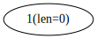
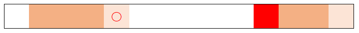
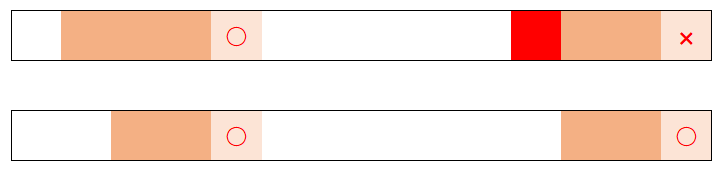

[TOC]

> 开局一个 Markdown，内容全靠编。——Orange

# 后缀自动机

## 有限状态自动机（Finite State Automaton，FSA）

&emsp;&emsp;有限状态自动机的功能就是识别字符串：

```c++
class FSA
{
private:
	// ...
public:
	bool operator()(const std::string& str)
	{
		if (this->recognize(str)) return true;
		else return false;
	}
} fsa;
```

&emsp;&emsp;FSA 由五个部分组成：

1. 字符集 $\alpha$
2. 状态集合 $\{ state \}$
3. 初始状态 $init$
4. 结束状态集合 $\{ end \}$
5. 状态转移函数 $\mathrm{trans}(state, str)$[^str]

[^str]: 在这里字符也看作字符串。

&emsp;&emsp;我们规定，如果 $\mathrm{trans}(state, str)$ 这个转移不存在，记作 $\mathrm{trans}(state, str) = \mathrm{null}$，并且 $\mathrm{trans}(\mathrm{null}, \forall str) = \mathrm{null}$。

------

&emsp;&emsp;自动机是做了一个怎样的事情呢？

```c++
bool FSA::recognize(const std::string& x)
{
	this->state = this->init;
	for (char ch : x)
		this->state = this->trans(this->state, ch);
	return this->isInEnd(this->state);
}
```

&emsp;&emsp;也就是说，自动机能识别的字符串就是所有使得 $\mathrm{trans}(init, x) \in end$ 的字符串 $x$；从状态 $s$ 开始能够识别的字符串，就是所有使得 $\mathrm{trans}(s, x) \in end$ 的字符串 $x$。我们记从状态 $s$ 开始**能够识别**的字符串集合为 $\mathrm{Reg}(s)$。

## 后缀自动机（Suffix Automaton，SAM）

> 先膜一下 Samjia 师傅。

&emsp;&emsp;字符串 $s$ 的后缀自动机 $\mathrm{SAM}_s$ 是一个能够识别 $s$ 的所有后缀的自动机。即当且仅当 $x$ 是 $s$ 的后缀时， $\mathrm{SAM}_s(x) = true$。但实际上，我们不仅可以使用 SAM 来识别 $s$ 的后缀，还能用来识别 $s$ 所有的子串。

##### 1. 砸锅卖铁，就写了个 Trie

&emsp;&emsp;你只会 Trie（会其它高级数据结构的请走开），但你很想要一个 SAM 作为 TA 的礼物，于是你决定动手写一个。**你发现 Trie 也能够实现后缀自动机**，只需要把所有的后缀插入一棵 Trie 即可。只不过对于长度为 $n$ 的串，**你需要建 $O(n^2)$ 个结点**，于是你就成了吃土少年……

##### 2. 正经的 SAM——最简状态后缀自动机

&emsp;&emsp;上面那个悲伤的故事发生在一个没知识没文化的吃土少年身上。如果你不想成为吃土少年，请做好心理准备……

------

&emsp;&emsp;我们先来看看吃土少年的“后缀自动机”：


&emsp;&emsp;以字符串“abbb”为例，这棵后缀 Trie 重复了很多结点。如果使用的字符更多，那么重复的结点也会更多。

------

&emsp;&emsp;我们再来看看正宗的 SAM 的样子：


&emsp;&emsp;有区别吗……我们再来看一个：


&emsp;&emsp;虽然字符串“aabbabd”的长度为 7，但是它的 SAM 只有 9 个结点（不包括根结点），边数也远远不及 7 的平方。像这样，**通过压缩状态来减少状态数，达到状态数最小的后缀自动机，我们称它为最小状态自动机。**下面我们简称最小状态后缀自动机为后缀自动机（SAM）。

##### 3. 线性时间构造后缀自动机的算法

&emsp;&emsp;接下来的内容参考了[远方的论文](http://e-maxx.ru/algo/suffix_automata)及其[中文翻译](http://blog.csdn.net/qq_35649707/article/details/66473069)，部分定义与其有出入。

###### ①right 集合

&emsp;&emsp;设原串为 $S$。对于一个 $S$ 中的子串 $s$，它很有可能出现了不止一次：


&emsp;&emsp;设 $s$ 出现的位置为 $\{ [l_i, r_i] \} \pod{i \in [1, k]}$，我们称 $\{ r_i \}$ 为子串 $s$ 在母串中的 *$right$ 集合*，记作 $right_s$。下图中打上红圈的位置便是深色位置对应的子串的 $right$ 集合：


&emsp;&emsp;很有可能会发生这样的情况，对于同一个母串，有多个子串的 $right$ 集合相同：


&emsp;&emsp;我们称 *$right$ 集合*相同的串属于同一个*等价类*，记作 $R(s)$，表示子串 $s$ 所属的等价类。规定 $right_{R(s)}$ 表示子串 $s$ 所属的等价类的元素的 $right$ 集合，其表示的集合与 $right_s$ 相同。

&emsp;&emsp;约定记 $aRb$ 表示子串 $a$，$b$ 属于同一个等价类。

&emsp;&emsp;需要注意的是，$right$ 集合是一个数的集合，但我们实际上可以使用这些数表示原串的后缀。

&emsp;&emsp;事实上，**对于在同一等价类的字符串保持了相同的性质**。换句话说，**SAM 中状态数等于所有子串的等价类个数**。为什么呢？因为对于同一个等价类中的子串，接下来**能够识别（recognize）**的字符串是相同的。

------

&emsp;&emsp;引理 1：两个非空子串 $a$ 和 $b$，不妨设 $a$ 比 $b$ 短。$aRb$ 成立，当且仅当 $a$ 是 $b$ 的后缀。

> 证明：
>
> &emsp;&emsp;（对比下上面的图感性理解下就好了，注意这是 $aRb$ 的**必要**条件。）其实根据定义来就好了：$a$ 是 $b$ 的后缀，那么**以 $b$ 的后缀的形式出现**的 $a$ 的右端点与 $b$ 的右端点是相同的。 

------

&emsp;&emsp;引理 2：两个非空子串 $a$ 和 $b$，不妨设 $a$ 比 $b$ 短。那么有：
$$
\left\{
\begin{matrix}
right_b \subseteq right_a & a \in suf_b
\\
right_b \cap right_a = \emptyset & \mathrm{otherwise}
\end{matrix}
\right.
$$
&emsp;&emsp;其中 $suf_b$ 表示子串 $b$ 的后缀的**集合**。引理 2 的意思是：子串 $a$，$b$ 的 $right$ 集合要么不相交，要么长的子串 $b$ 的 $right$ 集合是短的子串 $a$ 的 $right$ 集合的子集。

>证明：
>
>&emsp;&emsp;感性地理解，当 $a$ 是 $b$ 的后缀时，易知 $right_b \subseteq right_a$，即长的 $right$ 至少和短的 $right$ 是一样的，因为长的子串的后缀一定是短的子串。再感性理解下，越短，在原串中出现的可能性就越大，$right$ 集合就可能越大，即短的子串不一定作为那个长的子串的后缀，所以长的 $right$ 应该包含于短的 $right$。
>
>&emsp;&emsp;当 $a$ 不是 $b$ 的后缀时，结论显然：
>
>
>
>&emsp;&emsp;对于 $right_b$ 集合中的位置，由于 $a$ 不是 $b$ 的后缀，这些位置一定不属于 $right_a$。

------

&emsp;&emsp;引理 3：考虑某个等价类。这个等价类所有原来的子串的长度一定是一个公差为 1 的等差数列，且短的子串一定为长的子串的后缀。即：设这个等价类的原子串的最短长度为 $min$，最长长度为 $len$，则这个等价类的所有原子串的长度覆盖了整个 $[min, len]$ 区间。

> 证明：
>
> &emsp;&emsp;如果这个等价类只包含一个子串，那么引理 3 的正确性显然。
>
> &emsp;&emsp;如果不止包含一个子串，那么由于 $[min, len]$ 中所有的子串均为最长子串的后缀，又假设了它们应该在同一个等价类中，由引理 2，引理 3 显然成立。

###### ②后缀链接

&emsp;&emsp;我们知道，对于一个子串 $a$，它所属的等价类 $R(a)$ 有一个最长的子串，令其为 $t$。将 $t$ 的所有后缀按长度从大到小的顺序进行排序，则前几个后缀与 $t$ 在同一等价类中，后面的分别在其它各自的等价类中。

&emsp;&emsp;这里我们假设初始状态 $init$ 代表一个单独的等价类（把 $init$ 看作空字符串），并且规定：
$$
right_{init} = { 0, \cdots, len_s - 1 }
$$
&emsp;&emsp;对于一个等价类 $a$，我们从 $a$  向 $right$ 集是 $a$ 的 $right$ 集的真子集的，且对应的最长子串最长（即 $len$ 最大）的等价类连一条边，称其为*后缀链接*，记作 $link_a$。

------

&emsp;&emsp;引理 4：后缀链接将会形成一棵以 $init$ 为根的树。

> 证明：
>
> &emsp;&emsp;后缀链接从一个子串所属的等价类连向一个更短的后缀所述的等价类，因此最终会连到空串所属的等价类，即 $init$。结合引理 2，最终得到的一定是棵树。

------

&emsp;&emsp;引理 5：如果我们将所有等价类构成一棵树，树上的结点表示等价类的 $right$ 集合；每个结点的父结点为 $right$ 集合包含它的最小等价类，那么这棵树与后缀链接形成的树相同。

> 证明：
>
> &emsp;&emsp;根据等价类的定义，我们有：
> $$
> right_v \subset right_{parent_v}
> $$
> &emsp;&emsp;这和我们使用后缀链接建树的方法是相同的。

------


<center>

左图是 SAM，右图是后缀链接树（或等价类树，$fail$ 树，$parent$ 树，随便你叫什么）

</center>

&emsp;&emsp;应当注意的是，SAM 和后缀链接树的结点集合是相同的，但 SAM 是一个 DAG，后缀链接树是一棵树。

------

&emsp;&emsp;引理 6：对于一个结点 $u$ 和它后缀链接指向的结点 $link_u$，一定有 $min_u + 1 = len_{link_u}$。

> 证明
>
> &emsp;&emsp;感性地理解，考虑为何 $right$ 集合会发生改变，一定是因为子串变短使得相同的串在原串中出现得更多，才让 $right$ 集合更大，而改变的过程一定是某一个字符的增减导致的。

###### ③算法

&emsp;&emsp;我们的算法是在线的：逐个向 $s$ 中加入字符，并且对当前的 SAM 进行维护。我们称这个过程为 *extend*，设新的字符为 $x$。称这样每次插入一个字符的方法为*增量构造*，其基本思路是增加新的后缀到后缀自动机中。

&emsp;&emsp;设原串为 $T$，新串为 $S = Tx$。每次插入新字符时，**新的后缀只可能是以最后一个字符为后缀的子串**。所以我们考虑最后一个字符的插入将会对 SAM 有什么影响。

------

&emsp;&emsp;一开始 SAM 中只有一个空结点：



&emsp;&emsp;我们称正在处理的结点为 $cur$，称上一次 extend 时新增的第一个结点为 $last$（即**代表整个 $T$ 串的所属的等价类的结点**）。特别地，我们令 $0$ 号结点为 $init$ 对应的结点；一开始令 $last$ 等于 $0$。

&emsp;&emsp;对于每一个结点，**我们保存它在 SAM 中的后继结点编号 $c$，它的后缀链接 $link$ 和它对应的等价类的 $len$（即这个等价类的最长子串的长度）**，不保存 $right$ 集合。特别地，$link_0 = -1$（没有意义）。可以发现，**$len_v$ 可以表示从 $init$ 出发到 $v$ 的最长路**。

------

&emsp;&emsp;设原串为 $T$，新的字符为 $x$，新串为 $S = Tx$，我们依次执行以下步骤：

1. 建立一个新的结点，并令其为 $cur$。新的结点满足 $len_{cur} = len_{last} + 1$，$link_{cur}$ 将在稍后计算。


&emsp;&emsp;为什么 $len_{cur} = len_{last} + 1$ 呢？结合 $len$ 在 SAM 中的意义，这样是显然的，因为求的是到新结点的最长路，而 $S = Tx$，可以由 $right$ 集包含 $|T| - 1$ 的结点转移而来（即由 $T$ 对应的等价类的结点转移而来）。

2. 令 $p = last$，如果有 $p.c_x = \mathrm{null}$，即不存在从 $p$ 出发通过 $x$ 到 $cur$ 的转移，那么我们令 $p.c_x = cur$，然后令 $p = link_p$。重复这个过程，直到 $p = -1$ 或者 $p.c_x \ne \mathrm{null}$。如果 $p = -1$（即沿着 $0$ 号结点的 $link$ 跳跃），那么我们令 $link_{cur} = 0$，然后结束这次 extend。


<center>

插入 a

</center>


<center>

插入 b

</center>

&emsp;&emsp;在这个过程中，我们实际上是在寻找 $T$ 的后缀。如果 $T$ 的后缀本身没有到 $x$ 的转移，我们就加上这个转移。


<center>

插入 $x$ 前（后）后缀链接树上连续的三个结点对应的子串（浅色代表新字符，前面没有出现过）

</center>


<center>

插入 $x$ 后 $cur$ 结点对应的等价类的三个子串

</center>

&emsp;&emsp;实际上，如果我们通过这种方式退出了 extend 过程，说明在字符串 $T$ 中从未出现过字符 $x$。

------

&emsp;&emsp;否则，我们停在结点 $p$ 上，且 $p.c_x \ne \mathrm{null}$。接下来分成两种情况考虑：

3. 我们设 $q = p.c_x$（即 $p$ 沿着 $x$ 走的结点）。如果我们有 $len_p + 1 = len_q$，我们直接令 $link_{cur} = q$，然后结束这次 extend。


<center>

插入 a（“aba”）

</center>

&emsp;&emsp;$len_p + 1 = len_q$ 是什么意思呢？


<center>

插入 $x$ 前（后） $p$ 对应的等价类的 $right$ 集合，深色长度为 $len_p$（与之前的图无关）

</center>


<center>

插入 $x$ 前 $q$ 的 $right$ 集合

</center>


<center>

插入 $x$ 后 $q$ 的 $right$ 集合

</center>


<center>

插入 $x$ 后 $cur$ 的 $right$ 集合（对比）

</center>

&emsp;&emsp;仅当满足了 $len_p + 1 = len_q$ 时，才能这样更新。

&emsp;&emsp;为什么可以直接退出这次 extend 了？因为再往上走原等价类的 $right$ 集合**的改变方式都一样了**，即 $right$ 集合中增加一个新的元素 $|S| - 1$。**我们并没有保存 $right$ 集合，而是通过维护别的信息（后缀链接和 $len$）间接维护 $right$ 集合，所以可能看不出到底是哪里发生了改变。**

4. 否则，我们一定有 $len_p + 1 < len_q$：


<center>

插入 $x$  前（后）$p$ 的 $right$ 集合（与之前的图无关）

</center>



<center>

插入 $x$ 前 $q$ 的 $right$ 集合（子串长度为 $len_q > len_p + 1$）

</center>



<center>

插入 $x$ 后 $q$ 的 $right$ 集合：会有两种可能

</center>

&emsp;&emsp;这就产生了新的问题：当 $length_q \le p + 1$ 时[^length]，$q$ 的 $right$ 集合一定会有一个新的元素 $|S| - 1$（见 3.），而当 $length_q > p + 1$ 时， $right$ 集合**一定没有**元素 $|S| - 1$。证明显然，只需要观察插入 $x$ 前 $q$ 的 $right$ 集合即可。

[^length]: $length$ 指子串长度，不指等价类中最长子串长度 $len$。

&emsp;&emsp;解决这个问题的唯一方法是**拷贝（Clone）$q$ 状态**。我们使用原来的 $q$ 结点表示 $length_q > p + 1$ 的部分，以适应新插入的字符 $x$；用拷贝的结点 $clone$ 表示 $length_q \le p + 1$ 的部分。所以依次做以下操作：

①新建结点 $clone = q$，令 $len_{clone} = len_p + 1$。（结合 $clone$ 表示的内容，显然）

②令 $link_q = clone$。（结合 $q$ 和 $clone$ 表示的 $right$ 集，显然）

③令 $link_{cur} = clone$。（由 $link$ 的定义和 $cur$ 表示的 $right$ 集，显然，而且显然不应该让它指向 $q$）

④对于所有到 $q$ 的转移，我们需要将它们重定向至 $clone$。（不难发现 $clone$ 对应的状态是 $S$ 的后缀，如果不进行重定向将无法识别 $clone$ 对应的后缀）

&emsp;&emsp;具体地，我们从 $p$ 开始，检查是否存在**经过字符 $x$ 且到 $q$ 的转移**，如果存在，那么重定向至 $clone$。

------

&emsp;&emsp;如何感性理解分类讨论 $len_p + 1 = len_q$ 和 $len_p + 1 < len_q$？

&emsp;&emsp;可以从 SAM 的形态去理解：当 $len_p + 1 = len_q$ 时，存在一条路径，使得新的后缀可以匹配，所以可以退出；当 $len_p + 1 < len_q$ 时，有些后缀将无法匹配，必须新建结点，才能使得新的后缀能够匹配。

###### ④参考代码

（我的代码又长又慢，抄袭需谨慎）

```c++
class SAM
{
	static const int alphabet = 26;
	static int code(char ch) { return ch - 'a'; }
	struct Node
	{
		int len;
		int link;
		int next[alphabet];
	} nodes[maxn * 2];
	int size;
	int last;

public:
	SAM() : nodes(), size(), last()
	{
		nodes[last = size++].link = -1;
	}
	void extend(char ch)
	{
		int x = code(ch);
		int cur = size++;
		nodes[cur].len = nodes[last].len + 1;
		int p = last;
		last = cur;
		for (; ~p && !nodes[p].next[x]; p = nodes[p].link)
			nodes[p].next[x] = cur;
		if (!~p)
		{
			nodes[cur].link = 0;
			return;
		}
		int q = nodes[p].next[x];
		if (nodes[p].len + 1 == nodes[q].len)
		{
			nodes[cur].link = q;
			return;
		}
		int clone = size++;
		nodes[clone] = nodes[q];
		nodes[clone].len = nodes[p].len + 1;
		nodes[cur].link = nodes[q].link = clone;
		for (; ~p && nodes[p].next[x] == q; p = nodes[p].link)
			nodes[p].next[x] = clone;
	}
} sam;
```

##### 4. 复杂度证明

###### ①状态数

&emsp;&emsp;显然，状态数是线性的，因为插入一个字符时最多会产生两个新结点。

&emsp;&emsp;另一方面，考虑后缀链接树，它的叶子结点对应的 $right$ 集必定是只包含一个元素的集合，而它们的父结点一定是至少两个集合的并，所以最多只需要 $n - 1$ 次合并即可到达根结点 $init$。

###### ②转移数

&emsp;&emsp;首先可以发现，所有结点至少要形成一棵树，这会贡献 $O(n)$ 个结点。

&emsp;&emsp;考虑匹配的实质。实际上，对于每一个后缀，我们只需要至多一条额外的边就能识别它。考虑这样一条路径：从 $init$ 走到某个点，再通过一条额外的一条边走到另外一个点，再走到串的结尾。**这样一定能走出每一个后缀，因此最多只需要 $n$ 条额外边**。所以转移数（边数）是线性的。

###### ③空间复杂度

&emsp;&emsp;显然，由于结点数为 $O(n)$，因此 SAM 的空间复杂度为 $O(n \alpha)$。

###### ④时间复杂度

&emsp;&emsp;可以证明：SAM 的构造算法的时间复杂度是线性的。观察我们算法的步骤，显然，更新指向 $\mathrm{null}$ 的 $c$ 的操作是均摊 $O(n)$ 的，现在唯一的问题是，如何证明将 $c$ 重定向至 $clone$ 的时间复杂度是 $O(n)$ 的。

&emsp;&emsp;（我也不会，大概意思是，$link_{last}$ 的等价类对应的最短子串的长度始终不递增，且减少的数量与重定向的次数同阶）

##### 5. 后缀自动机的应用

###### ①识别子串

&emsp;&emsp;给定模板串 $T$，给定字符串 $S$，询问 $S$ 是否为 $T$ 的子串。

------

&emsp;&emsp;对 $T$ 建立后缀自动机，让 $S$ 从 $init$ 出发。如果在某一个时刻对应字符没有转移，那么 $S$ 不是 $T$ 的子串，同时我们找出了 $S$ 和 $T$ 的某个后缀的最长公共前缀。如果所有字符都有转移，那么 $S$ 是 $T$ 的子串。

###### ②不同子串个数

&emsp;&emsp;给定字符串 $S$，问它有多少不同的子串。

------

&emsp;&emsp;先回忆如何使用 SA 解决这个问题，通过 $\mathrm{height}$ 数组防止计重即可。那 SAM 呢？

------

1. 后缀自动机中的每条路径都对应一个子串。
2. 后缀自动机是一个 DAG。

&emsp;&emsp;所以我们要求的实际上是在 DAG 上从某个结点出发的路径条数，使用动态规划即可。注意，最终的答案要减一，**因为要忽略空串**。

&emsp;&emsp;另外，我们知道 $len$ 在 SAM 中可以代表从 $init$ 出发到某个结点的最长路的路径。换句话说，**路径上后面的结点的 $len$ 一定比路径上前面的结点的 $len$ 大**。我们可以利用 $len$ 对原序列进行拓扑排序，使用单趟基数排序即可，时间复杂度 $O(n)$。由于基数排序常数较大（四次 $O(n)$ 的循环），所以可能比直接使用记忆化搜索要慢，但是可以完全避免爆栈的问题（使用记忆化搜索除非开大栈空间，否则爆栈几乎是一定的）。

```c++
void radixSort()
{
	for (int i = 0; i < size; i++) buf[i] = 0;
	for (int i = 0; i < size; i++) buf[nodes[i].len]++;
	for (int i = 1; i < size; i++) buf[i] += buf[i - 1];
	for (int i = size - 1; ~i; i--) sort[--buf[nodes[i].len]] = i;
}
LL DP()
{
	for (int i = size - 1; ~i; i--)
	{
		int node = sort[i];
		f[node] = 1;
		for (int j = 0; j < alphabet; j++)
			if (int t = nodes[node].next[j])
				f[node] += f[t];
	}
	return f[0];
}
```


------

&emsp;&emsp;除此之外，考虑利用后缀链接的含义及性质。因为一个等价类所有的子串的长度一定是一个公差为 1 的等差数列，而用后缀链接连起来的两个等价类的子串的长度是连续的，所以我们直接统计一个等价类中有多少个本质不同的子串就好了。这个方法充分利用了后缀链接树的性质，比直接使用动态规划更快。

&emsp;&emsp;另外，使用这种方法不会计算空串，所以无需减一。

```c++
LL calc()
{
	LL ret = 0;
	for (int i = 1; i < size; i++)
		ret += nodes[i].len - nodes[nodes[i].link].len;
	return ret;
}
```

###### ③不同子串总长

&emsp;&emsp;给定字符串 $S$，问它本质不同的子串的长度之和。

------

&emsp;&emsp;这个问题跟上一个问题很像，只需要记录从某一个结点出发走出来的后缀的总长度，再额外记录从一个结点出发走出来的子串个数，就能对总长度进行转移了。

```c++
ULL DP()
{
	for (int i = size - 1; ~i; i--)
	{
		int node = sort[i];
		f[node] = 1;
		for (int j = 0; j < alphabet; j++)
		{
			if (int t = nodes[node].next[j])
			{
				f[node] += f[t];
				sum[node] += sum[t] + f[t];
			}
		}
	}
	return sum[0];
}
```

&emsp;&emsp;另外，同样可以利用后缀链接树求解，求长度之和相当于是要对等差数列求和：

```c++
ULL calc()
{
	ULL ret = 0;
	for (int i = 1; i < size; i++)
	{
		ULL end = len[i];
		ULL begin = len[link[i]] + 1;
		ret += (begin + end) * (end - begin + 1) / 2;
	}
	return ret;
}
```

###### ④字典序第 $k$ 小子串

&emsp;&emsp;给定字符串 $S$，有多组询问，每组询问给定一个数 $K_i$，要求计算 $S$ 的子串中字典序第 $K_i$ 小的子串。

------

&emsp;&emsp;回忆后缀数组求字典序第 $k$ 小子串的过程，需要用到二分，但是只能处理本质不同的第 $k$ 小子串，如果相同子串要重复计数则无法（或者难以）处理。

------

&emsp;&emsp;如何使用 SAM 解决这类问题呢？其实 SAM 既可以解决相同子串算一个的情况，又可以解决相同子串算多个的情况。

[BZOJ 3998 [TJOI 2015] 弦论](http://www.lydsy.com/JudgeOnline/problem.php?id=3998)

题目大意

&emsp;&emsp;给定一个长度为 $n \pod {n \le 5 \times 10^5}$，求它的第 $k$ 小子串。上面提到的两种情况都要解决。