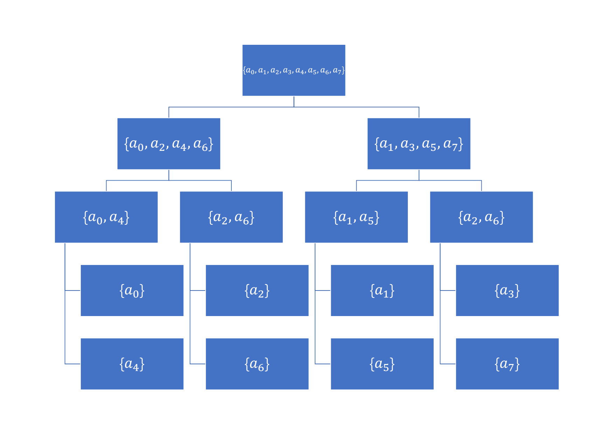

# 快速傅里叶变换

>   前言
>
>   ​	快速傅里叶变换（Fast Fourier Transform，FFT）的用处是==**计算多项式乘法**==。准确地说，FFT 是计算多项式乘法时用来降低时间复杂度的一个数学工具。在学习它之前，很有必要补充很多有关的数学知识。

####多项式基础

>   ​	多项式的概念是最为基础的部分。这部分主要补充过去没有听说过或者很少用到的概念。

#####1. 一元多项式乘法

​	设 $f(x) = a_0 + a_1 · x + a_2 · x^2 +~...~+ a_k · x^k$，称形如 $f_1(x) · f_2(x)$ 的乘法为==**一元多项式乘法**==。

​	一个典型的例子是高精度乘法：当 $x$ 等于 $10$ 时，代入计算出来的 $f(x)$ 便是结果。

​	我们接下来只讨论一元多项式，**所以把一元多项式简称为多项式**。

#####2. 多项式的基本概念 

###### ①次数界

​	定义一个多项式的次数界为==**多项式的最高项的次数 + 1**==。

e.g. $A(x) = 2x^3 - 5x^2 + x - 4$ 的次数界为 4。


​	一个次数界为 $N$ 的多项式可以记作：[^1]
$$
A(x) = \sum _{j = 0} ^{N - 1} a_j · x^j
$$
​	需要注意的是，最高次系数为 $N - 1$。

[^1]: 因为本节会使用到复数以及虚数单位 $i$，所以循环变量一般使用 $j$

###### ②系数表示的多项式乘法

​	设 $C(x) = A(x) · B(x)$。将这两个多项式相乘的方法为：
$$
c_k = \sum _{j = 0} ^{k} a_j b_{k - j} \; (0 \le k \le N_A + N_B - 1)
$$
​	很明显，计算出一个系数的时间复杂度为 $O(n)$，所以总的时间复杂度为 $O(n^2)$。


​	设一个多项式的次数界为 $N$，则有：
$$
N_C = N_A + N_B - 1
$$

###### ③多项式的系数表示

​	前面表示多项式的方法即为==**多项式的系数表示法**==：
$$
A(x) = \sum _{j = 0} ^{n - 1} a_j · x^j
$$

##### 3. 点值与插值

######①点值

​	对于一个多项式 $A(x)$，假设 $A(x) = x^2 - 3x + 2$，我们将 $x$ 代入具体数值，得到多项式的值：
$$
A(0) = 2
\\
A(1) = 0
\\
A(-2) = 12
$$
​	将 $x \to y$ 写作 $(x, y)$，就可以写作：$(0, 2)$，$(1, 0)$，$(-2, 12)$。像这三组有序对一样，==**一般地，如果有 $(x, y)$ 满足 $A(x) = y$，则称 $(x, y)$ 为 $A(x)$ 的点值对。**==

​	对于上例，将三组有序对组成一个集合 $S = \{ (0, 2), (1, 0), (-2, 12) \}$，则称 $S$ 为 $A(x)$ 的一个==**点值表示**==。

######②多项式的点值表示

​	一般地，一个次数界为 $N$ 的多项式 $A(x)$ 的点值表示就是一个==**由至少 $N$ 个点值对所组成的集合**==：
$$
\{ (x_0, y_0), (x_1, y_1),~...~,(x_{N - 1}, y_{N - 1}) \}
$$
​	对于集合中的每个元素，必须满足 $y_k = A(x_k)$。	

​	对 $x$ 的取值不是很严格，只需要满足互不相同就可以了。

​	如果已知多项式 $A(x)$ 的系数表示，得到多项式的点值表示的过程叫作==**点值运算**==。

###### ③插值

​	假设我们得到了一个有 $N$ 个点值对的点值表示，那么我们就==**可以确定一个唯一的次数界为 $N$ 的多项式**==。这个过程叫作==**插值运算**==。==**插值运算是点值运算的逆运算。**==

​	两个典型的例子是两点定一直线，三点定一抛物线。

##### 4. 点值，插值，与多项式乘法

######①点值表示的多项式乘法

​	对于两个用相同个点值对表示的唯一多项式 $A$，$B$，我们首先要确定一组 $x$：
$$
A = \{ (x_0, y_0), (x_1, y_1),~...~, (x_{n - 1}, y_{n - 1}) \}
\\
B = \{ (x_0, y'_0), (x_1, y'_1),~...~, (x_{n - 1}, y'_{n - 1}) \}
$$
​	设 $C = A · B$，我们可以得到 $C$ 的点值表示：
$$
C = \{ (x_0, y_0 · y'_0), (x_1, y_1 · y'_1),~...~, (x_{n - 1}, y_{n - 1} · y'_{n - 1}) \}
$$
​	==**很明显，点值表示的多项式乘法的时间复杂度为 $O(n)$。**==特别注意，用于表示 $A$ 和 $B$ 的点值对数必须相同。

######②对乘法结果进行插值运算

​	如果使用上面的方法计算 $C$，将无法进行插值运算。因为 $N_C = N_A + N_B - 1$，所以用以上方法表示的 $C$ 并不能对应一个唯一的多项式。

​	解决方法很简单，那就是让 $A$ 和 $B$ 各用 $2N$ 个点值对表示，再做乘法，就能得到可以进行插值运算的 $C$ 了。


​	就这样，我们有了计算两个用系数表示的多项式的乘法的新方法：

（1）点值运算

​	构造出 $A$ 和 $B$ 的长度为 $2N$ 的点值表示，其中 $N = \max(N_A, N_B)$。

（2）点值表示的多项式乘法

​	计算出 $C = A · B$ 的点值表示。

（3）插值运算

​	通过 $C$ 的点值表示求出多项式 $C$ 的每项系数。


​	==**注意到，如果我们直接选取 $1$ ~ $2N$ 作为 $x$，点值运算的时间复杂度为 $O(N^2)$。**==可以证明，==**插值运算的时间复杂度也为 $O(N^2)$。**==如果我们解决了这个时间复杂度的问题，我们的多项式乘法就完成了。

#### 复数基础

>   ​	FFT 需要用到复数中的 $N$ 次单位复数根的特殊性质来降低时间复杂度。这一部分既是关键点，又是难点。

##### 1. 坐标系中的复数 

​	我们可以用一条横轴表示全体实数。如果再用一条纵轴表示虚数，便可以在平面直角坐标系中表示一个复数。

​	一般地，我们把形如 $a + bi \; (a, b \in \mathbb{R})$ 的数称为复数。[^2]

[^2]: 有关复数的详细内容，可以参考高中数学。 

##### 2. $N$ 次单位复数根 

###### ①定义

​	$N$ 次单位复数根指满足 $w^n = 1$ 的复数 $w$。

​	$N$ 次单位复数根恰好有 $N$ 个，即：
$$
w = e^{\frac {k} {n} · 2 \pi i } \; (0 \le k < n)
$$
​	其中 $i$ 为虚数单位。	

​	$e^{ui}$ 是什么意思呢？我们有定义：
$$
e^{ui} = \cos(u) + i \sin(u)
$$
​	便得到了它的几何意义：==**$e^{ui}$ 代表单位圆上的一点，原点与其所在射线与 $x$ 正半轴成角 $u$。**==

​	==**所以 $N$ 个 $N$ 次单位复数根均匀分布在单位圆上。**==

######②主 $N$ 次单位根

​	我们记 $n$ 次单位复数根为 $\{ w_n^0, w_n^1, w_n^2,~...~, w_n^{n - 1} \}$，对其中的一个元素，记为 $w = e^{\frac {k} {n} · 2 \pi i } \; (0 \le k < n)$。

​	我们==**称 $w_n = w_n^1$ 为主 $N$ 次单位根**==。

​	注意到，$N$ 次单位复数根都是经过旋转而得到的，每次的旋转都是一定的角度。可以写作：
$$
w_n^i = w_n^{i - 1} w_n
$$
​	因此，==**$N$ 次单位复数根可视为公比为主 $N$ 次单位根的等比数列。**==

###### ③群论与 $N$ 次单位复数根

​	我们有：
$$
w_n^0 = w_n^n = 1
$$
​	由群论[^3]的相关知识，结合主 $N$ 次单位根的性质，我们可以得到：
$$
w_n^j w_n^k = w_n^{j + k} = w_n^{(j + k)~mod~n}
$$

[^3]: 有关群论的相关知识，请自行查阅相关资料。 这里涉及很浅。

​	推论：
$$
w_n^{-1} = w_n^{n - 1}
\\
w_n^k = w_n^{k + n}
\\
(w_n^k)^2 = w_n^{2k}
$$

##### 3. $N$ 次单位复数根的更多性质

​	前面提到了主 $N$ 次单位复数根和群论带来的 $N$ 次单位复数根的性质。接下来我们在它们的基础上继续讨论。

###### ①消去引理

$$
w_{dn}^{dk} = w_n^k
$$

​	称为==**消去引理**==。结合 $N$ 次单位复数根的几何意义，应该不难理解。

​	推论：
$$
w_n^{\frac {n} {2}} = w_2 = -1
\\
(w_n^k)^2 = w_{\frac {n} {2}}^{k}
$$
​	其中 $w_2$ 为主 $2$ 次单位根。

###### ②折半引理

​	如果 $n > 0$ 且 $n$ 为偶数，那么 $n$ 次单位复数根的平方的几何就是 $\frac {n} {2}$ 次单位复数根的集合。这被称为==**折半引理**==。

​	可以继续结合 $N$ 次单位复数根的几何意义理解。

###### ③求和引理

​	对于任意正整数 $n$ ，若有一非负整数 $k$ 满足 $n \nmid k$，则有：
$$
\sum_{j = 0}^{n - 1} (w_n^k)^j = 0
$$
​	称为==**求和引理**==。

>   证明
>
>   ​	考虑等比数列求和。
>   $$
>   \sum_{j = 0}^{n - 1} (w_n^k)^j
>   =
>   \frac {(w_n^k)^n - 1} {w_n^k - 1}
>   $$
>   ​	因为有 $w_n^k = (w_n)^k$，得：
>   $$
>   =
>   \frac {(w_n^n)^k - 1} {w_n^k - 1}
>   =
>   \frac {(1)^k - 1} {w_n^k - 1}
>   =
>   0
>   $$
>   ​	如果 $k​$ 是 $n​$ 的倍数，那么分母为 $0​$，无法通过这个方法计算。放回原式，实际上我们会计算 $\sum 0^j​$，当 $j = 0​$ 时，原式无意义。**所以当 $k​$ 为 $n​$ 的倍数时原式无意义。**

#### FFT

> ​	基础知识在以上部分已经介绍得差不多了。下面开始正式讲解核心内容 FFT。

##### 1. 离散傅里叶变换（DFT）

​	我们希望计算次数界为 $N$ 的多项式在 $N$ 次单位复数根处的值（共 $N$ 个）：
$$
A(x) = \sum _{j = 0} ^{n - 1} a_j · x^j
$$

​	定义结果 $y$：
$$
y_k = A(w_n^k) = \sum_{j = 0} ^{n - 1} a_j w_n^{kj}
$$
​	==**我们称 $y$ 为 $A$ 的离散傅里叶变换（DFT），记为 $y = DFT_n(A)$。**==

##### 2. 快速傅里叶变换（FFT）

​	FFT **的根本作用**便是==**快速完成 DFT**==。

###### ①准备工作

​	设多项式的次数界为 $N$，我们==**要保证 $N$ 为 $2$ 的 $N$ 次幂，然后利用单位复数根的特殊性质求解。**==

​	快速求解 DFT 的过程被称为 FFT。

###### ②分治策略

​	先明确问题：DFT 的任务是求得函数 $A(x)$ 在每个 $N$ 次单位复数根的取值。

​	==**FFT 基于分治策略。**==

​	回忆使用分治解决等比数列求和的问题，这里我们类似地定义两个新多项式：
$$
A^{[0]}(x) = a_0 + a_2 x + a_4 x^2 +~...~+ a_{n - 2} x^{\frac {n} {2} - 1}
\\
A^{[1]}(x) = a_1 + a_3 x + a_5 x^2 +~...~+ a_{n - 1} x^{\frac {n} {2} - 1}
$$
​	这两个多项式的特点：

（1）分别拥有奇数下标的系数与偶数下标的系数。

（2）次数界变为了 $\frac {N} {2}$。

​	不难得到：
$$
A(x) = A^{[0]}(x^2) + x · A^{[1]}(x^2)
$$
​	==**于是我们初步构造出了分治模型。**==

######③分治的时间复杂度

​	原问题：求一个多项式 $A(x)$ 在 $N$ 次单位复数根的取值。

​	$N$ 次单位复数根：$w_n^0$，$w_n^1$，... ，$w_n^{n - 1}$	

​	新问题：求两个多项式 $A^{[0]}(x)$ 和 $A^{[1]}(x)$ 在 $\frac {N} {2}$ 次单位复数根的取值。

​	$\frac {N} {2}$ 次单位复数根：$(w_n^0)^2$，$(w_n^1)^2$，... ，$(w_n^{n - 1})^2$。	


​	==**根据折半引理**==，$(w_n^0)^2$，$(w_n^1)^2$，... ，$(w_n^{n - 1})^2$ 并不是 $n$ 个不同的值，而是由 $\frac {N} {2}$ 个 $\frac {N} {2}$ 次单位复数根组成，每个根恰好出现两次。

​	==**假设不考虑具体的实现。**==现在，我们解决一个规模为 $N$ 的问题，就等于要解决两个规模为 $\frac {N} {2}$ 的问题并且额外花费 $N$ 的时间。因此我们的时间复杂度为 $O(n \log n)$。

​	这样，我们就在 $O(n \log n)$ 的时间复杂度内完成了==**点值运算**==。

###### ④插值运算

​	我们将点值运算表示成矩阵乘法表示求解线性方程组的形式[^4]：
$$
\begin{bmatrix}
1& 1 & 1 & 1 & \cdots & 1 \\
1 & w_n^1 & w_n^2 & w_n^3 & \cdots & w_n^{n - 1} \\
1 & w_n^2 & w_n^4 & w_n^6 & \cdots & w_n^{2(n - 1)} \\
1 & w_n^3 & w_n^6 & w_n^9 & \cdots & w_n^{3(n - 1)} \\
\vdots & \vdots & \vdots & \vdots & \ddots & \vdots \\
1 & w_n^{n - 1} & w_n^{2(n - 1)} & w_n^{3(n - 1)} & \cdots & w_n^{(n - 1)(n - 1)}
\end{bmatrix}
\begin{bmatrix}
a_0 \\ a_1 \\ a_2 \\ a_3 \\ \cdots \\ a_{n - 1}
\end{bmatrix}
=
\begin{bmatrix}
y_0 \\ y_1 \\ y_2 \\ y_3 \\ \cdots \\ y_{n - 1}
\end{bmatrix}	
$$

[^4]: 如果不了解，参看高斯消元。

​	两边同乘以系数矩阵的逆矩阵。
$$
V_n · a = y \to
a = V_n^{-1} · y
$$
​	**我们已经得到了 $C$ 对应的 $y$ 了，==如果我们得到了 $V_n^{-1}$，我们就能得到多项式的系数。==**

######⑤系数矩阵的逆矩阵

​	定理：==**$V_n^{-1}$ 的 $(j, k)$ 处元素为 $\frac {w_n^{-kj}} {n}$。**==

>必要性证明（充分性证明有点复杂，此处仅证必要性）
>$$
>(V_n^{-1} · V_n)_{jj'}
>=
>\sum _{k = 0}^{n - 1} (\frac {w_n^{-kj}} {n}) · (w_n^{kj'})
>=
>\sum _{k = 0}^{n - 1} \frac {w_{n}^{k(j' - j)}} {n}
>$$
>​	当 $j = j'$ 时，易得结果为 $1$。
>
>​	当 $j \ne j'$ 时，由[求和引理](#③求和引理)，得结果为 $0$。
>
>​	得证！

######⑥逆离散傅里叶变换（逆 DFT）

​	（使用 [DFT](#1.-离散傅里叶变换（dft）) 中定义的符号）通过 $y$ 计算出 $a$ 的过程，称为==**逆 DFT**==。

​	由 $V_n^{-1}$，可以通过 $y$ 得到 $DFT_n^{-1}(y)$：
$$
a_j = \frac {1} {n} \sum_{k = 0}^{n - 1} y_k w_n^{-kj}
$$
​	==**不难发现，使用 FFT 的方法仍然可以在 $O(n \log n)$ 的时间复杂度内解决逆 DFT。**==可以说逆 DFT 的本质是对另外一个多项式进行了 DFT。

​	至此，==**在理论上我们通过两次 FFT 分别进行 DFT 和逆 DFT 解决了多项式乘法的时间瓶颈。**==

##### 3. 实现

​	我们假设 $2N = 8$。

######①解决每个分治要处理的集合



​	上图展示了分治的过程。

​	然而在程序中，**我们难以保存这样的集合，也就难以保存每个集合对应的信息。**所以我们需要一些奇技淫巧来解决这个问题。

|       | $a_0$ | $a_4$ | $a_2$ | $a_6$ | $a_1$ | $a_5$ | $a_3$ | $a_7$ |
| :---: | :---: | :---: | :---: | :---: | :---: | :---: | :---: | :---: |
| 二进制编码 |  000  |  100  |  010  |  110  |  001  |  101  |  011  |  111  |

​	然后用一些奇技淫巧：

|             | $a_0$ | $a_4$ | $a_2$ | $a_6$ | $a_1$ | $a_5$ | $a_3$ | $a_7$ |
| :---------: | :---: | :---: | :---: | :---: | :---: | :---: | :---: | :---: |
|    二进制编码    |  000  |  100  |  010  |  110  |  001  |  101  |  011  |  111  |
| reverse[^5] |  000  |  001  |  010  |  011  |  100  |  101  |  110  |  111  |

[^5]: 这里是 reverse（反转），和 flip（翻转）区别开来。

​	反转二进制数后，我们发现，如果我们按顺序处理分治边界，我们将会得到一个连续的从 $0$ ~ $n - 1$ 的序列。

###### ②复数

​	只需要用两个实数来表示实部和虚部系数。

​	需要用到复数的加法，减法和乘法。

```c++
struct Complex
{
	double x, y;
	Complex() {}
	Complex(const double& x, const double& y) : x(x), y(y) {}
};
Complex operator+ (const Complex& a, const Complex& b)
{
	return Complex(a.x + b.x, a.y + b.y);
}
Complex operator- (const Complex& a, const Complex& b)
{
	return Complex(a.x - b.x, a.y - b.y);
}
Complex operator* (const Complex& a, const Complex& b)
{
	return Complex(a.x * a.x - a.y * b.y, a.x * b.y + b.x * a.y);
}
```

​	注意复数的乘法，可以使用多项式乘法==**理解（而不是记忆）**==，其中 $i^2 = -1$。

###### ③参考代码

​	下面给出参考代码：其中将会解答前面没有提及的如何计算的问题。

```c++

```

