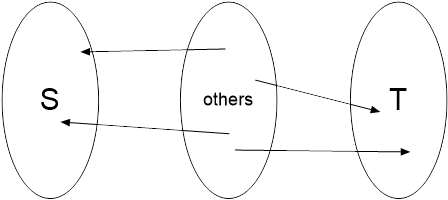

[TOC]

# 网络流

#### 快速复习

##### 1. 最大流问题

​	最大流问题（Maximum-Flow Problem）是指这样的一个问题：在一张有向图中，假设需要把一些物品从结点 $s$（源点）运送到结点 $t$（汇点），可以从其它结点中转。每条有向边表示最多能有多少个物品从这条边的起点运送到终点，问最多能把多少物品从源点送到汇点？

​	对于一条边 (u, v)，它的物品上限称为==**容量**==（capacity），记为 c(u, v)。对于不存在的边，其容量为 0。实际运送的物品数量称为==**流量**==（flow），记为 f(u, v)。

​	在最大流问题中，要求满足三个性质：

（1）==**容量限制**==
$$
f(u, v) \le c(u, v)
$$
（2）==**斜对称性**==
$$
f(u, v) = -f(v, u)
$$
（3）==**流量平衡**==

​	对 $\forall u \in V - \{ s, t \}$，有：
$$
\sum _{(u, v) \in E} f(u, v) = 0
$$


​	我们的问题实际上是求：
$$
\max \{ \sum_{(s, v) \in E} f(s, v) \} = \max \{ \sum_{(u, t) \in E} f(u, t) \}
$$

##### 2. 增广路算法

###### ①残量网络

​	计算出每条边上的容量和流量之差（称为==**残余流量**==，简称==**残量**==），得到==**残量网络**==（residual network）。**残量网络的边数可能达到原图边数的两倍。**

###### ②增广路定理

​	残量网络中的任何一条从 $s$ 到 $t$ 的有向道路都对应一条原图中的==**增广路**==（augmenting path）。只要求出增广路中所有残量的最小值 $d$，把对应的所有边上的流量增加 $d$，就能使总流量增加 $d$，这个过程称为==**增广**==（augmenting）。

​	==**增广路定理**==指，只要残量网络中存在增广路，流量就可以增大；如果残量网络中不存在增广路，则当前流就是最大流。

###### ③最短增广路方法

​	通过不断找到增广路进行增广，最终找到最大流的方法，称之为 ==**Ford-Fulkerson 方法**==。

​	最短增广路算法指，每次沿着边数最少点的增广进行增广，可以证明，这样最多需要 $O(nm)$ 次增广。

​	如果使用 BFS 来实现，每次需要 $O(m)$ 的时间，总时间复杂度为 $O(nm^2)$，这个算法叫做 ==**Edmonds Karp 算法**==。

###### ④存边方法

​	对于最大流问题的边，要保存 4 个参数：

```c++
struct Edge
{
	int from, to, cap, flow;
}
```

​	保存边时，使用 vector 加上边集数组保存：

```c++
std::vector<Edge> edges;
std::vector<std::vector<int> > G;
```

######⑤Edmonds Karp 算法

​	Edmonds Karp 算法需要的数据如下：

（1）用于 BFS 的队列 q

（2）用于记录最大增广量的数组 opt（初始时源点为 INF，其余点为 0；这个数组也用作 vis）

（3）用于记录来自哪一条边的 pre

过程速览：

​	如果一个点的 opt 为 0（即没有被访问过）且该边为残边，就更新它的 pre，opt，然后把它入队。

​	如果在任何时刻访问到了汇点，就停止 BFS。

​	如果在 BFS 结束后仍然没有访问到汇点，增广结束。

​	BFS 结束后，如果存在增广路，就从汇点开始，通过 pre 往回改边，直到改到 s。修改时只需要修改源边和源边的反向边的流量就可以了。

​	最后让总流量增加 opt[t]。


​	时间复杂度 $O(n m^2)$。

#### 高级内容

##### 1. Dinic 算法 —— 连续最短增广路算法

###### ①层次图

​	设在残量网络中，起点到结点 u 的最近距离为 dist(u)，我们设 level(u) = dist(u)，叫做结点的层次。若只保留从每个点出发到下一个层次的点的边，得到的图就叫做==**层次图**==。

​	因此，层次图上的任意路径都是“起点 $\to$ 层次 1 $\to$ 层次 2 $\to$ 层次 3 $\to$ …”这样的顺序。因此每条这样的路径都是 s 到 t 的最短路。

###### ②阻塞流

​	简单地说，==**阻塞流**==就是层次图的所有增广路总共可以使汇点增加的流量。

###### ③理论时间复杂度

​	Dinic 的理论时间复杂度为 $O(n^2 m)$，实际上要比这个好得多（$O(能过)$）。

​	如果所有容量均为 1，可以证明 Dinic 的时间复杂度为 $O(\min (n^{\frac {2} {3}}, m^{\frac{1}{2}}) m)$。

​	如果网络为“单位网络”[^1]，可以证明 Dinic 的时间复杂度为 $O(n^{\frac {1} {2}} m)$。

[^1]: 除了源点和汇点之外，每一个点要么只有一条入弧，且容量为 1，要么只有一条出弧，且容量为 1，其它弧的容量为任意整数，这样的网络成为单位网络。例如二分图最大匹配的网络就是单位网络。 

###### ④方法

​	首先使用 BFS 构建层次图。如果残量网络不能到达汇点，说明已达到最大流，退出过程。

​	然后使用 DFS 在层次图中求阻塞流。DFS 时，只从层次低的点向层次比自己大 1 的点前进。DFS 的返回值为阻塞流流量。DFS 的参数除了当前点外，还需要保存当前最多可增广流量 opt。求得阻塞流后，将阻塞流加到当前流量中。

###### ⑤当前弧优化

​	在层次图中 DFS 求阻塞流时，应该注意到这么一个事实：如果我们已经走过了一条边（弧），说明这条边受后继层次的影响已经增广到了最大程度，无法再增广。

>   证明
>
>   ​	用反证法。假设这条边已经被访问过但还没有增广到最大程度，那么之前访问它时就可以继续增广，与假设矛盾。故得证！

​	那么我们就不需要再走一次走过的边，因为这么走下去一定不能再增广了。我们可以保存当前点已经遍历了哪些边，下次走到当前点时，我们就接着没有增广过的边走。这个叫做==**当前弧优化**==。

###### ⑥过程速览

​	需要的数据：

（1）BFS 用的队列

（2）BFS 用的 vis 数组（相比 Edmonds Karp 算法，Dinic 算法不用 opt 数组，所以要单独开 vis 数组）

（3）BFS 得到的层次 level

（4）DFS 的当前弧优化 cnt

​	主过程：

（1）不断用 BFS 求层次图，若层次图不能到达汇点则退出。

（2）求得一个层次图后，先清空 cnt 数组。

（3）然后开始 DFS。让总流量加上 DFS 的返回值（因为 DFS 的定义是返回层次图的阻塞流）。

​	BFS 过程：

​	与一般的 BFS 完全相同，level 数组相当于是一个离远点的最短距离。

​	DFS 过程：

（1）先判断当前的可优化量 opt，一开始在源点为 INF。若 opt 已经为 0，则直接退出，因为无论如何都无法再增广了；若到达了汇点，则返回 opt，代表阻塞流又增加了 opt。

（2）我们需要用 flow 来保存==**当前点在本次调用的增广量**==，作为返回值。从当前弧开始遍历边。**如果这条边是层次图中的边，我们再继续考虑。**然后去调用 DFS，参数 opt 为这一层的 opt 与当前边的残量中的较小值。如果返回值不为 0，就意味着这么走下去是有一条流量为返回值的增广路的，我们就增广这条边。

（3）增广这条边，要让当前边的流量加上增广量，同时更新反向边。**还要让 flow 加上增广量，让 opt 减去增广量。**因为 opt 代表的是这个点之前的层次的最大增广量，所以还要满足 opt 的条件。

（4）最后返回 flow。

###### ⑦DFS 参考代码

```c++
INT DFS(INT node, INT opt)
{
	if (node == t || !opt)
		return opt;
	INT flow = 0;
	INT f;
	for (INT& i = cnt[node]; i < G[node].size(); i++)
	{
		Edge& e = edges[G[node][i]];
		if (level[node] + 1 == level[e.to] && (f = DFS(e.to, std::min(opt, e.cap - e.flow))) > 0)
		{
			e.flow += f;
			edges[G[node][i] ^ 1].flow -= f;
			flow += f;
			opt -= f;
			if (!opt) break;
		}
	}
	return flow;
}
```

##### 2. 割

###### ①概念

​	把所有顶点分成两个集合 $S$ 和 $T = V - S$，其中源点 $s$ 在集合 $S$ 中，汇点 $t$ 在集合 $T$ 中。==**这样的集合划分 $(S, T)$ 称为一个 $s$-$t$ 割**==，其容量为：
$$
c(S, T) = \sum_{u \in S, v \in t} c(u, v)
$$


​	即起点在 $S$ 中，终点在 $T$ 中的所有边的容量和。

######②最小割最大流定理

​	如果把“起点在 $S$ 中，终点在 $T$ 中的边全部删除，就无法从 $s$ 到达 $t$ 了，所以会把它取名为割。

​	既然如此，而从 $s$ 运送到 $t$ 的物品必然会跨越 $S$ 和 $T$ 的边，所以我们有这么一个结论：
$$
f(S, T) \le c(S, T)
$$
​	想象一下，跨过这两个点集的边，无非是满载的，满载时，$f(S, T) = c(S, T)$，如果存在边没有满载，那么 $f(S, T) < c(S, T)$。

​	那么究竟有没有可能所有割边满载呢？想一下残量网络。在增广完成后，$s$ 和 $t$ 不连通。把残量网络中已访问点看作 $S$，未访问点看作 $T$ ，则在残量网络中 $S$ 和 $T$ 分离，==**因此在原图中跨越 $S$ 和 $T$ 的边均达到满流。**==

​	所以我们得到了==**最小割最大流定理**==：在增广路算法结束时，$f$ 是 $s$-$t$ 最大流，$(S, T)$ 是 $s$-$t$ 最小割。

###### ③成为最小割的割边的充分条件和必要条件

e.g. [JZOJ 1665 最小割(AHOI 2009)](https://jzoj.net/senior/#main/show/1665)

​	我们首先用最大流算法得到任意一个最小割。显然，此时残量网络中源点所在点集不包含汇点，可以看作 $S$ 集；相应的，汇点所在点集可以看作 $T$ 集。**但可能会发生这种情况：一个点在此时的残量网络中即不属于 $S$ 集，也不属于 $T$ 集。**

​	显然，此时残量网络中只有这三种点（不然还有什么……）。



​	（注意，在残量网络中，虽然我们不能从 $S$ 到 $others$、从 $T$ 到 $others$，但我们是有可能从 $others$ 出发到 $S$ 或 $T$ 的）

​	注意到，根据最小割最大流定理，==**无论如何割边都是满流的。**==所以我们**只考虑满流的边就好了。**

​	由此，能发现一个重要的特性：如果我们认为一条边是割边，那么**它的起点和终点一定在不同的点集中**；==如果**在残量网络中**还有别的路径能连接这个边的起点和终点，那么这条边一定不会是割边。==

>   证明
>
>   ​	假设这条边是割边，那么它的起点和终点在不同的点集中。由最小割最大流定理，跨过点集的边（割边）一定是满流的。现在在残量网络中存在别的路径能连接这个边的起点和终点，这条路径上就一定存在一条边跨过点集。由于这条边在残量网络中存在，说明跨过点集的那条边也没有达到满流，与最小割最大流定理矛盾。

​	我们实际上得到了这样一个定理：

>   在残量网络中存在…… $\to$ 这条边不可能是割边

​	它的逆否命题是：

>   这条边是割边 $\to$ 在残量网络中不存在……

​	因此，一条边是割边的必要条件是在残量网络中不存在一条路径使得这条边的起点能够到达这条边的终点。当然，大前提是这条边本身是满流的。

​	换句话说，**如果一条边是满流的，且在残量网络中它的两个端点不在同一个强连通分量中，那么这条边就有可能是割边。**


​	**一条边是割边的充分条件是它的起点与源点在残量网络中位于同一个强连通分量，且它的终点与汇点在残量网络中位于同一个强连通分量。**

##### 3. 最小费用流

######①概念

​	给网络流增加一个因素：费用。假设每条边除了有一个容量限制外，还有一个==**单位流量所需**==的费用（cost）。称总流量最大时总费用最小的流为==**最小费用最大流**==。

###### ②方法

​	（除了下面介绍的方法，还有更高级的单纯形法，现在暂时不予以考虑）

​	与 Edmonds Karps 算法类似，但是每次使用 Bellman-Ford 算法而非 BFS 找增广路。==**只要初食流是该流量下的最小费用可行流，每次增广后的新流都是新流量下的最小费用流。**==

###### ③过程速览

​	先进行完整的 Bellman-Ford 算法，再增广。费用为 $f × \sum c$。

​	注意==**队列必须是循环的**==。

​	如果要限制流量，有两种方法。一是增加一个超级汇，费用为 0，容量为限制的流量。另一种方法是在增广时保证使流量不超过限制：

```c++
opt[t] = std::min(opt[t], limit - flow);
```