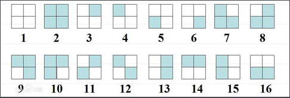

>   开局一个 Markdown，内容全靠编。——Orange

[TOC]

# 置换

####概念

&emsp;&emsp;置换（permutation）就是把 $n$ 个元素做一个全排列。一般地，$1$ 变 $a_1$，$2$ 变 $a_2$……的置换记为：
$$
\left( 
\begin{matrix}
1 & 2 & 3 & 4 & \cdots & n
\\
a_1 & a_2 & a_3 & a_4 & \cdots & a_n
\end{matrix}
\right)
$$
&emsp;&emsp;由于不同的元素映射到不同的数，这个函数是可逆的。

##### 1. 置换乘法

&emsp;&emsp;设置换 $f = \{ 1, 3, 2 \}$，$g = \{ 2, 1, 3 \}$。如果对数列 $\{ 1, 2, 3 \}$ 先做置换 $f$，再做置换 $g$，可以得到：
$$
1 \to 1 \to 2
\\
2 \to 3 \to 3
\\
3 \to 2 \to 1
$$
&emsp;&emsp;据此，我们可以定义置换乘法。在上例中，我们得到 $fg = \{ 2, 3, 1 \}$。

------

&emsp;&emsp;可以将上例中的置换写作：
$$
g(f(\{ 1, 2, 3 \}))
$$
&emsp;&emsp;这是一个复合函数。**在数学中，复合函数总是满足结合律。**所以我们有：
$$
\begin{align}
& \{ 1, 2, 3 \} × \{ 1, 3, 2 \} × \{ 2, 1, 3 \}
\\
=& \{ 1, 2, 3 \} × (\{ 1, 3, 2 \} × \{ 2, 1, 3 \})
\\
=& \{ 1, 2, 3 \} × \{ 2, 3, 1 \}
\end{align}
$$
&emsp;&emsp;需要注意的是，**置换乘法不满足交换律。**

##### 2. 循环

&emsp;&emsp;为了方便，常常将置换分解成循环（permutation cycle）的乘积。例如：
$$
\left(
\begin{matrix}
1 & 2 & 3 & 4 & 5
\\
3 & 5 & 1 & 4 & 2
\end{matrix}
\right)
=
(1~3)(2~5)(4)
$$
&emsp;&emsp;**循环也是一个置换。**

&emsp;&emsp;虽然在一般情况下置换乘法不满足交换律，但对于不相交的置换——循环来说，按照任意顺序相乘都是等价的。

&emsp;&emsp;我们称循环分解中循环的个数为该置换的循环节。比如 $(1~3)(2~5)(4)$ 的循环节为 $3$。

#### 等价类计数问题

#####1. 定义

&emsp;&emsp;给定一种等价关系，满足等价关系的元素被看成同一类，只统计一次，求有多少个本质不同的元素。这种问题被称为等价类计数问题。

&emsp;&emsp;等价关系要满足三个条件：

（1）自反性：每个元素和它自身等价。

（2）对称性：如果 $A$ 和 $B$ 等价，则 $B$ 和 $A$ 等价。

（3）传递性：如果 $A$ 和 $B$ 等价，$B$ 和 $C$ 等价，则 $A$ 和 $C$ 等价。

##### 2. 经典例题

&emsp;&emsp;有一个 $2 × 2$ 的方格，给它涂黑白两色，有几种方法？旋转 90°，180° 或者 270° 后方案相同的算作一种。

------

&emsp;&emsp;为了统计等价类的个数，首先需要用一个置换集合 $F$ 来描述等价关系。**如果一个置换把其中一个方案映射到另一个方案，就说两者是等价的。**

&emsp;&emsp;一个必须满足的条件是：$F$ 中任意两个置换的乘积也应当在 $F$ 中，否则 $F$ 无法构成置换群[^置换群]。例如，不能定义：
$$
F = \{ 逆时针旋转 0°, 逆时针旋转 90°, 逆时针旋转 270° \}
$$
因为两个“逆时针旋转 90°”叠加的效果是“逆时针旋转 180°”，不在 $F$ 内。

[^置换群]: 不必深究。 

##### 3. 不动点与 Burnside 引理

&emsp;&emsp;**对于一个置换 $f$，若一个着色方案 $s$ 经过置换后不变，称 $s$ 为 $f$ 的不动点。**

&emsp;&emsp;将 $f$ 的不动点数目记为 $C_f$，**则可以证明等价类数目为所有 $C_f$ 的平均值。此结论称为 Burnside 引理。**

#####4. Pólya 定理

&emsp;&emsp;一般地，如果置换 $f$ 分解成 $m_f$ 个循环的乘积，那么每个循环内所有格子的颜色必须相同。假设涂 $k$ 种颜色，则有 $C_f = k^{m_f}$。根据 Burnside 引理，**等价类的个数等于所有置换 $f$ 的 $k^{m_f}$ 的平均数，这被称为 Pólya 定理。**

##### 5. 解决经典例题

&emsp;&emsp;我们直接使用 Pólya 定理解决这个问题。

&emsp;&emsp;对于逆时针旋转 0°，可以看作以下置换：
$$
\begin{bmatrix}
1 & 2
\\
3 & 4
\end{bmatrix}
\to
\begin{bmatrix}
1 & 2
\\
3 & 4
\end{bmatrix}
$$
&emsp;&emsp;即：
$$
\left(
\begin{matrix}
1 & 2 & 3 & 4
\\
1 & 2 & 3 & 4
\end{matrix}
\right)
=
(1)(2)(3)(4)
$$
&emsp;&emsp;对于逆时针旋转 90°，可以看作以下置换：
$$
\begin{bmatrix}
1 & 2
\\
3 & 4
\end{bmatrix}
\to
\begin{bmatrix}
2 & 4
\\
1 & 3
\end{bmatrix}
$$
&emsp;&emsp;不动点个数为 $2^4 = 16$。

&emsp;&emsp;即：
$$
\left(
\begin{matrix}
1 & 2 & 3 & 4
\\
3 & 1 & 4 & 2
\end{matrix}
\right)
=
(1~3~4~2)
$$
&emsp;&emsp;所以不动点个数为 $2^1 = 2$。

&emsp;&emsp;对于逆时针旋转 180°：
$$
\begin{bmatrix}
1 & 2
\\
3 & 4
\end{bmatrix}
\to
\begin{bmatrix}
4 & 3
\\
2 & 1
\end{bmatrix}
$$

$$
\left(
\begin{matrix}
1 & 2 & 3 & 4
\\
4 & 3 & 2 & 1
\end{matrix}
\right)
=
(1~4)(2~3)
$$

&emsp;&emsp;不动点个数为 $2^2 = 4$。

&emsp;&emsp;类似的，旋转 270° 的不动点个数为 $2^1 = 2$。

&emsp;&emsp;所以总计数为 $\frac {2^4 + 2^1 + 2^2 + 2^1} {4} = 6$。