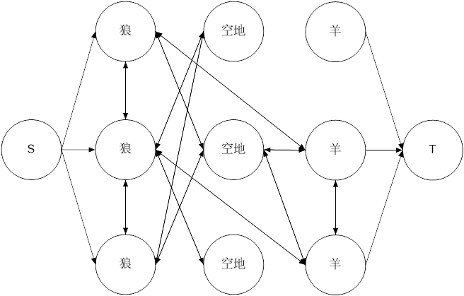

#####[JZOJ 5060 公路建设](https://jzoj.net/senior/#main/show/5060)

###### ①60 分做法

​	我们知道暴力算法：直接使用 Kruskal 即可。

​	Kruskal 算法需要先按边权排序，而这三个特殊的测试点并不需要。但是跑 Kruskal 肯定是不可能的，有什么好的方法吗？

​	考虑从大到小添加边，==每次添加后，如果形成了环，就删除环上的最大边。==这是加边的 MST 的套路。==**因为最多只有 n - 1 条边，所以我们用一个数组保存有哪些边即可。这种算法不需要将边保存成邻接矩阵或者邻接表的形式。**==

​	考虑询问 $[l, m]$ 的情况。只需要从 $m$ 到 $l$ 一直维护就可以了。**由于按处理的顺序边权递减，被删去的边永远不可能再被添加。**

​	所以考虑离线询问 $[l, r]$ 。加边时，如果形成了环，就重构；计算时，**只考虑 $[l, r]$ 中的已经选择的边。**可以用反证法证明这是正确的：如果需要考虑 $[l, r]$ 中已经删除了的边，而使它被删除的边是一定存在与 $[l, r]$ 的，因此不需要考虑被删除了的边。**这个做法要求边权是从小到大递增的。**

​	可以用树状数组维护添加了的边的边权和。

​	时间复杂度为 $O(mn \log m + q \log m)$。

###### ②100 分做法

​	考虑使用线段树。==**首先最重要的一点还是最多只会有 $n - 1$ 条边属于最小生成森林。**==所以我们可以对两个区间的最小生成森林的边归并排序后跑 Kruskal，得到大区间的最小生成森林。这个使用线段树来做。

​	查询的操作与初始化的操作类似。可以把结果保存在一个线段树结点中。

​	初始化的时间复杂度为 $O(\alpha(n) \, nm)$，单次查询的时间复杂度为 $O(\alpha(n) \, n \log m)$。

##### [JZOJ 4079 管道连接](https://jzoj.net/senior/#main/show/4079)

###### ①思路

​	先明确一点，如果所有情报站的频道相同，那么这道题就是一个裸的斯坦纳树。

​	可以用斯坦纳树求出所有情报站作为全集的答案，这样就可以得到某个频道的情报站连通的答案了。如何求某个集合的答案呢？$F_{S} = \min \{ f_{i, S} \}$。

​	对于两个频道的情报站，它们首先可以是完全连通的（$F_{S_1 \cup S_2}$），也可以是分成两块的（$F_{S_1} + F_{S_2}$）。同样，如果不存在分成两块的方案，那就一定有重边，$F_{S_1} + F_{S_2}$ 就一定比 $F_{S_1 \cup S_2}$ 大。**这里也用了非法解不会最优的思想。**

###### ②实现

​	首先做斯坦纳树。

​	然后设**频道**集合的全集为 $U$，设使频道集合 $S$ 的各频道建立了通道连接的最小代价为 $g_{S}$。我们实际上求的就是 $g_U$。

​	考虑用动态规划。
$$
g_S = \min(\min \{ 
g_{S_0} + g_{S_1} (S_0 + S_1 = S)
\},
F_{S}
)
$$
​	注意这里是频道集合，但是我们枚举重要情报站集合要方便些，所以可以先预处理某个重要情报站集合是不是能够代表一个完整的频道集合（即不存在某个频道的情报站出现但没有全部出现）。

###### ③最后部分的参考代码

```c++
for (int S = 0; S < U; S++)
for (int i = 1; i <= n; i++)
	g[S] = std::min(g[S], f[i][S]);

init();
for (int S = 0; S < U; S++)
{
	if (!isComplete[S]) continue;
	for (int S0 = (S - 1) & S; S0; S0 = (S0 - 1) & S)
	{
		int S1 = S ^ S0;
		if (!isComplete[S0]) continue;
		g[S] = std::min(g[S], g[S0] + g[S1]);
	}
}
printOut(g[U - 1]);
```

###### ④时间复杂度

​	$O(3^{p}n + 2^{p}k|E| + 2^{p}p + 3^{p})$

#####[JZOJ 1637 狼和羊的故事](https://jzoj.net/senior/#contest/show/2198/5)

###### ①思路	

​	既然要把狼和羊“割”开，自然就想到最小割。

###### ②建模

​	最小割建模的方法是：**将源点连向所有的狼，将汇点连向所有的羊，==容量无穷大==。**这样能够==**保证最小割不会把狼和羊割在一起，因为最小割不会去割一条容量为无穷大的边。**==

​	然后可以将一个点连向相邻的四个点，边权为 1，若这条边有流量，就代表这两个点是有篱笆的。

######③边优化

​	事实上，这道题需要用最小割建模的关键条件就是**存在空地**。如果不存在，那么相邻两格为狼和羊的地方直接修建篱笆就可以了。

​	我们可以把整个图分成五层：（下图只是一个示例）



​	相邻的两点要连两个方向的边。

​	像这样做，会导致边数有些多。不难发现，狼和羊一定是在不同点集中的，==**所以决定答案的是空地在哪个点集中。**==因此狼与狼，羊与羊是不需要连边的，它们之间的边一定不会是割边。

​	为了方便，我们应该尽量让图的边是单向的。由于这个图有些分层的样子，我们可以**只连接狼到空地，狼到羊，空地到空地，空地到羊的边**。理论上，狼到羊的边是不需要连的，因为它们一定是割。但是为了方便，为了让最小割等于答案，我们还是把它连上，否则答案等于最小割加上狼和羊相邻的位置数。

​	这也反过来证明了为什么没有空地的情况很简单：狼和羊相邻的位置在网络流图中一定是割边，所以答案就是这么多。