[TOC]

# 前言

&emsp;&emsp;漫无目的地做题还是做不来，痛心疾首，决定还是照着紫书和蓝书上的例题和习题去刷。

&emsp;&emsp;Tip：想要连上 UVa 基本是不可能的了，使用 [Virtual Judge](https://cn.vjudge.net/) 即可，相当好用。

&emsp;&emsp;update：本文以例题和模型的形式讲解网络流的应用。如果你不会网络流的板子，请移步“网络流”。

# 网络流进阶

## 速记

##### 矩阵与二分图的转换

&emsp;&emsp;矩阵常常可以转换为二分图：每一行代表 X 部中的一个点，每一列代表 Y 部中的一个点。X 中的点 x 到 Y 中的点 y 的边代表矩阵中对应的位置 (x, y)。

##### 拆点法

&emsp;&emsp;把点拆成两个，然后中间连一条边。

##### 最小割连边技巧

&emsp;&emsp;两个点连一条容量为无穷大的**无向边**[^1]，相当于强制让这条边不是最小割中的割边，也就相当于强制让这两个点在最小割中属于同一集合。

[^1]: 后面也会提到这个方法。在这里无向边要拆成两条有向边。

&emsp;&emsp;两个点连一条容量为无穷大的**有向边**，相当于强制防止这种情况：起点在 $S$ 中，而终点在 $T$ 中。其余情况都是可能存在的。

&emsp;&emsp;如果要连向源点或者汇点，**连边时容量往往为“逃脱”源点或汇点集合产生的贡献。**如果这时边权为负，则需要假设一开始选择源点集合或者汇点集合，使容量代表逃脱源点（汇点）集合到汇点（源点）集合时贡献的改变量，且该改变量必须为正。

##### 二分图匹配的联想

&emsp;&emsp;“每个东西恰好有一个唯一……”可能代表着二分图匹配。

## 题目列表

##### e.g. [UVa 753 Unix 插头](https://cn.vjudge.net/problem/UVA-753)

&emsp;&emsp;一种容易想到的建图方式是，既然转换器个数不限，那就直接连一条容量为无穷大的边。然后就想到源点连向设备对应的插头（设备的名称其实没有用），各个插头对应的插座连向汇点，容量均为 1。这么做很明显是对的，**如果**使用 EK 算法，增广一次就相当于插上了一个插头。

&emsp;&emsp;另外一种建图方式是，直接源点向设备连边，插座向汇点连边，容量均为 1。如果设备能用某种方式匹配到某个插座，就连一条容量为无穷大的边。

&emsp;&emsp;我觉得第一种方式好想一点，好写一点，甚至还要快一点。第二种建图方式还要用 Floyd 计算传递闭包。

##### e.g. [UVa 11082 矩阵解压](https://cn.vjudge.net/problem/UVA-11082)

&emsp;&emsp;这道题需要用到二分图来建模：将每一行用 X 部的一个点表示，每一列用 Y 部的一个点表示。**可以用 X 部的点向 Y 部的点连边，用边的流量代表 $a_{x, y}$。**由于每个位置的值不超过 20，所以边的容量应该为 20。

&emsp;&emsp;由于题目已经给定了每一行和每一列的和，因此源点向 X 部的每个点连一条容量为对应行的和的边，Y 部的每个点向汇点连一条容量为对应列的和的边。不难发现，如果这两种边每条边都是满载的，就说明问题有解，对应位置的答案为  X 部向 Y 部连的边的流量。

&emsp;&emsp;但是有一个问题：规定每个位置的最小值为 1，而像上面这么做可能会有流量为 0 的边。解决方法也很简单：干脆让矩阵中的每个数都减去 1，相应的其它地方也要发生改变，最后答案再加回来就可以了。

##### e.g. [UVa 1658 海军上将](https://cn.vjudge.net/problem/UVA-1658)

&emsp;&emsp;可以考虑最小费用最大流，边只能经过一次，就把容量设为 1，费用设为边权。但是点也只能经过一次，所以可以拆点，把点换成一条容量为 1，费用为 0 的边即可。

##### e.g. [UVa 1515 修水塘](https://cn.vjudge.net/problem/UVA-1515)

&emsp;&emsp;典型的**最小割模型**。

&emsp;&emsp;题目大概可以抽象成这么个问题：给定一张图，有两种结点，可以花费一定代价互相转化，有些结点不能转换。每对相邻的不同结点需要花费一定代价。问最小总代价？

&emsp;&emsp;再抽象一点，可以这样考虑：将所有结点分成**两个集合**，不同的分法按题意有不同的总代价，求最小总代价？

&emsp;&emsp;放到网络流上，就可以转换为最小割问题了。我们现在的任务是，**如何用割边的容量来代表代价。**

&emsp;&emsp;为了方便，我们**规定**源点所在集合的结点类型为草地，让汇点所在集合的结点类型为洞。

&emsp;&emsp;如何表示一个结点一定为草地？只需要**从源点向它连一条容量为无穷大的边。**如果最小割最后不是无穷大，那么一定不会割这条边，换句话说这么做之后这个点和源点始终是在同一集合内的。

&emsp;&emsp;如何表示一个结点发生了类型转换？假设这个结点为草地。如果我们要转换为洞，那么源点和这个结点就不在同一集合内。此时，如果源点到结点有边，这条边就是割边。同理，如果我们不转换，源点到结点的边就不是割边。**所以我们从源点向它连一条容量为转换为洞的代价的边。**一开始为洞的结点同理，从它向汇点连一条容量为转换为草地的代价的边。

&emsp;&emsp;如何表示相邻的两个不同类型的结点需要花费一定代价？只需要**连一条容量为修篱笆的代价的无向边（两条有向边）。**如果这两个结点在相同集合，就没有割边，否则无论哪个在 $S$ 哪个在 $T$，始终都会有一条割边。

##### [2018-1-2 集训 变量](C:\Users\lyche\Documents\GitHub\OI\Camp\2018-1-2\problem\problem.pdf)


&emsp;&emsp;又一个最小割模型：只有两种选择，相同集合对答案没有贡献，不同集合对答案有贡献。

&emsp;&emsp;先讲限制条件。结合上一道例题，已经可以解决两个点在同一集合（$x = y$），两个点在指定集合（$x < y$）的问题。最后的问题是如何处理 $x \le y$ 的情况（要么 $x$ 和 $y$ 在同一集合，要么 $x$ 在 $S$， $y$ 在 $T$）。

&emsp;&emsp;解决方法是**只从 $y$ 向 $x$ 连一条容量为无穷大的边**，这样，仅当 $x$ 在 $T$ 中，$y$ 在 $S$ 中时，这条边成为割边。


&emsp;&emsp;然后就是看两个在不同集合的点对答案的贡献了。对于前面有绝对值的部分，翻译过来就是只要两个不一样，就会对答案有 $2aW$（或者 $b$，或者 $c$）的贡献，所以直接连一条无向边即可。

&emsp;&emsp;剩下的部分好像很难处理，因为**网络流不能连容量为负的边。像这样很难考虑两个不同集合的点对答案的贡献的情况，干脆把式子拆开。**拆开后发现，每个变量将会对答案有 $sum_i w_i$ 的贡献。注意，这个 $sum_i$ 在拆开前就有初值 1，因为题目要求的和的第一部分是 $\sum w_i$。

&emsp;&emsp;于是现在问题就变成了计算选正选负对答案的贡献（**实质上是看是否和源点或者汇点在同一集合**，若在不同集合会造成多少贡献）。但是这样还是会有容量为负的边，所以我们要做这么一个操作：**先假设选正（负）的，再考虑改成选负（正）的会对答案有多少影响。要求这个影响必须为正。**这样我们就能保证连一条正容量的边了。

&emsp;&emsp;注意要提前把那个“假设”给算进答案里。

##### e.g. [UVa 10735 混合图的欧拉回路](https://cn.vjudge.net/problem/UVA-10735)

&emsp;&emsp;什么是混合图？就是既有有向边，又有无向边的图。混合图的常见方法有哪些？**把无向边拆成两条有向边。**这道题为什么不能这么做？**因为拆边后相当于可以正着反着走两次，而实际上只能走一次。**怎么解决这个问题？**考虑把无向边定向。**

&emsp;&emsp;**考虑有向图存在欧拉回路的充要条件，即每个点的入度都等于出度。**当且仅当每个点的 $outDegree - inDegree = 0$ 时，存在欧拉回路。

&emsp;&emsp;有向边转变方向的影响是使两个点的 $outDegree - inDegree$ 的绝对值分别改变 2，而我们的目标是让这个值全为 0。因此，在任意定向时，如果存在 $outDegree - inDegree$ 为奇数的点，那么整个问题无解。

&emsp;&emsp;设 $t_i = \frac {outDegree_i - inDegree_i} {2}$，如果我们把某条定了向的无向边重定向，相当于是 $t_{from} - 1$，$t_{to} + 1$。可以看作是把 $t$ 运送过去了，这就可以用网络流建模：如果 $t_i > 0$，我们相当于要运送 $t_i$ 出去；如果 $t_i < 0$，我们相当于要运送 $t_i$ 进来；如果 $u$，$v$ 有无向边，我们可以**先定为 $u \to v$**，然后考虑反向时对 $t_u$ 和 $t_v$ 的影响。反向时，可以看作是从 $u$ 向 $v$ 运送了 $t$。

&emsp;&emsp;所以这样建模：首先让所有边都有向。建立额外的源点和汇点。如果 $t_i > 0$，从源点向该点连一条容量为 $t_i$ 的边；如果 $t_i < 0$，从该点向汇点连一条容量为 $t_i$ 的边；对于所有原来为无向边的边 $(u, v)$，从 $u$ 向 $v$ 连一条容量为 $1$ 的边，代表对默认方向进行了改变。求最大流后，仅当最大流等于以源点为起点的边的总容量时问题有解。如果一条不以源点或汇点为端点的边的流量为 $1$，说明它的方向发生了反转，否则它的方向没有反转。

&emsp;&emsp;然后求欧拉回路就行了。访问过一条边后，可以**懒惰删除**掉它。干脆背住代码就好了……

```c++
void Euler(INT node)
{
	for (int i = 0; i < G[node].size(); i++)
	{
		int to = G[node][i];
		G[node][i] = 0;
		if (!to) continue;
		Euler(to);
	}
	seq.push(node);
}
```

##### e.g. [UVa 1349 最优巴士路线设计](https://cn.vjudge.net/problem/UVA-1349)

&emsp;&emsp;每个点恰好只属于一个点集，意味着每个点恰好只有一个后继；反过来，如果每个点恰好只有一个后继，那么一定会形成一个个圈。

&emsp;&emsp;**“每个东西恰好有一个唯一的……”可以使我们想到二分图匹配。**不难发现，这个问题实际上是一个二分图的最小权完美匹配问题。

&emsp;&emsp;**二分图最小权完美匹配问题**是这样一个问题：给定一张带权的规模为 $n$ - $n$ 的二分图，要求匹配数达到 $n$，且在此前提下边权和最小。由于**二分图的最大匹配**可以转换为最大流问题，那么**二分图的完美匹配**即可以转换为建模后最大流为 $n$。现在要边权和最小，那就是一个**最小费用最大流**了。

&emsp;&emsp;二分图的最大匹配的网络流解法相对简单，如果没有见过或者忘了网络流解法，可以参看紫书第 373 页。二分图的最大（小）权完美匹配也在那一页上。

##### [Luogu 2053 修车](https://www.luogu.org/problemnew/show/P2053)

&emsp;&emsp;每个人要且仅要一个师傅来给他修车，于是我们**想到了二分图匹配，费用为修它的等待时间。**

&emsp;&emsp;师傅只有一个，而修的车却没有变数，所以不能直接连边。于是我们想，能不能考虑计算对答案的贡献呢？

&emsp;&emsp;假设某个师傅只修 1 辆车，那么等待时间自然就是这辆车的修理时间啦。如果他要修两辆车，那么在修第一辆车时会有两个人等，修第二辆车时会有一个人等，总时间就是第一辆的修理时间 × 2 + 第二辆的修理时间……换句话说，**倒数第几个修，对总的等待时间的贡献就为修这辆车的时间的几倍。**

&emsp;&emsp;于是我们把师傅拆开，拆成修倒数第一辆车的师傅，修倒数第二辆车的师傅……同一个师傅拆开后的师傅区别就在于连边的费用不同。最后跑费用流就可以了。

&emsp;&emsp;答案一定是合法的，因为不合法的答案不会最优，这道题是很容易证明的。

##### [JZOJ 3370 [NOI 2012] 美食节](https://jzoj.net/senior/#main/show/3370)

&emsp;&emsp;这道题跟上题是一样的，只不过数据变大了。

&emsp;&emsp;首先需要明确一点：菜品不需要拆点，只需要改变源点到它的容量就可以代表有多少份了。

&emsp;&emsp;注意到，我们增广时一定是按照倒数第一，倒数第二……的顺序增广的。如果倒数第二还没有做，下次增广时可能会选择倒数第二，但是绝对不会选择倒数第三。因此，我们可以动态开点：增广后，如果下一个还没有连边，我们就把边连上。

```c++
long long c = decode(edges[pre[t]].from);
addCook(c >> 32, (c & 0xffffffff) + 1);
return true; //Bellman-Ford
```

&emsp;&emsp;值得一提的是，这个题由于需要大量加边（在最好情况下也需要至少 $np$ 条边），vector 十分卡常。在没有打开 -O2 选项时，只能得到 70 分，打开 -O2 选项就好了，直接冲到第二名。

&emsp;&emsp;以后开 -O2 还是用 vector，不开 -O2 的话尽量找代替品吧，下次试试链式前向星。

##### [JZOJ 1919 happiness](https://jzoj.net/senior/#main/show/1919)

&emsp;&emsp;同样还是网络流的最小割模型。看出是最小割是相当容易的，但是建模还是有点困难。

&emsp;&emsp;首先不考虑相邻两个人对答案的贡献，把两个人放在网络流图中，很明显就是先假设选喜悦值高的科目，以逃脱文科或者理科的损失（$\Delta$）为边的容量建图（很明显此时最大流是零流）。但是如果考虑了相邻两个人对答案的贡献，就发现很难建模了。

&emsp;&emsp;一个绝妙的技巧是，**不一定要像之前说的那样假设选哪个，再把损失或者贡献放到最小割上，而是直接全部加起来，用 $答案 = 总和 - 损失$ 来计算。**

&emsp;&emsp;所以一个人对文科和理科都要连边。离开文科的边权为文科的喜悦值，离开理科的边权为理科的喜悦值。相邻两个人如果都分开，那就会损失共同学文科和共同学理科的喜悦值，所以连一条无向边。

&emsp;&emsp;那怎么处理同时选文（理）科时减去同时选理（文）科的喜悦值呢？看上去又没有思路了。

&emsp;&emsp;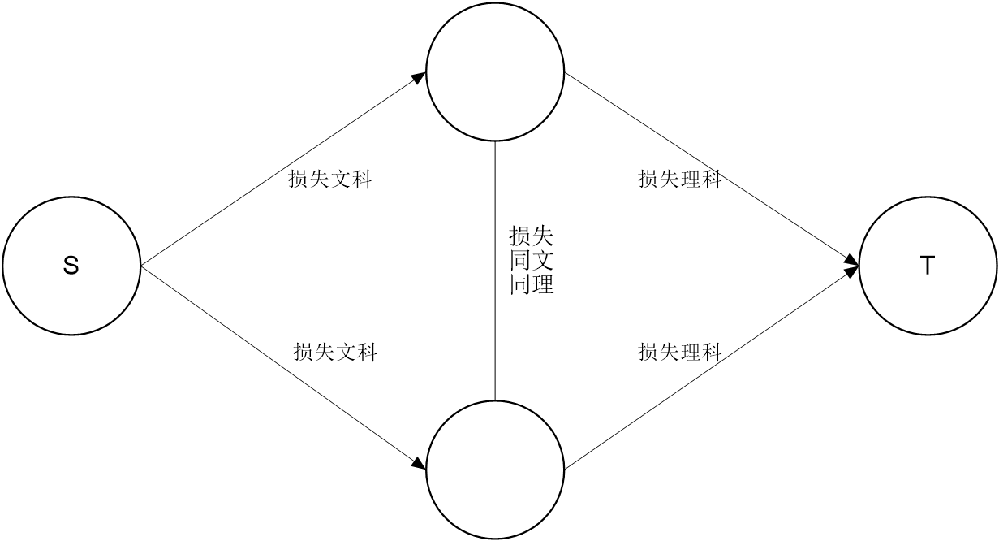

&emsp;&emsp;（上图为当前思路）

&emsp;&emsp;稍微调整下：

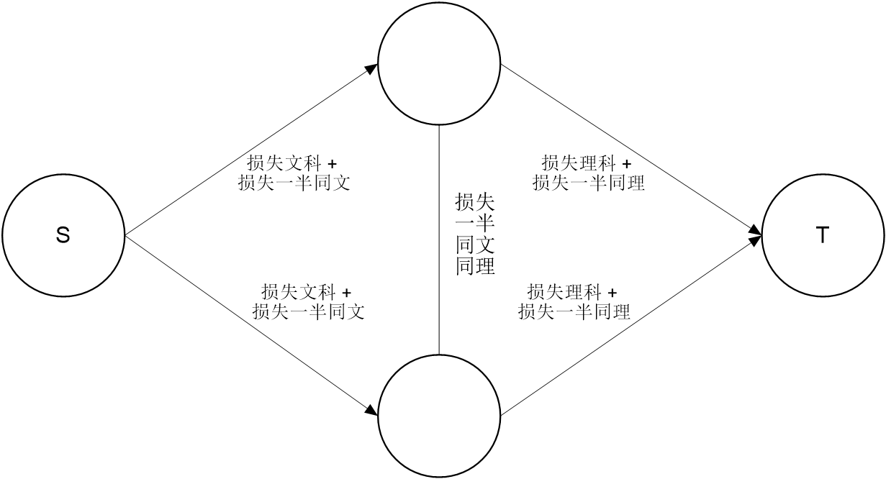

&emsp;&emsp;不难验证，这样建模就是对的了。这样建模保证中间不是负容量。

&emsp;&emsp;更新：通过解方程组得到边权。

##### e.g. [UVa 1659 帮助小罗拉](https://cn.vjudge.net/problem/UVA-1659)

&emsp;&emsp;可以将原问题进行转换：给定一张图有向图，从中选出边权和最大的边集，组成若干个有向圈。这里的边权等于题目中的 $dx - y$。$x$ 表示每单位长度得到的分数，$y$ 表示每画一条边得到的分数，$d$ 表示两点间的距离。

&emsp;&emsp;可以这样建一个费用流模型：在原图的基础上设每条边的容量为 1，费用为边权，要求找一个流，使得所有节点都满足流量平衡（入流等于出流）条件，且总流量乘以费用的总和最大。

&emsp;&emsp;这种模型很特殊：没有源点和汇点，而且每个结点要求满足流量平衡，所以没有最大流这种说法，称为*循环流（circulation）*。这个问题称为*最大费用循环流问题*。

###### ①问题转化

&emsp;&emsp;通常，**最大费用流问题需要把边权取负，转换为最小费用流问题，最大费用循环流也不例外**。现在把所有边权取负，则问题变为最小费用循环流问题。

&emsp;&emsp;解决方法有两个。

###### ②方法：寻找负费用增广圈

&emsp;&emsp;找到整个图的一个负费用增广圈后，沿着这条负费用增广圈进行增广。这样，每个结点的流量平衡不会被破坏，而整个循环流的总费用变小了。使用 Bellman-Ford 算法即可。

&emsp;&emsp;口胡简单，我写不来……

###### ③方法：改造边权

&emsp;&emsp;新增附加源 $s$ 和附加汇 $t$，对于原图中的每条负权边 $u \to v$ 变成 $3$ 条边：$s \to v$，$v \to u$，$u \to t$，容量均为 $1$，但是 $v \to u$ 的费用变为原来的相反数，其它两条边的费用为 $0$。原图中的正权边 $u \to v$ 保持不变，容量为 $1$，费用为权值。

&emsp;&emsp;经过处理后，所有边都是正权的了，但是有许多重边，需要处理一下：对于任意点 $u$，假设 $s \to u$ 的弧有 $a$ 条，$u \to t$ 的弧有 $b$ 条，不妨设 $a > b$，则只保留一条 $s \to u$ 的弧，容量为 $a - b$。$a = b$ 时删除所有 $s \to u$ 和 $u \to t$ 的弧即可（不要忘了这些弧费用为 $0$）。处理时，只需要给每个点记个数，最后再建边就好了。求出最小费用后，**再加上原图所有负权之和就是循环流的最小费用**。


<center>

原图（容量为 $1$，边权代表费用）

</center>


<center>

改造后的图

</center>

&emsp;&emsp;为什么是这样的呢？考虑一个圈。如果它是负圈，那么在新图中增广时一定优先增广负圈之外的边，因为负圈以外的边的费用比负边的费用的相反数要小，这时加上原边权就相当于同时增广了负边；如果不是负圈，那么就会往负边走，因为负圈以外的边的费用比负边的费用要大，这时加上原边权就相当于撤销增广。

## 模型

### 有上下界的网络流

[参考资料：有上下界的网络流 学习笔记，Clove_unique](https://blog.csdn.net/clove_unique/article/details/54884437)

##### 1. 无源汇可行流

###### 解决方法

1. 建立附加源 $s$ 和附加汇 $t$。

2. 对于原图中的边 $x \to y$，若限制为 $[b, c]$，那么连边 $x \to y$，流量为 $c - b$。

3. 对于原图中的某一个点 $i$，记 $d(i)$ 为流入这个点的所有边的下界和减去流出这个点的所有边的下界和。

   若 $d(i) > 0$，连边 $s \to i$，流量为 $d(i)$。

   若 $d(i) < 0$，连边 $i \to t$，流量为 $-d(i)$。

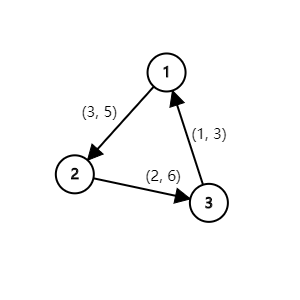

<center>一个有上下界的无源汇的网络流</center>

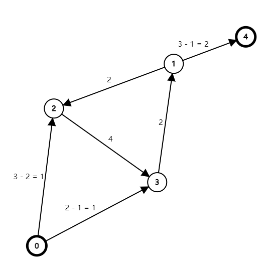

<center>改造后的网络</center>

&emsp;&emsp;对新建的图跑最大流，若新图**满流**，那么一定存在一种可行流。此时，原图中每一条边的流量为新图中对应边的流量加这条边的流量下界。

###### 实际含义

&emsp;&emsp;我们强行让所有边的流量达到流量下界，即用零流代表这个流量下界。如果我们不加入额外源点和汇点的话，虽然任意流都满足流量限制条件，但是不一定满足流量平衡条件。例如上图中，如果忽视源点 $0$ 和汇点 $4$，那么 $2$ 是新图中的一个可行流，但是放回原图中，却不满足流量平衡的条件。

&emsp;&emsp;为了满足流量平衡条件，对于一条出边，我们要从源点连一条容量为下界的边，给这个结点补充流量，**让以这个点为起点的边满足流量平衡条件**；对于一条出边，我们要从终点向汇点连一条容量为下界的边，给这个结点分流，**让以这个点为终点的边满足流量平衡条件**。在满足流量平衡的基础上，为了再次满足流量限制，**仅当附加边均满流时原图才有可行流**。

&emsp;&emsp;另外，无源汇的网络流不存在最大流和最小流的说法，因为所有点都满足流量平衡，我们无法定义这幅图的最大流到底是什么。

##### 2. 有源汇可行流

###### 解决方法

&emsp;&emsp;在原图中添加一条边 $t \to s$，流量限制为 $[0, \infty]$，然后对新图求无源汇可行流。

###### 实际含义

&emsp;&emsp;由于 $t$ 到 $s$ 的边实际上对容量是没有限制的，所以原图和新图中的流是一一对应的，换句话说，对于求新图的一个可行流，删去 $t \to s$ 这条边后就是原图的一个可行流。

##### 3. 有源汇最大流

###### 解决方法

&emsp;&emsp;对原图求有源汇可行流，然后删去附加源和附加汇并拆去 $t \to s$ ，再求 $s$ 到 $t$ 的最大流，求出来的就是答案。

###### e.g. [ZOJ 3229 Shoot the Bullet](https://cn.vjudge.net/problem/ZOJ-3229)

题目大意：接下来的 $n$ 天中，A 要给 $m$ 个女孩拍许多照片。对于女孩 $x \pod {1 \le x \le m}$，在这 $n$ 天中至少被拍 $G_x$ 张照片。在第 $k$ 天中，A 会给其中 $C_k$ 个女孩拍照，分别是 $T_{k_1}, T_{k_2}, \cdots, T_{k_{C_k}}$，同时必须满足给 $T_{k_i}$ 拍的照片数量在 $[L_{k_i}, R_{k_i}]$ 的范围内。另外，A 在第 $k$ 中最多只能拍 $D_k$ 张照片。求 A 在这 $n$ 天中最多能拍多少张照片；如果存在合法方案，还要输出每个女孩每一天的具体方案。测试沿袭 ACM 题库的特点，包含多组测试数据。

&emsp;&emsp;由于网络流的时间复杂度为 $O(能过)$，所以除了特殊情况我是不会给出数据规模的。

------

&emsp;&emsp;我们用流量表示拍照的数量，那么我们需要为每一天和每一个女孩建立一个点。

&emsp;&emsp;为了满足每天拍照上限，我们从源点向每一天的结点连一条容量为 $D_k$ 的边。为了满足每天女孩拍照的量，我们从每天的结点向要拍照的女孩连一条下界为 $L_{k_i}$ 上界为 $R_{k_i}$ 的边。为了满足女孩拍照的总量，我们从女孩向汇点连一条下界为 $G_x$ 上界为无穷大的边。则合法的最大流就会答案。

&emsp;&emsp;由于有上下界，我们用有上下界的网络流的建模方法即可。**强烈建议写一下代码，因为马上我就会说一套写一套**。

###### 参考代码

```c++
// 按照有源汇可行流的方法建模...
int lower_bound = nf.Dinic();
if (lower_bound != extra)
	printOut(-1);
else
{
	nf.s = 0;
	nf.t = n + m + 1;
	printOut(nf.Dinic()); // note
	for (int i = 1; i <= n; i++)
		for (int j = 1; j <= girl[i][0]; j++)
			printOut(lbound[i][j] + nf.edges[girlEdge[i][j]].flow);
}
```

&emsp;&emsp;你就会发现：说好的删点拆边呢？？？为什么这么做就对了？？？

&emsp;&emsp;先看几张图：

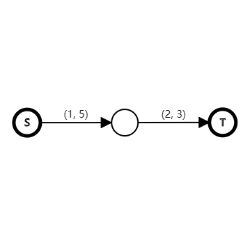

<center>原图</center>

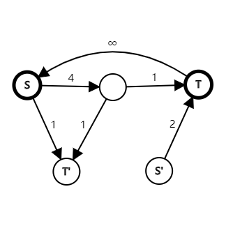

<center>用于求有源汇上下界的可行流的图</center>

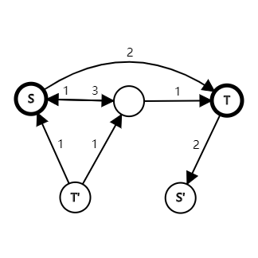

<center>上图的残量网络（由于 T 不可能向 S 流，所以忽略了 T 到 S 的边）</center>

&emsp;&emsp;容易发现，对于附加源附加汇以及所有以它们为端点的边，我们都已经不可能再增广了（不要忘了最后是以原来的源（汇）点为源（汇）点跑的网络流），所以我们可以不必管它们。

&emsp;&emsp;与原图相比，除了原图中的边的容量，唯一不同的地方就是多了一条 S 到 T 的边，**其容量又恰好为求出的可行流流量（因为是循环流，所有 S 到 T 的流量都会从 T 流回 S）**。所以我们直接对这个图求最大流就是答案，无需删边。

&emsp;&emsp;事实上，残量网络中 S 到 T 的这条边的作用就是为我们求出可行流的流量，这直接保证了所有边的符合流量限制。因为原图中的边的容量是假定零流就为下界的，所以这些边的流量不管怎么变化都满足了有上下界的原图的流量限制。

##### 4. 有源汇最小流

###### 解决方法

&emsp;&emsp;对原图求有源汇可行流，**删去 T 到 S 的边后（这次是真的删，否则有一条容量无穷大的边）求 T 到 S 的最大流**。用可行流减去最大流就是答案。正确性显然，T 到 S 的最大流相当于是 S 最多能撤回多少流量。

###### e.g. [BZOJ 2502 清理雪道](https://www.lydsy.com/JudgeOnline/problem.php?id=2502)（权限题）

题目大意：有一张 DAG，每次可以任意一个点出发走一条路径，路径上的所有**边**都会被标记。边可以被重复标记，求最少要出发多少次才能标记所有边。

------

&emsp;&emsp;~~一眼最小路径覆盖心态崩了。~~

&emsp;&emsp;这个题与最小路径覆盖不同的是，最小路径覆盖的是点，而这个题覆盖的是边，所以最小路径覆盖就 GG 了。（顺便复习一下，发现连样例都过不了，心态崩了）

&emsp;&emsp;考虑网络流。我们新增一个源点，向原图中的每一个点连一条容量为**正无穷**的边（可以从一个点出发多次但是路径不一样）；新增一个汇点，原图中的每一个点向其连一条容量为正无穷的边（可以停在一个点多次但是路径不一样）。对于原图中的边，我们将其视作一条下界为 $1$，没有上界的边（可以经过一条边多次，但是至少要经过一次）。则问题转化为求有源汇有上下界的最小流。

```c++
// 第一条加入的边（nf.edges[0]）是 t -> s 的容量为 ∞ 的边
nf.Dinic();
int upper_bound = nf.edges[0].flow; // excuse me???
nf.s = n + 1;
nf.t = 0;
nf.edges[0].flow = nf.edges[0].cap;
//nf.edges[1].flow = nf.edges[1].cap; // 不可能 t 增广到 s，可以不用删
printOut(upper_bound - nf.Dinic());
```

&emsp;&emsp;同理，我们不用管用于解决无源汇上下界可行流的额外源额外汇，因为无论如何它们都不会再增广了（这道题肯定有一个可行流，所以我们没有检查）。但为什么一开始的可行流是 $t \to s$ 那条边的流量而不是直接求出来的最大流？？？前一道例题中我们看的不是求出来的最大流吗？？？

------

&emsp;&emsp;如果你看到这儿觉得我写得很有问题，或者觉得这么显然我绕了个半天，那请你忘掉上面，下面我会给出上下界网络流建图的真正含义——

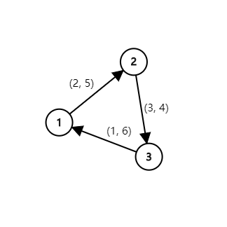

<center>无源汇上下界循环流</center>


<center>强制达到下界</center>

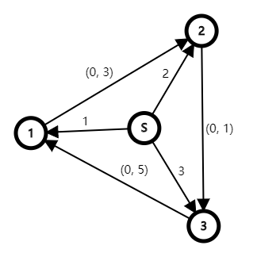

<center>流量不平衡？强制补充</center>

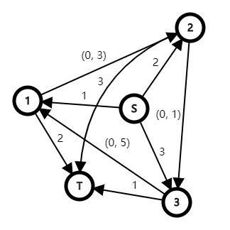

<center>还是不平衡？强制流出</center>

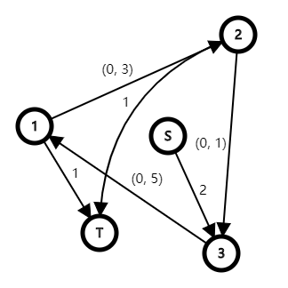

<center>处理重边</center>

&emsp;&emsp;S 的流出的总容量一定等于 T 流入的总容量，因为一个是入流，一个是出流。那 S 到 T 的流量到底代表什么呢？注意到，这个网络流的下界为 $3$，而 S 到 T 的最大流仅为 $2$，所以**附加源的最大流并不代表循环流的下界**。

&emsp;&emsp;前面提到过，附加源汇是为了使整个图满足流量平衡，给结点补流或者分流的。所以**附加源汇的最大流本身没有意义，它只代表了给结点补流或者分流的量**。

------

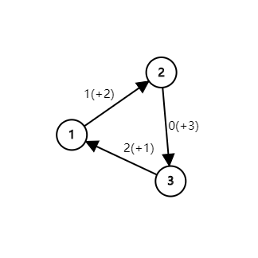

<center>忽略附加源和附加汇后每条边的流量</center>

&emsp;&emsp;显然，无源汇上下界网络流跑完后，与附加源汇无关的边的**流量加上它本身的下界就是它在原图中的流量**。由于无源汇上下界网络流不存在最大流或最小流一说，所以我们只知道它满足了流量限制和流量平衡条件，没有别的可利用的性质。

------

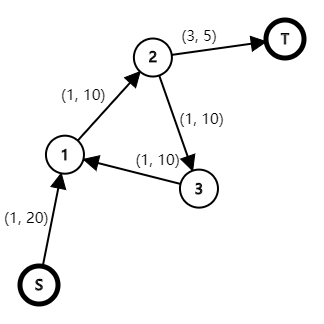

<center>有源汇上下界网络流</center>

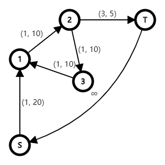

<center>转换成了无源汇上下界网络流</center>

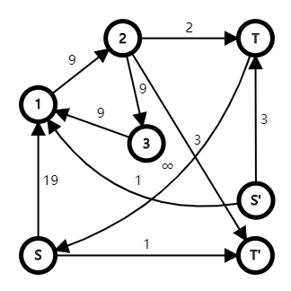

<center>增加了附加源和附加汇</center>

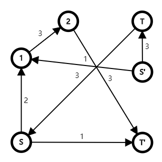

<center>实际流量（删去了没有流量的边）</center>

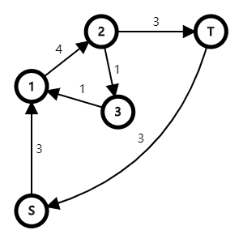

<center>原图（循环流）可行流的实际流量</center>

&emsp;&emsp;很明显，附加源的最大流为 $4$。结合之前的总结，**它的含义是为结点补充[^supply]的流量为 $4$**。可以发现，原图（循环流）的可行流的实际流量并不是 $4$，而是 $3$。由于从 $S$ 流向 $T$ 的所有流量都会从 $T$ 流回 $S$ 以满足流量平衡，**所以原图的可行流大小是 $T$ 到 $S$ 的流量，而非附加源的最大流**。

[^supply]: 补流和分流究竟是什么意思，我想到已经不重要了，只要你明白了你要求的是什么就可以了。

------

&emsp;&emsp;回到那两道例题。对于上下界最大流，我们利用了反向边直接进行增广，得到的自然就是最大流，而检查是否可行只能看附加源的最大流是否满载。对于上下界最小流，由于我们只能删除 $T$ 到 $S$ 的边然后去求最大退流，因此我们必须做个减法。被减数只能是 $T$ 到 $S$ 的流量，因为它才代表原图中可行流的流量。

------

&emsp;&emsp;回到[第一道例题](#e.g.-[zoj-3229-shoot-the-bullet](https://cn.vjudge.net/problem/zoj-3229))，在了解了求出来的东西的具体含义后，我们也可以这么写：

```c++
nf.s = 0;
nf.t = n + m + 1;
int sum1 = nf.edges[0].flow;
nf.edges[1].flow = nf.edges[1].cap;
printOut(nf.Dinic() + sum1);
for (int i = 1; i <= n; i++)
	for (int j = 1; j <= girl[i][0]; j++)
		printOut(lbound[i][j] + nf.edges[girlEdge[i][j]].flow);
```

&emsp;&emsp;这样写的好处是将要求的东西分成了很好划分的两部分。

##### 5. 有源汇最小费用可行流

###### 解决方法

&emsp;&emsp;像有源汇**可行流**那样建模，原图中的费用不变，以附加源汇为端点的边的费用为 $0$。对新图跑最小费用最大流，可以得到原图中每条边的流量。**这是原图中满足流量限制和流量平衡的最小费用流**。

&emsp;&emsp;相信大家已经深刻理解了有源汇可行流解法的含义，这里我就不解释了。只需要注意，可行流不一定是最大流，所以它也不一定是最小费用最大流，它只是一个最小费用流。

###### e.g. [BZOJ 2055 80 人环游世界](https://www.lydsy.com/JudgeOnline/problem.php?id=2055)（权限题）

题目大意：有 $n$ 个国家，$m$ 个人，每个人一开始在任意一个国家（由你来决定）。若一个人在国家 $i$，他只能到编号大于 $i$ 的国家去，且需要花费 $c_{i, j}$ 的费用（可能不能到达）。每个国家必须恰好有 $v_i$ 个人到达过，求满足这个条件的最小费用。

------

&emsp;&emsp;由于对点的经过次数有限制，我们考虑拆点，拆开的点中间连一条上下界为 $[v_i, v_i]$ 的边，费用为 $0$。对于可以飞到的两个点，我们连一条费用为开销，容量无限制的边。新建源点和汇点，源点向所有点连边，容量无限制，费用为 $0$；所有点向汇点连边，容量无限制，费用为 $0$。[^vertex]我们实际上要求的是最小费用**可行**流，套用上面的解决方法即可。（懒，我就不写了~~，相信不会考的~~）

[^vertex]: 由于这里拆了点，所以谁连谁请自己弄清楚。

&emsp;&emsp;具体实现是，可以直接跑在新图中跑最小费用最大流，再加上原图中的边的下界与费用之积即可，**不要忘了新图中原图的边的流量的含义**。

##### 6. 有源汇最小费用最大流

###### 解决方法

&emsp;&emsp;向有源汇最小费用可行流那样建模，对新图跑一次最小费用最大流。拆掉 $t \to s$ 的边后（为了表示你深刻理解了，同样不用拆 $t \to s$ 的反向边，因为流量不会回流），再对新图跑最小费用最大流。这样我们有三部分的费用：下界的费用，可行流额外流量的费用和最大流额外流量的费用，加起来就是最小费用。

&emsp;&emsp;以上方法没有验证，坐等大神指教。

### 最大权闭合子图

##### 1. 定义

&emsp;&emsp;给定一个有向图，每个点有点权（可以为负）。要求选择一个子图，满足当一个点被选后，它的后继点都被选，求最大权值和。这个问题被称为*最大权闭合子图问题*。

##### 2. 转换为最小割问题

&emsp;&emsp;设存在一条 $u \to v$ 边。

&emsp;&emsp;如果我们选了 $v$，那么我们可以可以选 $u$，也可以不选 $u$；如果我们选了 $u$，那么我们必须选 $v$。这和[前面的题目中遇到的模型](#[2018-1-2-集训-变量](c:\users\lyche\documents\github\oi\camp\2018-1-2\problem\problem.pdf))是相同的，在网络流图中，我们从 $u$ 到 $v$ 连一条容量无穷大的边即可。

&emsp;&emsp;我们令 $S$ 集代表选，令 $T$ 集代表不选。我们先假设把点权非负的全部都选了，则我们从 $S$ 向点权为正的点连一条容量为点权的边，表示将它割离 $S$ 集合（不选）要花费的代价；从所有点权为负的点向 $T$ 集合连一条容量为点权的相反数的边，表示将它割离 $T$ 集合要花费的代价（选）。则代价的最小损失就是最小割。最终的答案就是正点权的和减去最小割。

##### 3. e.g. [JZOJ 1076 [GDKOI 2006] 破解密文](https://jzoj.net/senior/#main/show/1076)

题目大意：给定一张 DAG，求出它的最大权闭合子图。你只需要输出最大权即可。结点权值只有 $-1$，$0$，$1$ 三种，但是这个条件没有什么用。

###### 参考代码

```c++
for (int i = 1; i <= n; i++)
{
	int cost = readIn();
	if (cost > 0)
	{
		accum++;
		nf.addEdge(0, i, 1);
	}
	else if (cost < 0)
		nf.addEdge(i, n + 1, 1);

	int c = readIn();
	while (c--)
		nf.addEdge(i, readIn(), INF);
}
printOut(accum - nf.Dinic());
```

##### 4. 最大密度子图

###### ①定义

&emsp;&emsp;定义无向图 $G = (V, E)$ 的密度 $D$ 为该图的边数与该图的点数的比值，即：
$$
D = \frac {|E|} {|V|}
$$
&emsp;&emsp;给定一张无向图，求它的最大密度子图，这个问题被称为*最大密度子图问题*。

###### ②问题转换

&emsp;&emsp;假设答案为 $k$，我们二分答案。则要解决的问题是：选出一个合法的点集 $V$ 和边集 $E$，令 $E - k \times |V|$ 取得最大值。合法指：若选择某条边，则必选择其两端点。可以将原图中点边看作一个点，然后向它的两个端点各连一条有向边，权值为 $1$；原图中的点的权值为 $-k$，则问题转换为了最大权闭合子图问题。

&emsp;&emsp;答案越大，原式的最大值肯定越小，而当原式为 $0$ 时我们就得到了答案。因此我们将这个最大值与 $0$ 进行比较，若最大值大于等于 $0$，则令答案变大；若最大值小于 $0$，则令答案变小。

##### 5. e.g. [JZOJ 4360 [GDKOI 2016] 寻宝](https://jzoj.net/senior/#main/show/4360)

题目大意：有 $n$ 个密室，进入密室后将会得到 $a_i$ 个单位的财富并受到 $b_i$ 个单位的伤害。进入一个密室前可能还需要先进入其它（可能不止一个）密室拿到钥匙才能进入。当然，如果两个密室形成死锁关系就都不能进入了。求出每得到一点财富值需要受到的最小伤害值。需要特判不可能得到财富值的情况。

------

&emsp;&emsp;题目相当于是要最小化：
$$
k' = \frac {\sum b} {\sum a}
$$
&emsp;&emsp;即最大化：
$$
k = \frac {\sum a} {\sum b}
$$
&emsp;&emsp;设：
$$
d = \sum a - k \times \sum b
$$
&emsp;&emsp;当 $k$ 变大时，$d$ 会变小，而当 $d$ 等于 $0$ 时 $k$ 就是答案，所以我们二分答案 $k$，若 $d > 0$，我们令答案更大；若 $d \le 0$，我们令答案更小。则原问题转换为了最大权闭合子图问题。注意，当 $d = 0$ 时，我们不能让 $k$ 更大，因为 $d = 0$ 还有可能是因为 $\sum a = 0$，代表当前 $k$ 过大，没有选择任何密室。最后，若 $k$ 趋于无穷大，说明 $\sum b = 0$，无论如何也得不到财富。

&emsp;&emsp;然而与最大权闭合子图问题不同的是，这个问题不能够选环。然而据说数据中没有有环的情况（垃圾数据，毁我青春，说好的有环的），所以直接套用最大权闭合子图问题就可以了。

&emsp;&emsp;这个题与最大密度子图的处理方法有着异曲同工之妙，都是**二分答案后跑最大权闭合子图**。

&emsp;&emsp;一定要注意数据类型，这道题是浮点数的网络流，如果你用整数，说不定能过样例……然后你就 GG 了。

```c++
double l = 0, r = INF;
while (r - l >= 1e-6)
{
	double mid = (l + r) / 2;
	if (check(mid) > 0) // note
		l = mid;
	else
		r = mid;
}
if (l + 0.5 >= INF) puts(noans);
else printf("%.6f", 1 / l);
```

&emsp;&emsp;如果这个题考场上我写不来对拍，我就凉了……

### 最小割树

##### 1. 问题引入

&emsp;&emsp;有些题要求我们求出**无向图**任意两点间的最小割，而 $O(n^2)$ 枚举源点汇点跑最大流不能满足时间上的需求。

&emsp;&emsp;最小割树的发明就是用来解决这个问题的，利用它可以只求 $n$ 次最大流来求出答案。

##### 2. 问题解决

（结论和证明都太难啦！我只能直接放个板子）

###### ①Gomory-Hu tree

&emsp;&emsp;*最小割树（Gomory-Hu Tree~~，郭沫若胡树~~）*是一棵代表了无向图中所有结点对见的最小割（最大流）的树。

&emsp;&emsp;顾名思义，这是一棵树。但我们是开局一张图，怎么建树呢？

###### ②建树过程

&emsp;&emsp;我们可以用伪代码来描述这一过程所需的参数：

```c++
void GomoryHu(Graph& G, Set Vertex);
```

&emsp;&emsp;也就是说，我们要给定一张**完整的**图，再给定一个**图里的点集**。在外部调用此函数时，我们将会这样调用：

```c++
GomoryHu(graph, graph.vertex);
```

&emsp;&emsp;也就是说一开始点集为整个图的点集。

------

&emsp;&emsp;步骤一：在 `Vertex` 中任意选择一个源点和一个汇点，求出它们间的最小割，并按残量网络将 `Vertex` 中的点划分到 $S$ 集或 $T$ 集中去。

&emsp;&emsp;步骤二：将划分出的两个集合看作一个点，连一条边权为最小割的边。

&emsp;&emsp;步骤三：递归处理划分出的两个集合。

###### ③参考代码

&emsp;&emsp;我们巧妙地维护每个结点在 Gomory-Hu 树中的父结点，则问题在 $O(n \times \mathrm{maxflow})$ 内解决：

```c++
void GomoryHu()
{
	depth[1] = 1;
	parent[1] = 0;
	cost[1] = 0;
	for (int i = 2; i <= n; i++)
		parent[i] = 1;
	for (int i = 2; i <= n; i++)
	{
		nf.s = i;
		nf.t = parent[i];
		nf.reset();
		cost[nf.s] = nf.Dinic();
		depth[nf.s] = depth[nf.t] + 1;
		for (int j = i + 1; j <= n; j++)
			if (parent[j] == nf.t && nf.vis[j] == nf.stamp)
				parent[j] = nf.s;
	}
}
```

&emsp;&emsp;这份代码非常巧妙，请仔细体会，我不想解释了，我觉得我也解释不清楚。

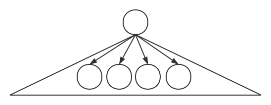

<center>一开始的形态，所有结点都在同一集合中</center>

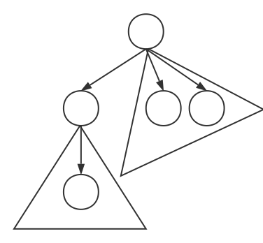

<center>求一次最小割后的形态，结点被分成了两部分，并且连接了一条真正有边权的边</center>

###### ④性质

&emsp;&emsp;对于任意两点，其最小割为两点在最小割树上的路径中的最小边权。

&emsp;&emsp;由此可知，一张 $n$ 个点的无向图的最小割至多有 $n - 1$ 个不同的取值。

##### 3. e.g. [Luogu 4123 [CQOI 2016] 不同的最小割](https://www.luogu.org/problemnew/show/P4123)

题目大意：给定一张 $n \pod {n \le 850}$ 个结点 $m \pod {m \le 8500}$ 条边的无向图，把 $\frac {n(n - 1)} {2}$ 个点对作为源汇点跑最小割，求有多少个不同的的最小割。

------

&emsp;&emsp;看建出来的最小割树中有多少种不同的边权就好了。实际操作时只需要看跑出多少种最小割就好了，无需建树。

```c++
void GomoryHu()
{
	int parent[maxn];
	for (int i = 2; i <= n; i++)
		parent[i] = 1;
	std::set<int> set;
	for (int i = 2; i <= n; i++)
	{
		nf.s = i;
		nf.t = parent[i];
		nf.reset();
		set.insert(nf.Dinic());
		for (int j = i + 1; j <= n; j++)
			if (parent[j] == nf.t && nf.vis[j] == nf.stamp)
				parent[j] = nf.s;
	}
	printOut(set.size());
}
```

##### 4. e.g. [Luogu 3329 [ZJOI 2011] 最小割](https://www.luogu.org/problemnew/show/P3329)

题目大意：给定一张 $n \pod {n \le 150}$ 个点 $m$ 条边的无向图。给定 $q \pod{q \le 30}$ 个询问，每次询问最小割不超过 $x$ 的点对数。有至多十组测试数据。

------

&emsp;&emsp;这道题需要我们建出最小割树，然后我们枚举点对求 LCA 就可以了。由于数据规模小无需倍增，暴力求 LCA 即可。参考代码见前面。

### 平面图最小割转对偶图最短路

##### 1. 问题引入

&emsp;&emsp;给定一个平面图，求它的最小割，数据范围超大。

&emsp;&emsp;什么叫平面图呢？就是你把这张图画在纸上，没有边发生交叉，就叫*平面图*。不同的画法可能导致交叉的产生，为了方便，我们认为画图人绝顶聪明，只要一张图能够画成平面图，画图的人就一定把它画成平面图。

##### 2. 问题解决

&emsp;&emsp;对于平面图 $G$，我们称 $G$ 中每一个封闭的图形为一个*区域*，特别地，延伸至无穷远的地方也算一个区域，显然，每两个区域之间一定有至少一条边把它们隔开。

&emsp;&emsp;我们将每个区域看作一个点，若两个区域被一条容量为 $x$ 的边隔开，我们就在这两条区域间连一条边权为 $x$ 的边，这样我们就得到了一张新的图，点集为各区域。我们称这张图为原平面图的*对偶图*。

&emsp;&emsp;由于平面图的最小割相当于是一条线划过各区域把原图划成两半，被划过的边的容量和最小，这正好对应对偶图的一条路径，所以我们有：**平面图的最小割等于对偶图的最短路**。

##### 3. 细节

&emsp;&emsp;以上只是概述，稍微举几个例子后马上就能发现问题：

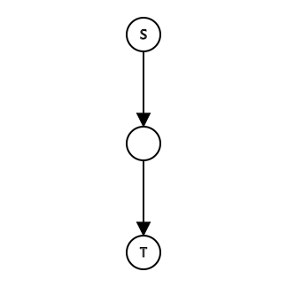

<center>有最小割吗？有。对偶图有几个点？一个！？</center>

&emsp;&emsp;为了解决这个问题，我们从 $s$ 向 $t$ 连一条容量为无穷的边：

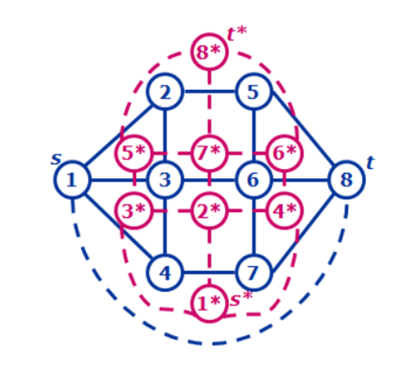

<center>由于 $s$ 到 $t$ 的边权为无穷大，不可能存在最短路，因此我们忽略它</center>

&emsp;&emsp;连边之后，平面图的最小割就等于 $s$ 到 $t$ 划分成的两个区域间的最短路，**但前提是这个被划开的区域原来可以延伸至无穷远**，否则问题不能转换成对偶图求解。

------

&emsp;&emsp;另外，我们规定，如果一条边的两侧属于同一区域，那么在对偶图中它将会形成一个自环。

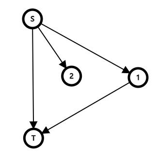

<center>$s \to 2$ 这条边将会形成一个自环</center>

##### 4. e.g. [BZOJ 1001 [BJOI 2006] 狼抓兔子](https://www.lydsy.com/JudgeOnline/problem.php?id=1001)

&emsp;&emsp;直接将平面图最小割转换成对偶图最短路问题，注意 $n = 1$ 以及 $m = 1$ 的情况，建图时只能手动建图。（我懒，就不写了）