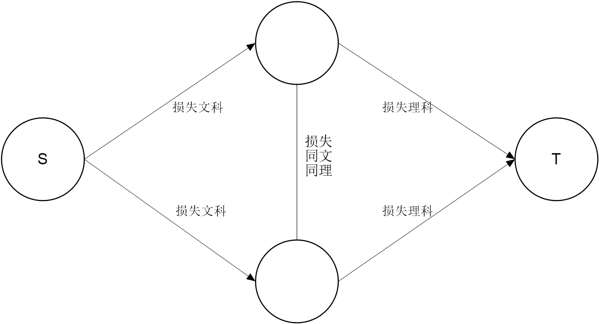
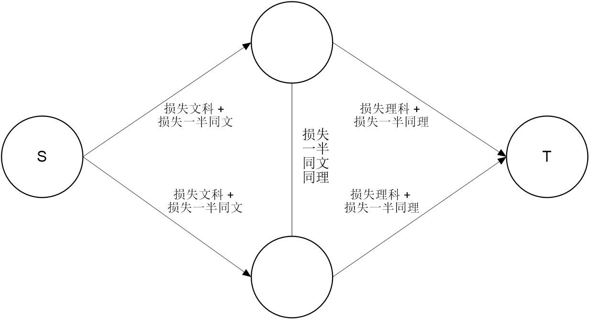

[TOC]

# 前言

&emsp;&emsp;漫无目的地做题还是做不来，痛心疾首，决定还是照着紫书和蓝书上的例题和习题去刷。

&emsp;&emsp;Tip：想要连上 UVa 基本是不可能的了，使用 [Virtual Judge](https://cn.vjudge.net/) 即可，相当好用。

# 网络流

#### 速记

##### 矩阵与二分图的转换

&emsp;&emsp;矩阵常常可以转换为二分图：每一行代表 X 部中的一个点，每一列代表 Y 部中的一个点。X 中的点 x 到 Y 中的点 y 的边代表矩阵中对应的位置 (x, y)。

##### 拆点法

&emsp;&emsp;把点拆成两个，然后中间连一条边。

##### 最小割连边技巧

&emsp;&emsp;两个点连一条容量为无穷大的**无向边**[^1]，相当于强制让这条边不是最小割中的割边，也就相当于强制让这两个点在最小割中属于同一集合。

[^1]: 后面也会提到这个方法。在这里无向边要拆成两条有向边。

&emsp;&emsp;两个点连一条容量为无穷大的**有向边**，相当于强制防止这种情况：起点在 $S$ 中，而终点在 $T$ 中。其余情况都是可能存在的。

&emsp;&emsp;如果要连向源点或者汇点，**连边时容量往往为“逃脱”源点或汇点集合产生的贡献。**如果这时边权为负，则需要假设一开始选择源点集合或者汇点集合，使容量代表逃脱源点（汇点）集合到汇点（源点）集合时贡献的改变量，且该改变量必须为正。

##### 二分图匹配的联想

&emsp;&emsp;“每个东西恰好有一个唯一……”可能代表着二分图匹配。

#### 题目列表

##### e.g. [UVa 753 Unix 插头](https://cn.vjudge.net/problem/UVA-753)

&emsp;&emsp;一种容易想到的建图方式是，既然转换器个数不限，那就直接连一条容量为无穷大的边。然后就想到源点连向设备对应的插头（设备的名称其实没有用），各个插头对应的插座连向汇点，容量均为 1。这么做很明显是对的，**如果**使用 EK 算法，增广一次就相当于插上了一个插头。

&emsp;&emsp;另外一种建图方式是，直接源点向设备连边，插座向汇点连边，容量均为 1。如果设备能用某种方式匹配到某个插座，就连一条容量为无穷大的边。

&emsp;&emsp;我觉得第一种方式好想一点，好写一点，甚至还要快一点。第二种建图方式还要用 Floyd 计算传递闭包。

##### e.g. [UVa 11082 矩阵解压](https://cn.vjudge.net/problem/UVA-11082)

&emsp;&emsp;这道题需要用到二分图来建模：将每一行用 X 部的一个点表示，每一列用 Y 部的一个点表示。**可以用 X 部的点向 Y 部的点连边，用边的流量代表 $a_{x, y}$。**由于每个位置的值不超过 20，所以边的容量应该为 20。

&emsp;&emsp;由于题目已经给定了每一行和每一列的和，因此源点向 X 部的每个点连一条容量为对应行的和的边，Y 部的每个点向汇点连一条容量为对应列的和的边。不难发现，如果这两种边每条边都是满载的，就说明问题有解，对应位置的答案为  X 部向 Y 部连的边的流量。

&emsp;&emsp;但是有一个问题：规定每个位置的最小值为 1，而像上面这么做可能会有流量为 0 的边。解决方法也很简单：干脆让矩阵中的每个数都减去 1，相应的其它地方也要发生改变，最后答案再加回来就可以了。

##### e.g. [UVa 1658 海军上将](https://cn.vjudge.net/problem/UVA-1658)

&emsp;&emsp;可以考虑最小费用最大流，边只能经过一次，就把容量设为 1，费用设为边权。但是点也只能经过一次，所以可以拆点，把点换成一条容量为 1，费用为 0 的边即可。

##### e.g. [UVa 1515 修水塘](https://cn.vjudge.net/problem/UVA-1515)

&emsp;&emsp;典型的**最小割模型**。

&emsp;&emsp;题目大概可以抽象成这么个问题：给定一张图，有两种结点，可以花费一定代价互相转化，有些结点不能转换。每对相邻的不同结点需要花费一定代价。问最小总代价？

&emsp;&emsp;再抽象一点，可以这样考虑：将所有结点分成**两个集合**，不同的分法按题意有不同的总代价，求最小总代价？

&emsp;&emsp;放到网络流上，就可以转换为最小割问题了。我们现在的任务是，**如何用割边的容量来代表代价。**

&emsp;&emsp;为了方便，我们**规定**源点所在集合的结点类型为草地，让汇点所在集合的结点类型为洞。

&emsp;&emsp;如何表示一个结点一定为草地？只需要**从源点向它连一条容量为无穷大的边。**如果最小割最后不是无穷大，那么一定不会割这条边，换句话说这么做之后这个点和源点始终是在同一集合内的。

&emsp;&emsp;如何表示一个结点发生了类型转换？假设这个结点为草地。如果我们要转换为洞，那么源点和这个结点就不在同一集合内。此时，如果源点到结点有边，这条边就是割边。同理，如果我们不转换，源点到结点的边就不是割边。**所以我们从源点向它连一条容量为转换为洞的代价的边。**一开始为洞的结点同理，从它向汇点连一条容量为转换为草地的代价的边。

&emsp;&emsp;如何表示相邻的两个不同类型的结点需要花费一定代价？只需要**连一条容量为修篱笆的代价的无向边（两条有向边）。**如果这两个结点在相同集合，就没有割边，否则无论哪个在 $S$ 哪个在 $T$，始终都会有一条割边。

##### [2018-1-1 集训 变量](C:\Users\lyche\Documents\GitHub\OI\Camp\2018-1-2\problem\problem.pdf)


&emsp;&emsp;又一个最小割模型：只有两种选择，相同集合对答案没有贡献，不同集合对答案有贡献。

&emsp;&emsp;先讲限制条件。结合上一道例题，已经可以解决两个点在同一集合（$x = y$），两个点在指定集合（$x < y$）的问题。最后的问题是如何处理 $x \le y$ 的情况（要么 $x$ 和 $y$ 在同一集合，要么 $x$ 在 $S$， $y$ 在 $T$）。

&emsp;&emsp;解决方法是**只从 $y$ 向 $x$ 连一条容量为无穷大的边**，这样，仅当 $x$ 在 $T$ 中，$y$ 在 $S$ 中时，这条边成为割边。


&emsp;&emsp;然后就是看两个在不同集合的点对答案的贡献了。对于前面有绝对值的部分，翻译过来就是只要两个不一样，就会对答案有 $2aW$（或者 $b$，或者 $c$）的贡献，所以直接连一条无向边即可。

&emsp;&emsp;剩下的部分好像很难处理，因为**网络流不能连容量为负的边。像这样很难考虑两个不同集合的点对答案的贡献的情况，干脆把式子拆开。**拆开后发现，每个变量将会对答案有 $sum_i w_i$ 的贡献。注意，这个 $sum_i$ 在拆开前就有初值 1，因为题目要求的和的第一部分是 $\sum w_i$。

&emsp;&emsp;于是现在问题就变成了计算选正选负对答案的贡献（**实质上是看是否和源点或者汇点在同一集合**，若在不同集合会造成多少贡献）。但是这样还是会有容量为负的边，所以我们要做这么一个操作：**先假设选正（负）的，再考虑改成选负（正）的会对答案有多少影响。要求这个影响必须为正。**这样我们就能保证连一条正容量的边了。

&emsp;&emsp;注意要提前把那个“假设”给算进答案里。

##### e.g. [UVa 10735 混合图的欧拉回路](https://cn.vjudge.net/problem/UVA-10735)

&emsp;&emsp;什么是混合图？就是既有有向边，又有无向边的图。混合图的常见方法有哪些？**把无向边拆成两条有向边。**这道题为什么不能这么做？**因为拆边后相当于可以正着反着走两次，而实际上只能走一次。**怎么解决这个问题？**考虑把无向边定向。**

&emsp;&emsp;**考虑有向图存在欧拉回路的充要条件，即每个点的入度都等于出度。**当且仅当每个点的 $outDegree - inDegree = 0$ 时，存在欧拉回路。

&emsp;&emsp;有向边转变方向的影响是使两个点的 $outDegree - inDegree$ 的绝对值分别改变 2，而我们的目标是让这个值全为 0。因此，在任意定向时，如果存在 $outDegree - inDegree$ 为奇数的点，那么整个问题无解。

&emsp;&emsp;设 $t_i = \frac {outDegree_i - inDegree_i} {2}$，如果我们把某条定了向的无向边重定向，相当于是 $t_{from} - 1$，$t_{to} + 1$。可以看作是把 $t$ 运送过去了，这就可以用网络流建模：如果 $t_i > 0$，我们相当于要运送 $t_i$ 出去；如果 $t_i < 0$，我们相当于要运送 $t_i$ 进来；如果 $u$，$v$ 有无向边，我们可以**先定为 $u \to v$**，然后考虑反向时对 $t_u$ 和 $t_v$ 的影响。反向时，可以看作是从 $u$ 向 $v$ 运送了 $t$。

&emsp;&emsp;所以这样建模：首先让所有边都有向。建立额外的源点和汇点。如果 $t_i > 0$，从源点向该点连一条容量为 $t_i$ 的边；如果 $t_i < 0$，从该点向汇点连一条容量为 $t_i$ 的边；对于所有原来为无向边的边 $(u, v)$，从 $u$ 向 $v$ 连一条容量为 $1$ 的边，代表对默认方向进行了改变。求最大流后，仅当最大流等于以源点为起点的边的总容量时问题有解。如果一条不以源点或汇点为端点的边的流量为 $1$，说明它的方向发生了反转，否则它的方向没有反转。

&emsp;&emsp;然后求欧拉回路就行了。访问过一条边后，可以**懒惰删除**掉它。干脆背住代码就好了……

```c++
void Euler(INT node)
{
	for (int i = 0; i < G[node].size(); i++)
	{
		int to = G[node][i];
		G[node][i] = 0;
		if (!to) continue;
		Euler(to);
	}
	seq.push(node);
}
```

##### e.g. [UVa 1349 最优巴士路线设计](https://cn.vjudge.net/problem/UVA-1349)

&emsp;&emsp;每个点恰好只属于一个点集，意味着每个点恰好只有一个后继；反过来，如果每个点恰好只有一个后继，那么一定会形成一个个圈。

&emsp;&emsp;**“每个东西恰好有一个唯一的……”可以使我们想到二分图匹配。**不难发现，这个问题实际上是一个二分图的最小权完美匹配问题。

&emsp;&emsp;**二分图最小权完美匹配问题**是这样一个问题：给定一张带权的规模为 $n$ - $n$ 的二分图，要求匹配数达到 $n$，且在此前提下边权和最小。由于**二分图的最大匹配**可以转换为最大流问题，那么**二分图的完美匹配**即可以转换为建模后最大流为 $n$。现在要边权和最小，那就是一个**最小费用最大流**了。

&emsp;&emsp;二分图的最大匹配的网络流解法相对简单，如果没有见过或者忘了网络流解法，可以参看紫书第 373 页。二分图的最大（小）权完美匹配也在那一页上。

##### [Luogu 2053 修车](https://www.luogu.org/problemnew/show/P2053)

&emsp;&emsp;每个人要且仅要一个师傅来给他修车，于是我们**想到了二分图匹配，费用为修它的等待时间。**

&emsp;&emsp;师傅只有一个，而修的车却没有变数，所以不能直接连边。于是我们想，能不能考虑计算对答案的贡献呢？

&emsp;&emsp;假设某个师傅只修 1 辆车，那么等待时间自然就是这辆车的修理时间啦。如果他要修两辆车，那么在修第一辆车时会有两个人等，修第二辆车时会有一个人等，总时间就是第一辆的修理时间 × 2 + 第二辆的修理时间……换句话说，**倒数第几个修，对总的等待时间的贡献就为修这辆车的时间的几倍。**

&emsp;&emsp;于是我们把师傅拆开，拆成修倒数第一辆车的师傅，修倒数第二辆车的师傅……同一个师傅拆开后的师傅区别就在于连边的费用不同。最后跑费用流就可以了。

&emsp;&emsp;答案一定是合法的，因为不合法的答案不会最优，这道题是很容易证明的。

##### [JZOJ 3370 [NOI 2012] 美食节](https://jzoj.net/senior/#main/show/3370)

&emsp;&emsp;这道题跟上题是一样的，只不过数据变大了。

&emsp;&emsp;首先需要明确一点：菜品不需要拆点，只需要改变源点到它的容量就可以代表有多少份了。

&emsp;&emsp;注意到，我们增广时一定是按照倒数第一，倒数第二……的顺序增广的。如果倒数第二还没有做，下次增广时可能会选择倒数第二，但是绝对不会选择倒数第三。因此，我们可以动态开点：增广后，如果下一个还没有连边，我们就把边连上。

```c++
long long c = decode(edges[pre[t]].from);
addCook(c >> 32, (c & 0xffffffff) + 1);
return true; //Bellman-Ford
```

&emsp;&emsp;值得一提的是，这个题由于需要大量加边（在最好情况下也需要至少 $np$ 条边），vector 十分卡常。在没有打开 -O2 选项时，只能得到 70 分，打开 -O2 选项就好了，直接冲到第二名。

&emsp;&emsp;以后开 -O2 还是用 vector，不开 -O2 的话尽量找代替品吧，下次试试链式前向星。

##### [JZOJ 1919 happiness](https://jzoj.net/senior/#main/show/1919)

&emsp;&emsp;同样还是网络流的最小割模型。看出是最小割是相当容易的，但是建模还是有点困难。

&emsp;&emsp;首先不考虑相邻两个人对答案的贡献，把两个人放在网络流图中，很明显就是先假设选喜悦值高的科目，以逃脱文科或者理科的损失（$\Delta$）为边的容量建图（很明显此时最大流是零流）。但是如果考虑了相邻两个人对答案的贡献，就发现很难建模了。

&emsp;&emsp;一个绝妙的技巧是，**不一定要像之前说的那样假设选哪个，再把损失或者贡献放到最小割上，而是直接全部加起来，用 $答案 = 总和 - 损失$ 来计算。**

&emsp;&emsp;所以一个人对文科和理科都要连边。离开文科的边权为文科的喜悦值，离开理科的边权为理科的喜悦值。相邻两个人如果都分开，那就会损失共同学文科和共同学理科的喜悦值，所以连一条无向边。

&emsp;&emsp;那怎么处理同时选文（理）科时减去同时选理（文）科的喜悦值呢？看上去又没有思路了。

&emsp;&emsp;

&emsp;&emsp;（上图为当前思路）

&emsp;&emsp;稍微调整下：



&emsp;&emsp;不难验证，这样建模就是对的了。这样建模保证中间不是负容量。

&emsp;&emsp;更新：通过解方程组得到边权。

##### e.g. [UVa 1659 帮助小罗拉](https://cn.vjudge.net/problem/UVA-1659)

&emsp;&emsp;可以将原问题进行转换：给定一张图有向图，从中选出边权和最大的边集，组成若干个有向圈。这里的边权等于题目中的 $dx - y$。$x$ 表示每单位长度得到的分数，$y$ 表示每画一条边得到的分数，$d$ 表示两点间的距离。

&emsp;&emsp;可以这样建一个费用流模型：在原图的基础上设每条边的容量为 1，费用为边权，要求找一个流，使得所有节点都满足流量平衡（入流等于出流）条件，且总流量乘以费用的总和最大。

&emsp;&emsp;这种模型很特殊：没有源点和汇点，而且每个结点要求满足流量平衡，所以没有最大流这种说法，称为*循环流（circulation）*。这个问题称为*最大费用循环流问题*。

###### ①问题转化

&emsp;&emsp;通常，**最大费用流问题需要把边权取负，转换为最小费用流问题，最大费用循环流也不例外**。现在把所有边权取负，则问题变为最小费用循环流问题。

&emsp;&emsp;解决方法有两个。

###### ②方法：寻找负费用增广圈

&emsp;&emsp;找到整个图的一个负费用增广圈后，沿着这条负费用增广圈进行增广。这样，每个结点的流量平衡不会被破坏，而整个循环流的总费用变小了。使用 Bellman-Ford 算法即可。

&emsp;&emsp;口胡简单，我写不来……

###### ③方法：改造边权

&emsp;&emsp;新增附加源 $s$ 和附加汇 $t$，对于原图中的每条负权边 $u \to v$ 变成 $3$ 条边：$s \to v$，$v \to u$，$u \to t$，容量均为 $1$，但是 $v \to u$ 的费用变为原来的相反数，其它两条边的费用为 $0$。原图中的正权边 $u \to v$ 保持不变，容量为 $1$，费用为权值。

&emsp;&emsp;经过处理后，所有边都是正权的了，但是有许多重边，需要处理一下：对于任意点 $u$，假设 $s \to u$ 的弧有 $a$ 条，$u \to t$ 的弧有 $b$ 条，不妨设 $a > b$，则只保留一条 $s \to u$ 的弧，容量为 $a - b$。$a = b$ 时删除所有 $s \to u$ 和 $u \to t$ 的弧即可（不要忘了这些弧费用为 $0$）。处理时，只需要给每个点记个数，最后再建边就好了。求出最小费用后，**再加上原图所有负权之和就是循环流的最小费用**。


<center>

原图（容量为 $1$，边权代表费用）

</center>


<center>

改造后的图

</center>

&emsp;&emsp;为什么是这样的呢？考虑一个圈。如果它是负圈，那么在新图中增广时一定优先增广负圈之外的边，因为负圈以外的边的费用比负边的费用的相反数要小，这时加上原边权就相当于同时增广了负边；如果不是负圈，那么就会往负边走，因为负圈以外的边的费用比负边的费用要大，这时加上原边权就相当于撤销增广。