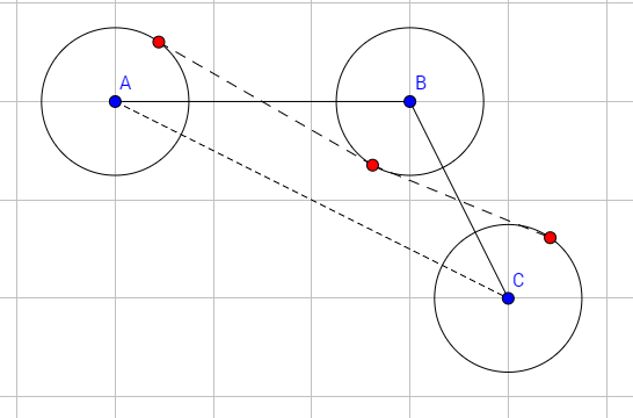

[TOC]

# 计算几何

#### 速记

#### 题目列表

#####[CF 801D Volatile Kite](https://cn.vjudge.net/problem/CodeForces-801D)

​	==**画图**==。首先答案不会超过相邻两点间距离的一半，否则会自交。其次为了保持多边形的凸性，答案不会超过在连续的三个点中中间的点到两边的点所在直线的距离的一半。

##### [Toys](http://cqsyz.openjudge.cn/jisuanjihe/03/)

​	用叉乘来判断点在直线的哪一侧。

​	用二分加速。

​	只需要判断查询的点就可以了。==**点在一条线段右边的话，叉乘的正负是确定的。**==**不要去管左下角，因为会有贴着箱子壁放的板，导致叉乘为 0。**

#####[Segments](http://cqsyz.openjudge.cn/jisuanjihe/05/)

​	首先转化问题：如果存在那么一条直线，它的一条垂线一定经过了所有的线段。如果我们旋转这条垂线，那么总有一种方法使它经过两个线段的端点。

​	所以我们枚举端点作为直线的垂线上的两点就可以了，时间复杂度 $O(n^3)$。

​	==**一定要判断是否为重点，否则叉乘始终为 0！**==